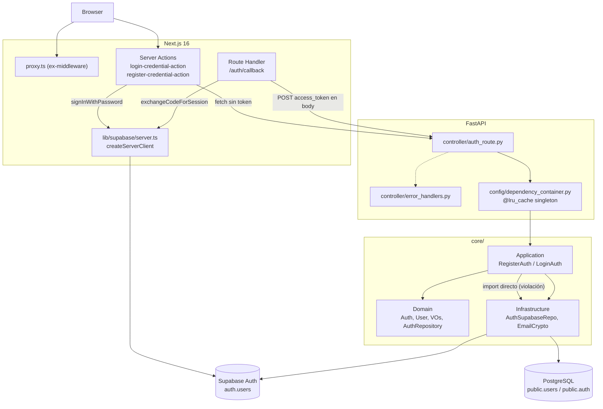
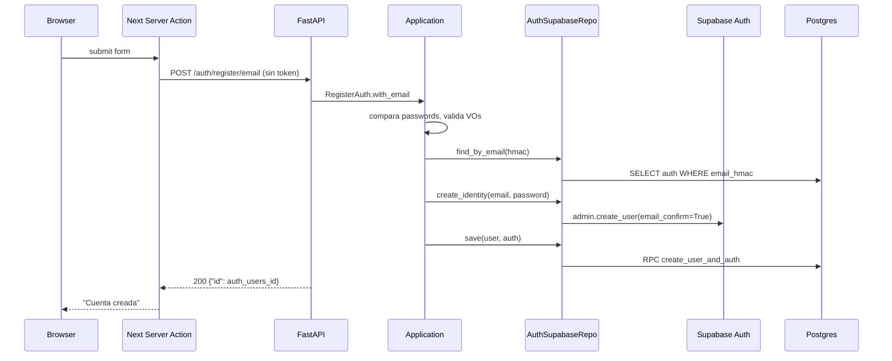
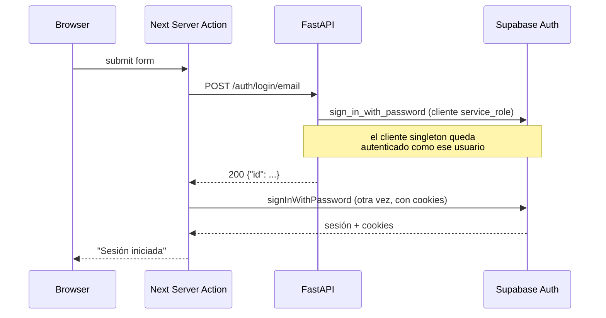
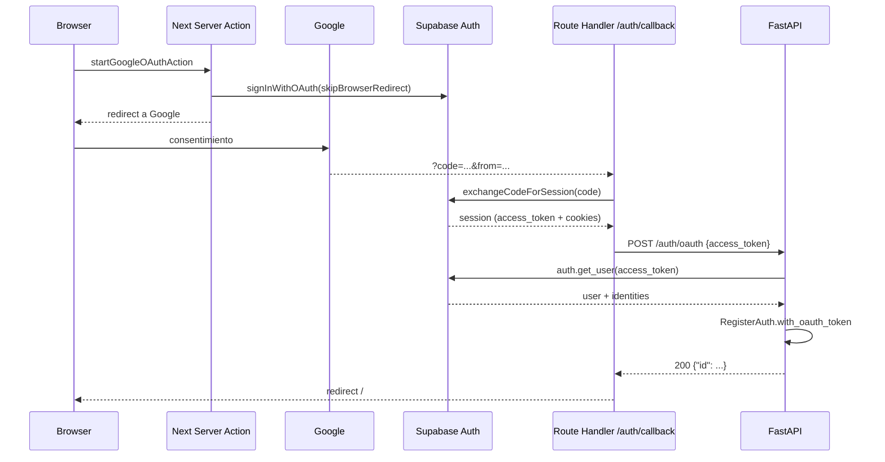
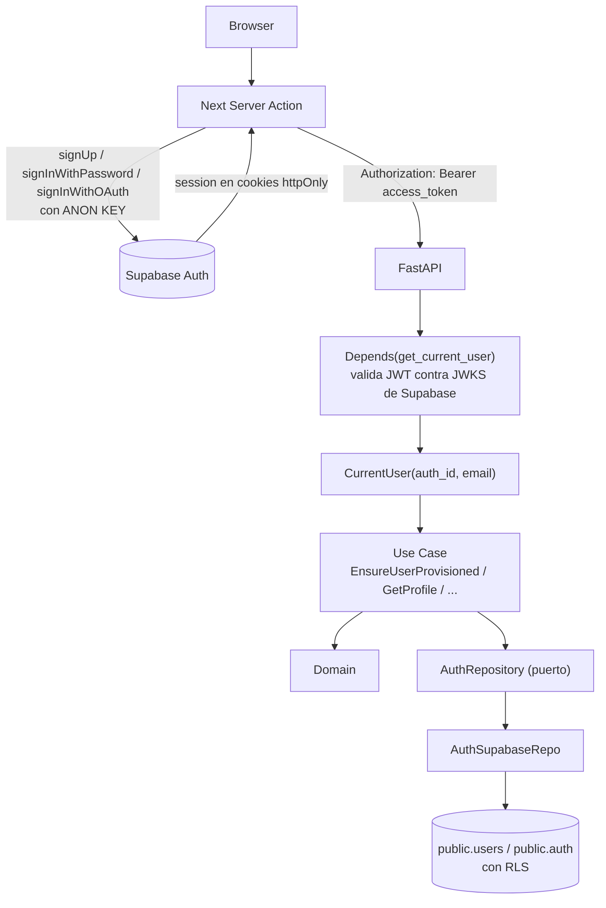
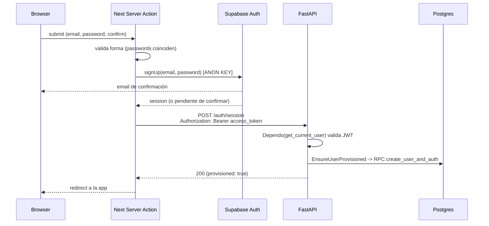
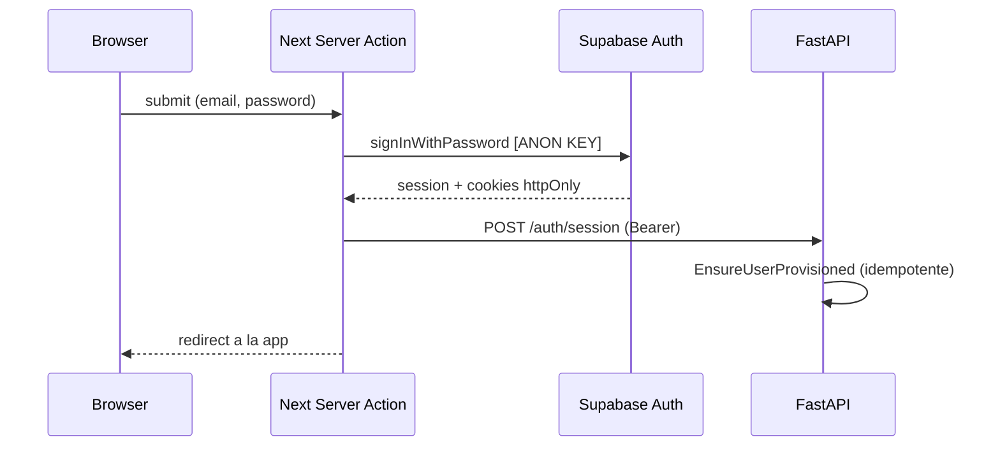

# Auditoría Arquitectónica — `ig`

Fecha: 2026-09-12
Alcance: repositorio completo (backend FastAPI, frontend Next.js 16, esquema Postgres/Supabase, Docker, tests).
Superficie real de código: ~60 archivos fuente. El resto del repo (19.653 archivos) es `.pnpm-store` commiteado por error.

Todo hallazgo marcado como **VERIFICADO** fue comprobado ejecutando código o leyendo la librería instalada, no inferido.

---

## 1. Executive Summary

El proyecto tiene **buenos cimientos de DDD y un excelente manejo de errores por capas**, pero la integración con Supabase Auth está mal planteada y contiene tres defectos que, tal como está el código hoy, rompen el sistema en producción o lo dejan expuesto.

Lo que está genuinamente bien: la jerarquía `DomainError` / `ApplicationError` / `InfrastructureError` mapeada a HTTP únicamente en el borde (`controller/error_handlers.py`); routers realmente delgados; el puerto `AuthRepository` definido como `Protocol` en Domain e implementado en Infrastructure; el cifrado de emails en reposo con AES-GCM más un HMAC determinista para búsqueda por igualdad; la función `create_user_and_auth` como `SECURITY DEFINER` que inserta `users` y `auth` atómicamente; y la saga de compensación en el registro. No hay una sola `HTTPException` en Domain o Application. Eso es raro de ver bien hecho y hay que preservarlo.

Lo que está mal se concentra en cuatro focos:

1. **Autenticación duplicada y mal ubicada.** El backend verifica passwords llamando a `sign_in_with_password` sobre el cliente Supabase de `service_role`, que es un singleton de proceso. Esto contamina las credenciales de todo el proceso (VERIFICADO contra `supabase 2.31.0`). Además el frontend vuelve a verificar la misma password inmediatamente después, así que el endpoint del backend no aporta nada y solo agrega un oráculo de credenciales sin rate limiting.
2. **Configuración de claves peligrosa.** El frontend cae silenciosamente a `SUPABASE_SECRET_KEY` cuando la anon key está vacía, que es exactamente el estado actual del `.env`. Y ninguna tabla de `public` tiene RLS habilitado.
3. **Los Value Objects no validan.** `UserId`, `AuthCreatedAt`, `UserCreatedAt` y `UserUpdatedAt` aceptan cualquier basura. La causa es sutil (`@dataclass` regenera `__init__` en las subclases) y los 88 tests que pasan no lo detectan. La validación de UUID nunca funcionó, ni una sola vez.
4. **El directorio `frontend/pages/` colisiona con el Pages Router de Next.** Next está generando 14 rutas públicas a partir de componentes y Server Actions (VERIFICADO en `.next/dev/types/routes.d.ts`).

La buena noticia: la arquitectura de capas es correcta en su forma, el volumen de código es chico, y casi todos los arreglos son locales. No hace falta reescribir nada.

---

## 2. Architecture Score

| Dimensión | Nota | Justificación |
|---|---|---|
| DDD | 6/10 | Capas y bounded contexts (`auth`, `user`, `shared`) bien nombrados. Pero el dominio es anémico (entidades con `to_primitive`/`from_primitive` de persistencia), invariantes validadas en Infrastructure, y VOs cuya validación no se ejecuta. |
| Separation of Concerns | 6/10 | Routers delgados y errores mapeados solo en el borde. Roto por un import directo de Application a Infrastructure y por la lógica de sesión repartida entre Next y FastAPI sin dueño claro. |
| Testability | 6/10 | Los use cases se instancian con un repo inyectado por constructor y se testean sin FastAPI ni Supabase. Baja por los mocks, por `FakeAuthRepo` sin usar, y por dos archivos de test que pytest nunca colecta. |
| TDD readiness | 7/10 | Lo más alto del informe. Correr `RegisterAuth` aislado ya es posible hoy y el ciclo red-green es rápido (0,37s para 88 tests). Falta que los tests describan comportamiento en lugar de llamadas. |
| FastAPI architecture | 7/10 | FastAPI está correctamente confinado al borde: `main.py` de 8 líneas, router sin lógica, `Depends` solo para resolver use cases desde un contenedor propio. Baja porque no hay response models ni capa de autorización. |
| Supabase integration | 3/10 | Contaminación del cliente singleton, `email_confirm: True` que anula la verificación de email, detección de duplicados por substring del mensaje de error, y `sign_in_with_password` usado como si fuera un `verify_password`. |
| Authentication | 3/10 | Password verificada dos veces, enumeración de usuarios, sin refresh, sin logout, sin recuperación de password, sin verificación de email, y sin ninguna forma de que el backend sepa quién es el usuario actual. |
| Security | 2/10 | Sin RLS, fallback a la secret key, verificación de email deshabilitada, y un endpoint de login sin rate limiting. Detalle en la sección 12. |
| Next.js architecture | 4/10 | Server Actions y Route Handler usados correctamente y sin open redirects. Pero `pages/` genera rutas fantasma, no hay validación de input, ni estados de error/loading más allá de un string. |
| Maintainability | 6/10 | Código corto, consistente y legible. Penalizado por abstracciones muertas, nombres duplicados entre capas y ruido masivo en git. |

**Promedio ponderado: ~5/10.** La forma es buena; la implementación de los detalles críticos no.

---

## 3. Current Architecture



Puntos clave del estado actual:

- **Ninguna request al backend lleva token**, salvo `/auth/oauth` que lo manda en el body JSON.
- **El backend no tiene concepto de "usuario actual".** No existe `get_current_user`, ni validación de JWT, ni endpoint protegido.
- **La sesión vive solo en Next**, en cookies gestionadas por `@supabase/ssr`.
- **El contenedor de dependencias es un singleton de proceso** (`@lru_cache`), y con él el cliente Supabase. Esto es lo que convierte el bug de `verify_password` en un problema global.

---

## 4. Problems Found

| Problema | Capa actual | Capa correcta | Severidad | Solución |
|---|---|---|---|---|
| `frontend/pages/` genera 14 rutas públicas del Pages Router | Presentation (Next) | — | **P0** | Renombrar a `frontend/features/` y `frontend/components/ui/` |
| `verify_password` contamina el cliente `service_role` singleton | Infrastructure | — | **P0** | Eliminar el login del backend; si se conserva, cliente efímero por llamada |
| Frontend cae a `SUPABASE_SECRET_KEY` como clave de cliente | Config (Next) | — | **P0** | Quitar el fallback; fallar ruidosamente si falta la anon key |
| Sin RLS en `public.users` y `public.auth` | Persistence | — | **P0** | `ENABLE ROW LEVEL SECURITY` + policies por `auth.uid()` |
| `email_confirm: True` anula la verificación de email | Infrastructure | — | **P0** | Quitar el flag y adoptar el flujo de confirmación de Supabase |
| VOs `UserId` / `*CreatedAt` no validan nada | Domain | Domain | **P0** | Arreglar herencia de dataclass + `UUID.validate` rota |
| Application importa de Infrastructure | Application | Domain (puerto) | **P1** | Mover `IdentityAlreadyExistsError` al contrato del puerto |
| Login verifica la password dos veces | Application + Presentation | Supabase | **P1** | Borrar `/auth/login/email` y `LoginAuth.with_email` |
| Enumeración de usuarios en login y registro | Application | — | **P1** | Mensaje genérico para credenciales inválidas |
| No existe autorización ni `current_user` | Ausente | Presentation (dependency) | **P1** | `get_current_user` que valide el JWT de Supabase |
| Endpoints devuelven el `auth.users.id` sin autenticar | Presentation | — | **P1** | Response DTOs que no expongan IDs de identidad |
| Router construye dicts a mano, sin `response_model` | Presentation | Presentation | **P1** | Pydantic response schemas |
| `RegisterAuth` contiene tres casos de uso | Application | Application | **P1** | Separar en `RegisterWithEmail` y `ProvisionOAuthUser` |
| Invariante "auth de email tiene email" validada en el repo | Infrastructure | Domain | **P2** | Mover a `Auth.__post_init__` |
| `to_primitive`/`from_primitive` acoplan la entidad a la fila | Domain | Infrastructure | **P2** | Mapper en `AuthSupabaseRepo` |
| `AuthPassword(password)` se construye y se descarta | Application | Domain | **P2** | Usar el VO o convertirlo en policy explícita |
| `EmailCrypto` (Protocol de dominio) nunca usado | Domain | — | **P2** | Borrarlo o usarlo como tipo en el repo |
| `UserRepository` sin implementación ni consumidor | Domain | — | **P2** | Borrarlo hasta que exista el caso de uso |
| `fake_repo_user.py` importa `UserRepo` inexistente | Tests | — | **P2** | Borrar el archivo |
| `test-user_id.py` (guion) nunca se colecta | Tests | — | **P2** | Renombrar a `test_user_id.py` |
| `InvalidAuthProviderError` duplicado en Domain y Application | Domain + Application | Una sola | **P2** | Renombrar el de Application |
| Tests de Application con `Mock()` en vez del `FakeAuthRepo` existente | Tests | — | **P2** | Usar el fake y assertar estado |
| Sin tests de integración de API ni del repositorio real | Tests | — | **P2** | `TestClient` + roundtrip del repo |
| Detección de duplicados por substring del mensaje de error | Infrastructure | — | **P2** | Inspeccionar código de error de Supabase |
| `.pnpm-store/` y `tsconfig.tsbuildinfo` commiteados | Repo | — | **P3** | `git rm -r --cached` + `.gitignore` |
| Sin logging, health check ni request id | Cross-cutting | Presentation | **P3** | `/health` + logging estructurado mínimo |
| `schema.sql` empieza con `DROP TABLE` | Persistence | — | **P3** | Migraciones versionadas (Supabase CLI) |
| `Dockerfile` de backend usa `--reload` | Infra | — | **P3** | `--reload` solo en compose |

---

## 5. Authentication Flow

### 5.1 Registro con email — flujo actual



Problemas de este flujo:

- **El usuario queda registrado pero sin sesión.** Tiene que ir a loguearse manualmente.
- **`email_confirm: True` marca el email como verificado sin verificarlo.** Puedo registrar `victima@gmail.com` y la cuenta queda activa.
- **La password cruda viaja Browser → Next → FastAPI → Supabase.** Un salto de red más de lo necesario, con el backend como intermediario que no aporta nada al resultado.
- **`find_by_email` seguido de `create_identity` es un TOCTOU.** En la carrera gana el `UNIQUE` sobre `email_hmac`, pero se manifiesta como un 500 (`AuthCreationError`) en vez de un 409.
- **La compensación puede dejar identidades huérfanas**: si `save` falla y `delete_identity` también, el `except Exception: pass` (`register_auth.py:69`) se traga el error y queda un `auth.users` sin `public.auth`.

### 5.2 Login con email — flujo actual



Esto es el problema más serio del proyecto. El backend verifica la password, **descarta la sesión resultante**, y el frontend verifica la misma password otra vez. El endpoint del backend es puro overhead, y encima deja el cliente contaminado (ver hallazgo P0-2 abajo).

### 5.3 Google OAuth — flujo actual



**Este flujo es el más correcto del proyecto** y debería ser el modelo para todo lo demás: Supabase autentica, el frontend obtiene el token, el backend **valida el token** y recién entonces aprovisiona sus propias tablas. Los detalles a corregir son menores: el token debería ir en `Authorization: Bearer` en vez del body, y el nombre del endpoint (`/auth/oauth` en un caso de uso llamado `RegisterAuth`) esconde que en realidad hace "registrar o devolver el existente".

Nota positiva: `fromQuery` y `fromPath` son allowlists estrictas, así que **no hay open redirect**, y los mensajes de error viajan por `encodeURIComponent` y se renderizan como texto en React, así que **no hay XSS**.

### 5.4 Flujo recomendado

**Principio rector: Supabase Auth es el Identity Provider y el único que toca credenciales. FastAPI nunca ve una password; solo valida tokens y es dueño de los datos de negocio.**



Responsabilidades, explícitamente:

- **Supabase se queda con:** registro, login, hash de passwords, política de passwords, verificación de email, recuperación de password, refresh tokens, OAuth, y emisión/firma del JWT. No dupliquemos nada de esto.
- **Next se queda con:** iniciar los flujos de Supabase, guardar y refrescar la sesión en cookies (`proxy.ts` ya lo hace bien), proteger rutas del lado del cliente, validación de UX del formulario, y adjuntar el `Bearer` a cada llamada al backend.
- **FastAPI se queda con:** validar el JWT, resolver el `CurrentUser`, aplicar **autorización** (¿este usuario puede tocar este recurso?), y toda la lógica y los datos de negocio (`public.users`, `public.auth`, perfiles, links).

El `user_id` se propaga así: el JWT trae `sub` = `auth.users.id` → `get_current_user` lo convierte en un `CurrentUser` → el use case lo recibe como **parámetro explícito**, nunca como estado global. Eso es lo que permite testear el use case sin FastAPI.

Sobre la política de password: hoy `AuthPassword` la define en el dominio. Si se adopta el flujo recomendado, esa regla se mueve a la configuración de Supabase.

- **Trade-off:** se pierde la expresividad de tener la regla como código testeable y se gana eliminar todo el manejo de credenciales del backend.
- **Recomendación:** aceptar el trade-off. La política de password no es una regla de negocio de este dominio, es una política de seguridad de la plataforma de identidad. Mantener `AuthPassword` solo si el producto necesita reglas que Supabase no puede expresar; en ese caso, validarla en el registro **antes** de llamar a `signUp`, no verificándola en el login.

Lo que **desaparece** con este cambio: `/auth/login/email`, `LoginAuth`, `AuthRepository.verify_password`, `AuthRepository.create_identity`, `AuthRepository.delete_identity`, y con ellos el bug P0-2 y toda la saga de compensación. Esto es significativo: el cambio **borra código**, no lo agrega.

---

## 6. DDD Analysis

### Qué pertenece a Domain

Ya está bien ubicado: `Auth`, `User`, los VOs (`AuthEmail`, `AuthMethod`, `AuthProvider`, `UserName`, `UserAvatar`, `UserDescription`), las excepciones de dominio, y el puerto `AuthRepository`. Ningún archivo de `core/*/domain/` importa FastAPI, Supabase ni HTTP. Verificado.

Lo que **debería** estar en Domain y hoy no está:

- La invariante *"un `Auth` con provider EMAIL siempre tiene email"*. Hoy se valida en `AuthSupabaseRepo.save()`, línea 68. Pertenece a `Auth.__post_init__`, junto a `AuthMethod.__post_init__` que ya hace exactamente esto para el `provider_id`.
- La regla *"registrarse con OAuth requiere email"*, hoy en `RegisterAuth.with_oauth` (línea 85). Es una invariante de `Auth`, no orquestación.

Lo que **no** debería estar en Domain:

- `Auth.to_primitive()` / `Auth.from_primitive()` y sus equivalentes en `User`. Son mapeo de persistencia disfrazado de dominio: el diccionario que producen tiene exactamente la forma de la fila que consume `AuthSupabaseRepo._row_to_auth`. Si mañana cambia el esquema, cambia el dominio. El mapper pertenece a Infrastructure.
  - **Trade-off honesto:** hoy este acoplamiento no duele, y el patrón `to_primitive`/`from_primitive` da tests de roundtrip baratos. Es P2, no P0. Pero hay que saber que el dominio está pagando por una decisión de infraestructura.

### Qué pertenece a Application

`RegisterAuth` y `LoginAuth` están en el lugar correcto y no conocen HTTP. Correcto.

Dos problemas:

1. **Violación de dependencia.** `core/auth/application/register_auth.py:12` importa `from core.auth.infrastructure.error_infrastructure import IdentityAlreadyExistsError`. Application no puede depender de Infrastructure. El arreglo es mover ese error al contrato del puerto: si `AuthRepository` promete lanzar `IdentityAlreadyExists`, ese error es parte del puerto y vive en Domain junto a él.
2. **`RegisterAuth` agrupa tres casos de uso** (`with_email`, `with_oauth`, `with_oauth_token`). El test lo delata: 232 líneas para una clase, con dos bloques separados por comentarios `# WITH EMAIL` / `# WITH OAUTH`. Separar en `RegisterWithEmail` y `ProvisionOAuthUser`.

### Qué pertenece a Infrastructure

`AuthSupabaseRepo`, `EmailCrypto` (la implementación), `DBClient`, y los settings de Pydantic. Todo correcto en su ubicación.

`db/db_client.py` está fuera de `core/`, lo cual es defendible (es un cliente compartido). Moverlo a `core/shared/infrastructure/` sería más consistente, pero es cosmético.

### Qué pertenece a Presentation

`controller/auth_route.py`, `controller/error_handlers.py`, `main.py` y `config/dependency_container.py`.

**Lo mejor del proyecto está acá**: `register_error_handlers` traduce las tres jerarquías de excepciones a códigos HTTP en un único lugar, y `_status_for` mapea cada error de aplicación a su status. Ese es exactamente el patrón correcto y hay que defenderlo en las refactorizaciones.

Lo que falta: response models de Pydantic. Hoy el router devuelve `{"id": auth.id.value}` a mano, así que el OpenAPI generado no documenta nada y no hay separación entre el modelo de dominio y el contrato HTTP.

### Anemic domain model

Sí, hay síntomas, pero **moderados y no uniformes**:

- `AuthMethod` es un VO rico y correcto: encapsula una invariante real (email no lleva `provider_id`, OAuth sí) y la valida en `__post_init__`. Excelente.
- `AuthProvider` con `is_email()` / `is_oauth()` en vez de comparar strings: bien.
- `Auth` y `User`, en cambio, son casi estructuras de datos: constructores estáticos, serializadores, y ningún comportamiento.

Esto es **aceptable hoy** porque el dominio de autenticación realmente no tiene mucho comportamiento propio (Supabase se queda con casi todo). No fuerces métodos al agregado solo para que "parezca DDD". El lugar donde el dominio va a ganar peso es `User` cuando aparezcan perfil, username y links.

### Primitive obsession

Presente en los bordes del dominio: `Auth.create_with_email(id: str, user_id: str, email: str)` recibe primitivos y construye los VOs adentro, y `AuthRepository` habla en `str` (`find_by_email(email: str)`, `create_identity(email: str, password: str)`). Los VOs existen pero no se usan como el lenguaje de los contratos.

Esto es una decisión de diseño defendible (simplifica el llamador), no un error. Pero produce el efecto raro de `RegisterAuth.with_email`: construye `AuthPassword(password)` en la línea 35 y **descarta el objeto inmediatamente**, usando el VO como si fuera una función de validación. Si el VO se usa como validador, que sea explícito (`AuthPassword.validate(password)`); si se usa como VO, que viaje.

---

## 7. Testing Analysis

**Estado:** 88 unit tests pasan en 0,37s. 3 integration tests que se saltean sin Supabase configurado.

### Unit tests existentes — Domain

**Son buenos.** `test_auth_email.py`, `test_user_name.py`, `test_auth_provider.py`, `test_auth.py` prueban comportamiento, cubren bordes (exactamente 1 carácter, exactamente 50, 51), son rápidos y no tocan infraestructura. Es el modelo a seguir.

**Pero tienen un punto ciego grave.** Ningún test de dominio detecta que la validación de UUID y de fecha no se ejecuta:

```python
UserId('NOT-A-UUID-AT-ALL')   # -> UserId(value='NOT-A-UUID-AT-ALL')
AuthCreatedAt('not a date')   # -> AuthCreatedAt(value='not a date')
```

`test-user_id.py` habría atrapado parte de esto, pero **pytest nunca lo colecta porque el nombre usa guion en vez de guion bajo**. Los tres tests de ese archivo jamás corrieron.

### Unit tests existentes — Application

Acá está el problema que el enunciado pedía identificar: **demasiados mocks, y tests que verifican implementación en lugar de comportamiento.**

`test_register_auth.py` y `test_login_auth.py` usan `Mock()` para todo y assertean llamadas:

```python
self.auth_repo.find_by_email.assert_called_once_with("test@example.com")
self.auth_repo.create_identity.assert_called_once_with("test@example.com", "Password123")
```

Y el assert de resultado es `assert result == "saved"` — un string arbitrario que el mock devuelve. El test no comprueba que se haya registrado un usuario; comprueba que se llamaron ciertos métodos con ciertos argumentos. Si mañana refactorizo `find_by_email(email)` a `find_by_email(AuthEmail)`, el test rompe sin que el comportamiento haya cambiado. Eso es fragilidad, no cobertura.

**Lo irónico: el fake correcto ya existe y nadie lo usa.** `tests/unit/auth/application/fake_auth_repo.py` es un `FakeAuthRepo` bien construido, con almacenamiento en memoria, detección de duplicados y verificación de password. No se importa desde ningún test.

Comparación del mismo test con fake en vez de mock:

```python
# Hoy: verifica llamadas
def test_should_register_with_email(self):
    self.auth_repo.save.return_value = "saved"
    result = self.register_auth.with_email(...)
    assert result == "saved"
    self.auth_repo.create_identity.assert_called_once_with("test@example.com", "Password123")

# Propuesto: verifica comportamiento observable
def test_registering_creates_a_user_and_an_email_identity(self):
    repo = FakeAuthRepo()
    result = RegisterAuth(repo).with_email(
        email="TEST@EXAMPLE.COM", password="Password123", confirm_password="Password123",
    )
    assert repo.find_by_email("test@example.com") == result
    assert result.provider_method.provider is AuthProvider.EMAIL
    assert len(repo.users) == 1
```

El segundo sobrevive a cualquier refactor interno y falla solo si el registro deja de registrar.

### Cuándo usar cada doble — recomendación por dependencia

| Dependencia | Doble recomendado | Por qué |
|---|---|---|
| `AuthRepository` en tests de use case | **Fake** (`FakeAuthRepo`) | Tiene estado consultable; permite assertear resultado en vez de llamadas |
| `AuthRepository` para probar el rollback | **Fake con fallo inyectado** (`repo.fail_on_save = True`) | El rollback SÍ es una interacción observable; ahí el assert de llamada es legítimo |
| `EmailCrypto` en tests de repo | **Implementación real** con claves de test | Es puro y determinista (salvo el nonce); mockearlo no aporta nada |
| Cliente Supabase en unit tests | **No aparece** | Si aparece, el test está en la capa equivocada |
| Cliente Supabase en integration tests | **Real** | Es exactamente lo que se quiere verificar |
| `get_current_user` en tests de API | **Override de `Depends`** | Para probar el router sin firmar JWTs |

### Integration tests existentes

`tests/integration/` prueba solo la plomería: que el service role puede llamar `auth.admin`, que la tabla `users` existe, y un insert/delete crudo. **No ejercita ninguna línea de código propio** — ni FastAPI, ni los use cases, ni `AuthSupabaseRepo`.

Además `test_inserts_and_deletes_user` escribe en la base real dentro de un `try/finally`. Si el proceso muere entre el insert y el finally, queda basura.

Lo positivo: `conftest.py` hace `pytest.skip` con un mensaje accionable cuando falta configuración, en vez de fallar con un stack trace. Buen detalle.

### Tests faltantes, por prioridad

1. **Domain:** que `UserId("garbage")` lance `InvalidUUIDError`. Este test hoy falla; escribirlo primero es TDD en su forma más pura.
2. **Application con fake:** reescribir los tests de `RegisterAuth`/`LoginAuth` sobre `FakeAuthRepo`.
3. **Integration del repositorio:** roundtrip real `save()` → `find_by_email()` contra Supabase, que es lo único que verifica de verdad que AES-GCM + HMAC + el RPC funcionan juntos. Hoy nada lo prueba.
4. **Contract tests de la API:** `TestClient` con el contenedor sobrescrito por un fake, verificando códigos HTTP (409 en email duplicado, 401 en credenciales inválidas, 422 en body inválido). Rápidos, sin red, y son los que blindan `error_handlers.py`.
5. **Integration de auth:** que un JWT válido de Supabase resuelva un `CurrentUser` y uno inválido dé 401 (una vez que exista esa capa).

### Test Pyramid

```
        E2E          0  (ninguno, y está bien por ahora)
   Integration       3  (y ninguno toca código propio)
      Unit          88
```

El diagnóstico no es "demasiado E2E" ni "pocos unit tests". Es:

- **Muy pocos tests de integración reales.** La franja donde vive todo el riesgo de este proyecto (Supabase, crypto, el RPC) está sin cubrir.
- **Demasiados mocks en la capa Application**, generando tests frágiles.
- **Cobertura de dominio amplia pero con un agujero estructural**: los VOs base (`UUID`, `Date`) no tienen tests propios, solo se testean indirectamente vía subclases, que es justamente donde la validación se rompe.

### Estrategia TDD recomendada

La arquitectura **sí soporta TDD hoy**: `RegisterAuth(FakeAuthRepo())` se instancia y ejecuta sin FastAPI, sin Supabase, sin HTTP. Eso es lo que el enunciado ponía como criterio y el proyecto lo cumple. Es su mayor fortaleza.

Ciclo propuesto para la refactorización:

1. **RED** — escribir el test que documenta el bug antes de tocar nada (`UserId` inválido, `verify_password` contaminando el cliente, la validación de UUID).
2. **GREEN** — el arreglo mínimo.
3. **REFACTOR** — recién ahí mover responsabilidades de capa, con la red de seguridad puesta.

Regla para los tests nuevos: **si el assert nombra un método del repositorio, probablemente estás probando implementación.** Preguntá qué cambió en el mundo y asserteá eso.

---

## 8. Recommended Architecture

Cambios mínimos sobre lo que ya existe. No propongo CQRS, ni Event Sourcing, ni Unit of Work: el proyecto no los necesita y agregarían ceremonia sin resolver ninguno de los problemas encontrados.

```
backend/
  main.py
  api/                              # antes controller/
    dependencies/
      auth.py                       # get_current_user -> CurrentUser  (NUEVO)
      container.py                  # antes config/dependency_container.py
    routers/
      auth.py                       # POST /auth/session  (reemplaza login+oauth)
      users.py                      # endpoints protegidos (futuro)
    schemas/
      auth.py                       # Request y Response models Pydantic
    errors.py                       # antes error_handlers.py (conservar tal cual)
  config/
    crypto_settings.py              # typo corregido
    db_settings.py
  core/
    shared/
      domain/       { date.py, string.py, uuid.py, domain_error.py }
      application/  { application_error.py }
      infrastructure/ { infrastructure_error.py, supabase_client.py }   # antes db/db_client.py
    auth/
      domain/
        auth.py                     # + invariantes que hoy están en el repo
        auth_repo.py                # puerto + sus errores de contrato
        value_objects/              # agrupar los 7 VOs sueltos
      application/
        register_with_email.py      # antes RegisterAuth.with_email
        provision_oauth_user.py     # antes RegisterAuth.with_oauth*
        application_error.py
      infrastructure/
        auth_supabase_repo.py
        auth_mapper.py              # row <-> Auth  (sale de la entidad)
        email_crypto.py
    user/
      domain/ ...
  db/
    migrations/                     # reemplaza el schema.sql destructivo
  tests/
    unit/         { domain/, application/ }   # con fakes, sin Mock()
    integration/  { repositories/, api/ }     # lo que hoy falta
```

```
frontend/
  app/                              # solo rutas del App Router
    (public)/{login,register}/page.tsx
    auth/callback/route.ts
  features/                         # RENOMBRADO desde pages/   <- arregla el P0
    login/    { actions/, components/, login-page.tsx }
    register/ { actions/, components/, register-page.tsx }
  components/ui/                    # button, input, form-hero, page-wrapper
  lib/
    supabase/ { server.ts, env.ts }
    api/      { client.ts }         # antes fetch_data.ts, + Bearer automático
    validation/                     # schemas Zod de UX
  proxy.ts
```

Sobre **Zod**: el enunciado lo menciona. Hoy no está instalado y hoy no hace falta — los formularios tienen tres campos y la fuente de verdad está en el backend. Vale la pena cuando aparezcan formularios de perfil con varios campos y se quiera feedback inline sin roundtrip. **Trade-off:** una dependencia más y el riesgo real de duplicar reglas de negocio en el cliente. Si se adopta, que valide solo forma (email parseable, campos no vacíos, passwords coinciden), nunca reglas de negocio.

Sobre el **Repository Pattern**: el enunciado pregunta si hace falta una interfaz por repositorio. Respuesta honesta para este proyecto:

- `AuthRepository` **sí** justifica el puerto: tiene dos implementaciones reales (`AuthSupabaseRepo` y `FakeAuthRepo`), y esa segunda es lo que hace testeable la capa Application. La abstracción se paga sola.
- `UserRepository` **no** lo justifica hoy: cero implementaciones, cero consumidores. Es premature abstraction. Borrarlo y recrearlo cuando exista `CreateProfile`.
- `EmailCrypto` como Protocol de dominio **no** lo justifica: hay una sola implementación, es determinista y barata de usar de verdad en los tests. Además el Protocol está duplicado con la clase concreta bajo el mismo nombre en otro módulo, lo cual confunde más de lo que abstrae. Elegir uno.

---

## 9. Recommended Flows

### 9.1 Registro con email (corregido)



Qué cambia y por qué:

- El backend **nunca ve la password**. Desaparece `create_identity`, `delete_identity` y la saga de compensación entera.
- La confirmación de email vuelve a funcionar (se quita `email_confirm: True`).
- El usuario queda **con sesión iniciada** tras registrarse.
- El aprovisionamiento es **idempotente**: si ya existe el `auth`, se devuelve; si no, se crea. Eso elimina el TOCTOU: no hay check-then-act, hay un `INSERT ... ON CONFLICT DO NOTHING` dentro del RPC.

### 9.2 Login con email (corregido)



**Una sola verificación de password, hecha por quien corresponde.** `/auth/login/email` y `LoginAuth` se borran. El bug del cliente contaminado desaparece con ellos, porque ya no hay ningún `sign_in_with_password` en el backend.

Y como el login pasa a ser de Supabase, el **rate limiting y la protección contra fuerza bruta son de Supabase**, que ya los tiene. Hoy el endpoint propio no tiene ninguno.

### 9.3 Google OAuth (corregido)

Estructuralmente ya es correcto. Cambios menores:

- El token va en `Authorization: Bearer`, no en el body JSON.
- El endpoint pasa a ser el mismo `/auth/session` que usan email y Google. Un solo camino de aprovisionamiento, un solo caso de uso, un solo test.
- La validación del token pasa de `auth.get_user(token)` (un roundtrip HTTP a Supabase por request) a validación local de la firma contra el JWKS.
  - **Trade-off:** la validación local no detecta un token revocado hasta que expira; el roundtrip sí, pero agrega latencia a cada request. **Recomendación:** validación local, porque los access tokens de Supabase son de vida corta (1h por defecto) y el costo de un roundtrip por request es alto. Si aparece un requisito de revocación inmediata, se revisa.

### 9.4 Un endpoint protegido cualquiera (patrón a seguir)

```
Request + Bearer
  -> Depends(get_current_user) -> CurrentUser(auth_id, email)     [Presentation]
  -> Request schema Pydantic                                       [Presentation]
  -> use_case.execute(current_user.auth_id, command)               [Application]
  -> Domain (invariantes)                                          [Domain]
  -> AuthRepository / UserRepository (puertos)                     [Domain]
  -> AuthSupabaseRepo                                              [Infrastructure]
  -> Postgres con RLS                                              [Persistence]
  <- Response schema Pydantic                                      [Presentation]
```

El use case recibe el `auth_id` **como argumento**. Nunca lee un contexto global. Esa es la propiedad que mantiene los tests sin FastAPI.

---

## 10. Refactoring Plan

### P0 — Crítico (antes de cualquier deploy)

1. **Renombrar `frontend/pages/` a `frontend/features/`** y mover `pages/ui/` a `frontend/components/ui/`. Actualizar los imports `@/pages/...`. Elimina las 14 rutas fantasma.
2. **Quitar el fallback a la secret key** en `lib/supabase/env.ts`: si falta la anon key, lanzar. Definir `NEXT_PUBLIC_SUPABASE_ANON_KEY` en `.env` y en `docker-compose.yml`, y dejar de pasarle el `.env` completo (con la secret key) al servicio frontend.
3. **Habilitar RLS** en `public.users` y `public.auth`, con policies de lectura/escritura por `auth.uid()`. El RPC `SECURITY DEFINER` sigue funcionando para el service role.
4. **Eliminar `/auth/login/email`, `LoginAuth` y `verify_password`.** El login pasa a Supabase en el frontend. Esto cierra el bug de contaminación del cliente singleton.
5. **Quitar `email_confirm: True`** y adoptar el flujo de confirmación de Supabase.
6. **Arreglar la validación de VOs**: corregir `UUID.validate` (usa `uuid.UUID(value)`, no `uuid7(value)`) y la herencia de dataclass en `UserId`, `AuthCreatedAt`, `UserCreatedAt`, `UserUpdatedAt`. Test primero.
7. **Sacar `.pnpm-store/` y `tsconfig.tsbuildinfo` de git.**

### P1 — Alta prioridad

8. **`Depends(get_current_user)`** que valide el JWT de Supabase y exponga un `CurrentUser`.
9. **Unificar el aprovisionamiento** en `/auth/session` + `EnsureUserProvisioned` idempotente, para email y Google.
10. **Romper la dependencia Application → Infrastructure**: mover `IdentityAlreadyExistsError` al contrato del puerto en Domain.
11. **Response schemas de Pydantic** y dejar de devolver el `auth.users.id` a callers no autenticados.
12. **Mensajes genéricos de credenciales** para eliminar la enumeración de usuarios.
13. **Separar `RegisterAuth`** en `RegisterWithEmail` y `ProvisionOAuthUser`.

### P2 — Media prioridad

14. **Reescribir los tests de Application sobre `FakeAuthRepo`**, asserteando estado en vez de llamadas.
15. **Renombrar `test-user_id.py`** y borrar `fake_repo_user.py` (import roto).
16. **Integration tests que falten**: roundtrip real del repositorio y contract tests de la API con `TestClient`.
17. **Mover invariantes de `Auth` desde el repo a la entidad.**
18. **Sacar `to_primitive`/`from_primitive` a un mapper** en Infrastructure.
19. **Borrar abstracciones muertas**: `UserRepository`, y uno de los dos `EmailCrypto`.
20. **Detectar duplicados por código de error** de Supabase, no por substring del mensaje.
21. **Renombrar el `InvalidAuthProviderError` de Application** para no colisionar con el de Domain.

### P3 — Baja prioridad

22. Migraciones versionadas en vez del `schema.sql` con `DROP TABLE`.
23. `/health`, logging estructurado y request id.
24. Declarar `python-dotenv` en `pyproject.toml`; agregar `ruff` y `mypy` (el `.gitignore` ya los anticipa).
25. Quitar `--reload` del `Dockerfile` de producción; mover `supabase` (CLI) a `devDependencies`.
26. Corregir el typo `crypto_setings.py`; completar el `README.md` vacío; agrupar los VOs en `value_objects/`.
27. CI que corra los unit tests y el linter.

---

## 11. Top 10 Improvements

Ordenadas por impacto real, no por esfuerzo:

1. **Eliminar el login del backend.** Un solo cambio que borra un bug crítico de contaminación de credenciales, elimina un oráculo de passwords sin rate limiting, quita una verificación duplicada y **reduce** la cantidad de código. Es la mejora con mejor relación impacto/esfuerzo del proyecto.
2. **Renombrar `frontend/pages/`.** Un `git mv` que elimina 14 rutas públicas no intencionadas.
3. **Arreglar la validación de los Value Objects.** Hoy el dominio no protege ninguna invariante de identidad ni de fecha, y los 88 tests verdes dan una falsa sensación de seguridad.
4. **Habilitar RLS.** Es la única defensa real si la anon key se publica, que es su propósito.
5. **Quitar el fallback a la secret key** y hacer que la configuración falle ruidosamente.
6. **`get_current_user` con validación de JWT.** Sin esto el backend no puede tener ni un solo endpoint protegido, que es el próximo paso obvio del producto.
7. **Restaurar la verificación de email.**
8. **Reescribir los tests de Application sobre el fake que ya existe.** Convierte la suite de frágil a útil sin agregar infraestructura.
9. **Agregar integration tests del repositorio.** La combinación AES-GCM + HMAC + RPC es la parte más delicada del sistema y hoy nada la prueba.
10. **Romper la dependencia Application → Infrastructure.** Un import, pero es el que invalida la regla que sostiene toda la arquitectura.

---

## 12. Security Audit

| Severidad | Hallazgo | Detalle |
|---|---|---|
| **CRITICAL** | Contaminación del cliente `service_role` | VERIFICADO en `supabase/_sync/client.py:334-346`: `_listen_to_auth_events` reemplaza `options.headers["Authorization"]` y `auth._headers["Authorization"]` con el token del usuario en `SIGNED_IN`. Como `get_dependency_container` es `@lru_cache` y `DBClient` crea un único `Client`, tras el primer login exitoso **todas** las operaciones del proceso (incluidas `auth.admin.create_user` y las queries a `public.auth`) usan el Bearer del último usuario logueado en lugar del service role. Es corrupción de privilegios entre requests concurrentes. |
| **CRITICAL** | Sin RLS en `public.users` y `public.auth` | `db/schema.sql` no contiene ningún `ENABLE ROW LEVEL SECURITY`. Supabase expone el esquema `public` vía PostgREST. Con la anon key —que por diseño es pública— se podría leer y escribir ambas tablas libremente. *Atenuante actual:* la anon key está vacía en el `.env`, así que hoy no es explotable; pero es bloqueante antes del primer deploy. |
| **CRITICAL** | Verificación de email deshabilitada | `auth_supabase_repo.py:33` pasa `"email_confirm": True`, que marca el email como verificado sin enviar nada. Permite registrar cuentas con emails de terceros y, combinado con la recuperación de password de Supabase, es un vector de apropiación de identidad. |
| **HIGH** | Fallback silencioso a la secret key en el frontend | `lib/supabase/env.ts:15`: `const key = anonKey || (process.env.SUPABASE_SECRET_KEY \|\| "").trim();`. En el `.env` actual `SUPABASE_ANON_KEY` está vacío y no existe `NEXT_PUBLIC_SUPABASE_ANON_KEY`; `next.config.ts` carga el `.env` de la raíz y `docker-compose.yml` pasa el `.env` completo al servicio frontend. Resultado: `createServerClient` en `proxy.ts` y `lib/supabase/server.ts` se instancia con la **secret key**. No llega al browser (no lleva prefijo `NEXT_PUBLIC_`), por eso es HIGH y no CRITICAL, pero el proxy corre con privilegios de service role en cada request y cualquier futuro `NEXT_PUBLIC_` sobre esa variable la publicaría. |
| **HIGH** | Oráculo de credenciales sin rate limiting | `POST /auth/login/email` verifica passwords contra Supabase sin throttling, lockout, captcha ni backoff propios. |
| **MEDIUM** | Enumeración de usuarios | `LoginAuth.with_email` distingue `EmailNotFoundError` (401, "El email no existe") de `PasswordMismatchError` (401, "La contraseña no es correcta"). Permite enumerar cuentas registradas. |
| **MEDIUM** | Exposición del `auth.users.id` | `/auth/register/email` y `/auth/login/email` devuelven `{"id": auth.id.value}` a un caller no autenticado. Ese UUID es la PK de `auth.users` y de `public.auth`. |
| **MEDIUM** | Detección de duplicados por substring | `_is_duplicate_identity` (`auth_supabase_repo.py:198-200`) hace matching sobre `str(exc).lower()` buscando `"already"`, `"registered"` o `"exists"`. Frágil ante cambios de mensaje o localización, y puede clasificar mal un error distinto como duplicado. |
| **MEDIUM** | Identidades huérfanas posibles | `register_auth.py:66-71`: si `save` falla y el `delete_identity` de compensación también, el `except Exception: pass` se traga el error y queda un `auth.users` sin fila en `public.auth`. |
| **LOW** | Sin logout, refresh explícito ni recuperación de password | Flujos inexistentes. No es una vulnerabilidad hoy porque no hay área autenticada, pero son requisitos previos a tenerla. |
| **LOW** | Token OAuth en el body en vez del header | `POST /auth/oauth` recibe el `access_token` en JSON. Funcionalmente equivalente, pero más propenso a terminar en logs de aplicación que un header `Authorization`. |
| **LOW** | Sin logging de eventos de seguridad | No hay registro de intentos de login fallidos ni de registros. |
| **REQUIRES VERIFICATION** | Redirect URLs de Google OAuth | El código construye `redirectTo` desde headers (`origin`, `x-forwarded-host`) con allowlist para el parámetro `from`, lo cual es correcto. Pero la seguridad real depende de la lista de Authorized redirect URIs configurada en Supabase y en Google Cloud Console, que no es inspeccionable desde el repositorio. |
| **REQUIRES VERIFICATION** | Rotación y custodia de `EMAIL_ENCRYPTION_KEY` / `EMAIL_HMAC_KEY` | Las claves están correctamente fuera de git (`.env` ignorado) y separadas entre cifrado y HMAC, que es lo correcto. No hay forma de verificar desde el repo si existe un procedimiento de rotación ni cómo se gestionan en producción. Nota: no hay versionado de clave en el ciphertext, así que una rotación hoy requeriría re-cifrar toda la tabla. |

**Aspectos de seguridad que están BIEN y no hay que tocar:**

- No hay open redirect: `fromQuery` y `fromPath` (`lib/google-oauth-action.ts`, `app/auth/callback/route.ts`) son allowlists estrictas de dos valores.
- No hay XSS: los mensajes de error pasan por `encodeURIComponent` y React los renderiza como texto.
- No hay SQL injection: todo el acceso es vía PostgREST parametrizado o el RPC con parámetros tipados.
- La función `create_user_and_auth` es `SECURITY DEFINER` **con `SET search_path = public`** y `GRANT` únicamente a `service_role`. Ambas cosas son exactamente lo correcto y es un error común no hacerlas.
- El email se cifra en reposo con AES-GCM (nonce aleatorio de 12 bytes por operación) y se busca por un HMAC-SHA256 con clave independiente. Diseño correcto y deliberado.
- No configurar CORS es la decisión correcta: el frontend siempre llama al backend desde el servidor, nunca desde el browser. Por la misma razón, CSRF no aplica al backend hoy; las Server Actions de Next traen su propia protección.
- El `.env` real está fuera de git y el `.env.example` no contiene valores.

---

## 13. Observabilidad

El enunciado pide no agregar observabilidad innecesaria para un proyecto de este tamaño. Estoy de acuerdo. Lo mínimo que sí vale la pena:

- **`GET /health`** que verifique que el proceso responde. Hoy `docker-compose` tiene `restart: unless-stopped` sin healthcheck, así que un proceso vivo pero roto no se detecta.
- **Logging estructurado en los handlers de error.** `register_error_handlers` ya es el punto único por donde pasa todo error: loguear ahí `InfrastructureError` con el traceback (hoy se devuelve un 500 genérico y el error original se pierde) es un cambio de tres líneas con mucho retorno.
- **Request ID** propagado desde Next hacia FastAPI. Con dos servicios y un flujo que cruza ambos, correlacionar sin esto es doloroso.

Lo que **no** recomiendo todavía: tracing distribuido, métricas Prometheus, APM. No hay volumen ni superficie que los justifique.

---

## 14. Code Smells

| Smell | Dónde | Por qué importa | Prioridad |
|---|---|---|---|
| Leakage de infraestructura hacia Application | `register_auth.py:12` | Invalida la regla de dependencias que sostiene la arquitectura | P1 |
| Clase con múltiples casos de uso | `RegisterAuth` (3 métodos públicos, 232 líneas de test) | Dificulta nombrar el comportamiento y crece sin límite | P1 |
| Lógica de negocio en el repositorio | `AuthSupabaseRepo.save():68` valida la invariante del email | La invariante deja de aplicarse si cambia la persistencia | P2 |
| Anemic domain model | `Auth`, `User` | Aceptable hoy; vigilar cuando crezca `User` | P2 |
| Primitive obsession | `AuthRepository` habla en `str` pese a que los VOs existen | Los VOs no protegen los bordes que deberían | P2 |
| Abstracción prematura | `UserRepository`, `EmailCrypto` (Protocol de dominio) | Cero implementaciones, cero consumidores | P2 |
| Nombres duplicados entre capas | `InvalidAuthProviderError` (Domain y Application), `EmailCrypto` (Domain y Infrastructure) | Obliga a mirar el import para saber qué se está usando | P2 |
| Código muerto / roto | `fake_repo_user.py` importa `UserRepo` inexistente | Da la impresión de que hay cobertura donde no la hay | P2 |
| Test invisible | `test-user_id.py` con guion | Tres tests que nunca corrieron | P2 |
| Demasiados mocks | `test_register_auth.py`, `test_login_auth.py` | Tests frágiles acoplados a la implementación | P2 |
| VO usado como función | `AuthPassword(password)` construido y descartado (`register_auth.py:35`) | Intención poco clara al lector | P2 |
| Excepción tragada | `except Exception: pass` (`register_auth.py:69-70`) | Oculta fallos de compensación | P2 |
| Nombre engañoso | `RegisterAuth.with_oauth` también hace login (devuelve el existente) | El nombre miente sobre lo que hace | P3 |
| Typo en nombre de módulo | `config/crypto_setings.py` | Fricción al buscar | P3 |
| Ruido en el repositorio | `.pnpm-store/` (19.653 archivos), `tsconfig.tsbuildinfo` | Clones lentos, diffs inútiles | P3 |

**No encontré:** God classes (el archivo más largo del backend tiene 201 líneas), imports circulares, ni funciones desmedidas. El código es corto y consistente.

---

## 15. Final Verdict

**¿El proyecto está correctamente diseñado para crecer? Parcialmente: la estructura sí, la implementación no todavía.**

Lo que está a favor, y no es poco. La separación en capas es real, no decorativa: hay un puerto en Domain con dos implementaciones, los use cases se ejecutan sin levantar FastAPI ni Supabase, y las excepciones se traducen a HTTP en un único punto del borde. La mayoría de los proyectos que dicen "hacer DDD" fallan en exactamente estas tres cosas. Acá están bien. El criterio que planteaba el enunciado —*poder testear `RegisterUser` sin levantar FastAPI + Supabase + PostgreSQL*— **ya se cumple hoy**. Esa es la base sobre la que se construye todo lo demás, y está puesta.

Lo que está en contra. La integración con Supabase Auth se planteó como si Supabase fuera una base de datos con una API de usuarios, en lugar de un proveedor de identidad. De ahí sale casi todo lo grave: verificar passwords en el backend, descartar la sesión que Supabase devuelve, verificarlas de nuevo en el frontend, marcar emails como confirmados sin confirmarlos, y usar el cliente de `service_role` para operaciones de usuario final. El resultado es un backend que duplica lo que Supabase ya hace bien y que, al mismo tiempo, no hace lo único que le corresponde: validar tokens y saber quién es el usuario actual.

El segundo problema es de confianza en las herramientas. Que los 88 tests pasen mientras `UserId("basura")` se construye sin protestar, que `pytest` ignore un archivo por un guion, y que Next genere 14 rutas a partir de componentes sin que nadie lo note, apuntan a lo mismo: hay poca verificación de que las cosas efectivamente hacen lo que se cree. No es un problema de cantidad de tests, es de qué se está observando.

La conclusión práctica es optimista. Casi todas las correcciones **quitan** código en lugar de agregarlo: eliminar el login del backend borra un endpoint, un caso de uso, tres métodos del repositorio, una saga de compensación y un bug crítico de una sola vez. Renombrar un directorio arregla las rutas fantasma. El fake que hace útiles los tests ya está escrito. Con el volumen actual de código, el plan P0 completo es cuestión de días, no de semanas, y después de eso el proyecto sí está listo para crecer.

**Orden de ataque recomendado:** P0-4 (eliminar el login del backend) primero, porque resuelve el bug más grave y simplifica todo lo que viene después. Luego P0-1 y P0-6, que son mecánicos y de bajo riesgo. Después P0-2, P0-3 y P0-5, que son configuración. Recién ahí empezar con los cambios estructurales de P1.


------


Backlog atómico — ig
🔴 P0 — Crítico

Estas tareas deberían completarse antes de cualquier deploy. El propio informe recomienda atacar primero la eliminación del login del backend, luego los cambios mecánicos y finalmente la configuración.

1. ✅ Eliminar login del backend
 Eliminar el endpoint POST /auth/login/email.
 Eliminar LoginAuth.
 Eliminar AuthRepository.verify_password.
 Eliminar AuthRepository.create_identity.
 Eliminar AuthRepository.delete_identity.
 Eliminar sign_in_with_password del backend.
 Eliminar la lógica de verificación duplicada de password.
 Eliminar la saga de compensación asociada al login/registro antiguo.
 Modificar el login de Next para usar directamente signInWithPassword.
 Configurar Next para conservar la sesión de Supabase.
 Hacer que Next envíe el access_token al backend para aprovisionamiento.

El objetivo es que FastAPI nunca reciba ni valide passwords; Supabase queda como Identity Provider.

2. ✅ Corregir estructura frontend/pages
 Renombrar frontend/pages/ → frontend/features/.
 Mover frontend/pages/ui/ → frontend/components/ui/.
 Actualizar imports @/pages/....
 Buscar referencias restantes a @/pages.
 Ejecutar Next en desarrollo.
 Verificar que desaparezcan las 14 rutas fantasma.
 Verificar que features/ no sea interpretado como Pages Router.

El informe identifica esto como P0 porque pages/ está generando rutas públicas no intencionadas.

3. ✅ Corregir configuración de Supabase en frontend
 Eliminar fallback de SUPABASE_SECRET_KEY.
 Hacer obligatorio NEXT_PUBLIC_SUPABASE_ANON_KEY.
 Lanzar error si falta la anon key.
 Agregar NEXT_PUBLIC_SUPABASE_ANON_KEY al .env.
 Agregar NEXT_PUBLIC_SUPABASE_ANON_KEY a docker-compose.yml.
 Dejar de pasar el .env completo al frontend.
 Verificar que SUPABASE_SECRET_KEY no llegue al contenedor frontend.
 Verificar que la secret key nunca sea utilizada por createServerClient.

Esto elimina el fallback que actualmente puede hacer que Next utilice accidentalmente privilegios de service_role.

4. ✅ Habilitar RLS
 Habilitar RLS en public.users.
 Habilitar RLS en public.auth.
 Crear policy de lectura para users.
 Crear policy de escritura para users.
 Crear policy de lectura para auth.
 Crear policy de escritura para auth.
 Basar las policies en auth.uid().
 Verificar que el RPC create_user_and_auth siga funcionando.
 Verificar que SECURITY DEFINER siga funcionando.
 Probar acceso con anon key.
 Probar acceso autenticado.

El informe marca la ausencia de RLS como CRITICAL.

5. ????????? (ya esta hehco) Restaurar verificación de email
 Eliminar "email_confirm": True.
 Usar signUp(email, password) desde Next.
 Configurar Supabase para enviar email de confirmación.
 Verificar comportamiento cuando el email no está confirmado.
 Implementar/ajustar callback de confirmación.
 Verificar que un email no confirmado no pueda iniciar sesión normalmente.
 Probar registro con email válido.
 Probar confirmación del email.

El informe señala que email_confirm: True actualmente marca la cuenta como verificada sin verificarla.

6. ✅ Reparar Value Objects
UUID
 Escribir test para UserId("NOT-A-UUID").
 Hacer que el test falle.
 Corregir UUID.validate.
 Usar uuid.UUID(value) para validar.
 Corregir la herencia dataclass de UserId.
 Verificar que UserId ejecute su validación.
 Agregar test de UUID válido.
 Agregar test de UUID inválido.
Fechas
 Corregir AuthCreatedAt.
 Corregir UserCreatedAt.
 Corregir UserUpdatedAt.
 Verificar que las subclases ejecuten __post_init__.
 Agregar test para fecha inválida.
 Agregar test para fecha válida.

El informe detectó que actualmente incluso UserId('NOT-A-UUID-AT-ALL') es aceptado.

7. ✅ Limpiar archivos generados de Git
 Agregar .pnpm-store/ a .gitignore.
 Agregar tsconfig.tsbuildinfo a .gitignore.
 Ejecutar git rm -r --cached .pnpm-store.
 Ejecutar git rm --cached tsconfig.tsbuildinfo.
 Verificar git status.
 Verificar que .pnpm-store siga existiendo localmente.
 Verificar que Git ya no lo rastree.
 Crear commit de limpieza.

El repositorio tiene aproximadamente 19.653 archivos de .pnpm-store que fueron commiteados accidentalmente.

🟠 P1 — Alta prioridad

8. ✅ Crear get_current_user
 Crear api/dependencies/auth.py.
 Crear CurrentUser.
 Definir auth_id.
 Definir email.
 Leer header Authorization.
 Validar formato Bearer.
 Extraer JWT.
 Obtener JWKS de Supabase.
 Validar firma JWT.
 Validar expiración.
 Validar claims necesarios.
 Extraer sub.
 Convertir sub en CurrentUser.
 Lanzar 401 para token inválido.
 Lanzar 401 cuando no exista token.
 Testear token válido.
 Testear token inválido.

La arquitectura propuesta usa Depends(get_current_user) como frontera de autenticación.

9. ✅ Crear /auth/session
 Crear endpoint POST /auth/session.
 Definir request schema.
 Definir response schema.
 Agregar Depends(get_current_user).
 Obtener CurrentUser.
 Pasar auth_id al caso de uso.
 Crear EnsureUserProvisioned.
 Hacer el aprovisionamiento idempotente.
 Usar INSERT ... ON CONFLICT DO NOTHING.
 Hacer que email use /auth/session.
 Hacer que Google use /auth/session.
 Eliminar /auth/oauth.
 Eliminar el token del body.
 Recibir token únicamente mediante Authorization: Bearer.

El informe propone unificar email y Google en un único camino de aprovisionamiento.

10. ✅ Separar RegisterAuth
 Crear RegisterWithEmail.
 Mover lógica with_email a RegisterWithEmail.
 Crear ProvisionOAuthUser.
 Mover lógica OAuth a ProvisionOAuthUser.
 Eliminar with_oauth.
 Eliminar with_oauth_token.
 Eliminar RegisterAuth.
 Actualizar dependency container.
 Actualizar tests.

La razón es que RegisterAuth actualmente agrupa tres casos de uso distintos.

11. ✅ Romper Application → Infrastructure
 Crear IdentityAlreadyExistsError en Domain.
 Exponerlo desde AuthRepository.
 Eliminar import de core.auth.infrastructure desde Application.
 Actualizar RegisterAuth/nuevo use case.
 Actualizar AuthSupabaseRepo.
 Ejecutar tests para verificar dirección de dependencias.

12. ✅ Crear Response Schemas
 Crear api/schemas/auth.py.
 Crear schema para respuesta de sesión.
 Eliminar {"id": auth.id.value} construido manualmente.
 Dejar de exponer auth.users.id innecesariamente.
 Definir explícitamente qué campos devuelve cada endpoint.
 Agregar response_model a endpoints.
 Verificar OpenAPI.

El informe identifica la ausencia de response_model como problema P1.

13. ✅ Eliminar enumeración de usuarios
 Unificar error de email inexistente.
 Unificar error de password incorrecta.
 Devolver mensaje genérico para credenciales inválidas.
 Actualizar tests.
 Verificar que no pueda distinguirse email existente vs inexistente.


🟡 P2 — Media prioridad

14. ✅ Rehacer tests de Application
 Identificar tests que utilizan Mock.
 Reemplazar Mock de AuthRepository.
 Instanciar FakeAuthRepo.
 Testear registro exitoso.
 Testear usuario creado.
 Testear identidad creada.
 Testear provider.
 Testear email normalizado.
 Testear duplicados.
 Testear passwords diferentes. (N/A: Application ya no recibe passwords)
 Testear rollback.
 Usar fake con fail_on_save.
 Eliminar asserts innecesarios sobre llamadas.

El informe recomienda verificar estado observable, no llamadas internas.

15. ✅ Arreglar tests que no se ejecutan
 Renombrar test-user_id.py → test_user_id.py.
 Ejecutar pytest.
 Confirmar que los tres tests ahora sean colectados.
 Borrar fake_repo_user.py.
 Eliminar el import roto de UserRepo.
 Ejecutar pytest nuevamente.

16. ✅ Crear integration tests del Repository
 Crear test de AuthSupabaseRepo.save.
 Crear test save → find_by_email.
 Verificar cifrado AES-GCM.
 Verificar HMAC.
 Verificar RPC create_user_and_auth.
 Verificar recuperación del email.
 Verificar duplicado.
 Limpiar datos creados durante el test.

El informe señala que esta combinación es una de las partes más delicadas y actualmente no está cubierta.

17. ✅ Crear Contract Tests de API
 Crear TestClient.
 Sobrescribir dependency container.
 Inyectar fake.
 Testear 200 para registro válido.
 Testear 409 para email duplicado.
 Testear 401 para credenciales inválidas.
 Testear 422 para body inválido.
 Testear handlers de errores.

18. ✅ Testear autenticación JWT
 Testear JWT válido.
 Testear JWT expirado.
 Testear JWT mal firmado.
 Testear JWT sin sub.
 Testear ausencia de Authorization.
 Verificar 401.
 Testear creación de CurrentUser.

19. ✅Mover invariantes a Domain
 Mover "EMAIL requiere email" a Auth.__post_init__.
 Mover "OAuth requiere email" a Auth.
 Eliminar esas validaciones del repository.
 Agregar tests de las invariantes.
 Verificar que AuthSupabaseRepo solo persista.

El informe considera estas invariantes responsabilidad del Domain.

20. ✅ Crear AuthMapper
 Crear auth_mapper.py.
 Implementar row → Auth.
 Implementar Auth → row.
 Mover to_primitive fuera de Auth.
 Mover from_primitive fuera de Auth.
 Eliminar acoplamiento de Auth con estructura de DB.
 Actualizar tests.

21. Eliminar abstracciones muertas
 Eliminar UserRepository.
 Eliminar EmailCrypto Protocol si se mantiene implementación concreta.
 O, alternativamente, utilizar el Protocol correctamente.
 Resolver duplicidad de EmailCrypto.
 Ejecutar tests.

22. Corregir duplicados de Supabase
 Inspeccionar código de error real de Supabase.
 Crear función para identificar duplicado por código.
 Eliminar búsqueda por "already".
 Eliminar búsqueda por "registered".
 Eliminar búsqueda por "exists".
 Agregar test para error duplicado.
 Agregar test para error diferente que contenga esas palabras.

23. Resolver nombres duplicados
 Renombrar InvalidAuthProviderError de Application.
 Actualizar imports.
 Verificar que exista una sola excepción Domain para el concepto correspondiente.

🟢 P3 — Baja prioridad

24. Migraciones
 Crear directorio db/migrations/.
 Crear migración inicial.
 Migrar tablas de schema.sql.
 Migrar funciones RPC.
 Migrar constraints.
 Migrar índices.
 Eliminar DROP TABLE del flujo normal.
 Dejar schema.sql fuera del proceso destructivo.

25. Health check
 Crear GET /health.
 Devolver estado HTTP 200.
 Configurar healthcheck en Docker Compose.
 Verificar comportamiento cuando FastAPI está disponible.
 Verificar reinicio de contenedor ante fallo.

26. Logging estructurado
 Agregar logging al handler de errores.
 Registrar InfrastructureError.
 Registrar traceback.
 Mantener respuesta HTTP genérica al cliente.
 No registrar passwords.
 No registrar access tokens.

El informe recomienda concentrarlo en register_error_handlers, que ya es el punto único de manejo de errores.

27. Request ID
 Generar request ID en Next.
 Enviar request ID a FastAPI.
 Leer request ID en FastAPI.
 Incluir request ID en logs.
 Propagar request ID en errores.

28. Mejorar herramientas Python
 Declarar python-dotenv en pyproject.toml.
 Agregar ruff.
 Agregar mypy.
 Configurar ruff.
 Configurar mypy.
 Ejecutar ambos localmente.

29. Corregir Docker
 Quitar --reload del Dockerfile de producción.
 Mantener --reload únicamente en Compose/dev.
 Mover Supabase CLI a devDependencies.
 Verificar build de producción.
 Verificar build de desarrollo.
 
30. Limpieza estructural
 Renombrar crypto_setings.py → crypto_settings.py.
 Actualizar imports.
 Crear README.md con setup del proyecto.
 Documentar variables de entorno.
 Documentar cómo levantar Docker.
 Documentar cómo ejecutar tests.
 Crear core/auth/domain/value_objects/.
 Mover los 7 VOs al nuevo directorio.
 Actualizar imports.

La estructura propuesta explícitamente agrupa los VOs y separa api, core, db/migrations y los tests.

31. CI
 Crear workflow de CI.
 Instalar dependencias.
 Ejecutar unit tests.
 Ejecutar Ruff.
 Ejecutar Mypy.
 Hacer fallar CI si fallan tests.
 Hacer fallar CI si falla lint.
 Verificar workflow con un commit.
📌 Orden exacto que yo seguiría

No haría simplemente P0 → P1 → P2 → P3, porque algunas tareas de una misma prioridad dependen de otras.

✅ Fase 1 — Seguridad inmediata
✅ Eliminar login del backend
✅ Renombrar frontend/pages
✅ Eliminar fallback a SUPABASE_SECRET_KEY
✅ Habilitar RLS
? (ya esta hehco) Eliminar email_confirm: True
✅ Corregir Value Objects
✅ Limpiar .pnpm-store de Git

Fase 2 — Nueva autenticación
 ✅Crear CurrentUser
✅ Implementar validación JWT
✅ Crear get_current_user
✅ Crear EnsureUserProvisioned
✅ Crear POST /auth/session
✅ Cambiar registro email a signUp
✅ Cambiar login email a signInWithPassword
✅ Cambiar Google OAuth a Authorization: Bearer
✅ Unificar email + Google en /auth/session
✅ Eliminar /auth/oauth

Fase 3 — Arquitectura
✅ Mover IdentityAlreadyExistsError a Domain
✅ Eliminar Application → Infrastructure
✅ Separar RegisterAuth
✅ Crear RegisterWithEmail 
 ✅Crear ProvisionOAuthUser
 ✅Crear Response Schemas
✅Eliminar exposición de auth.users.id
✅Unificar mensajes de credenciales

Fase 4 — Tests
✅ Renombrar test-user_id.py
✅ Eliminar fake_repo_user.py
✅ Reescribir tests de Application usando FakeAuthRepo
✅ Agregar tests de rollback
✅Agregar integration test del Repository
✅Agregar roundtrip AES-GCM + HMAC
✅Agregar tests del RPC
✅ Agregar Contract Tests de API
✅ Agregar tests de get_current_user
✅ Agregar tests JWT inválido/expirado

Fase 5 — DDD / limpieza
✅ Mover invariantes de Auth al Domain
✅ Crear AuthMapper
Eliminar to_primitive/from_primitive del Domain
Eliminar UserRepository
Resolver EmailCrypto
Corregir InvalidAuthProviderError
Detectar duplicados por código Supabase

Fase 6 — Operación
Crear migraciones versionadas
Crear /health
Agregar healthcheck Docker
Agregar logging estructurado
Agregar request ID
Agregar ruff
Agregar mypy
Corregir Dockerfile de producción
Corregir crypto_settings.py
Completar README
Agrupar VOs
Crear CI

En total: ~54 tareas atómicas, en vez de las 27 tareas originales del informe. Esto conserva exactamente las recomendaciones del documento, pero las divide en unidades que puedes convertir directamente en issues/tickets. El informe además recomienda explícitamente trabajar en ciclo RED → GREEN → REFACTOR, especialmente para los bugs de los Value Objects y autenticación.