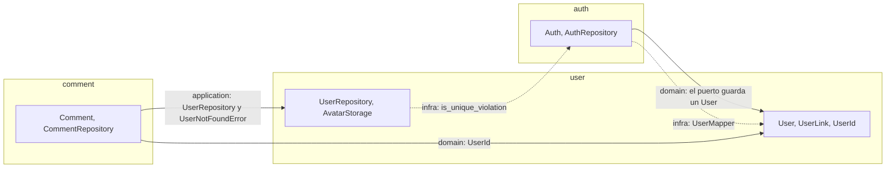

# Revisión pre-despliegue: DDD, TDD y UX/UI

- **Fecha:** 23/09/2026
- **Commit revisado:** `3668581b` (rama `main`)
- **Alcance:** backend (FastAPI, Python 3.13), frontend (Next.js 16.3.4, React 19.2.8), esquema de Supabase (`supabase/migrations/` y `backend/db/`), Docker y tests.
- **Documento relacionado:** [`ARCHITECTURE_AUDIT.md`](./ARCHITECTURE_AUDIT.md) (12/09/2026).

La auditoría del 12/09 se centró en autenticación y seguridad. Este documento no la repite: parte del estado actual del código, comprueba qué quedó realmente resuelto de aquel backlog y revisa todo lo que se agregó después (perfil, links, avatar, comentarios y perfil público), con foco en lo que hace falta para desplegar.

**Convenciones.** Las rutas son relativas a la raíz del repositorio y los números de línea corresponden al commit revisado. Lo marcado como **[verificado]** se comprobó ejecutando código, tests o requests; el resto sale de leer el código, y cuando algo es una deducción se indica.

## Índice

1. [Resumen ejecutivo](#1-resumen-ejecutivo)
2. [Cómo se verificó](#2-cómo-se-verificó)
3. [Estado del backlog anterior](#3-estado-del-backlog-anterior)
4. [Bloqueantes de despliegue (P0)](#4-bloqueantes-de-despliegue-p0)
5. [DDD en el backend](#5-ddd-en-el-backend)
6. [Arquitectura del frontend](#6-arquitectura-del-frontend)
7. [TDD en el backend](#7-tdd-en-el-backend)
8. [TDD en el frontend](#8-tdd-en-el-frontend)
9. [UX/UI](#9-uxui)
10. [Operación y despliegue](#10-operación-y-despliegue)
11. [Plan de trabajo por fases](#11-plan-de-trabajo-por-fases)
12. [Checklist final "listo para desplegar"](#12-checklist-final-listo-para-desplegar)

---

## 1. Resumen ejecutivo

**Veredicto: todavía no está listo para producción, pero le falta poco y no hace falta reescribir nada.**

La base es buena y conviene protegerla. La arquitectura en capas por contexto es real y se respeta. El flujo de identidad quedó bien resuelto después de la auditoría anterior: Supabase autentica, FastAPI valida el JWT contra JWKS y aprovisiona de forma idempotente. Los errores se traducen a HTTP en un único lugar. Y hay 316 tests unitarios que corren en un segundo y usan fakes en lugar de mocks.

Lo que falta se concentra en tres problemas:

1. **Las reglas del negocio viven en el lugar equivocado, o en varios a la vez.** La regla central del producto ("el nombre de usuario es la URL pública: único, en minúsculas y sin espacios") solo existe en el formulario de onboarding. El backend acepta `"Luna Reyes"`, `"login"` o un nombre hecho de emojis; el formulario de edición de perfil también; y la base que crean las migraciones ni siquiera tiene el índice único. Lo mismo pasa, en menor medida, con los dominios de los links, los límites (6 links, 2 MB, 280 caracteres) y la política de contraseñas, que están duplicados y ya divergieron.
2. **La base de producción no sería igual a la de desarrollo, y se puede escribir en ella salteando el backend.** La tabla `comments`, sus policies y el índice único de `users.name` solo están en `backend/db/schema.sql`, no en `supabase/migrations/`. Además, los permisos del rol `authenticated` permiten que cualquier usuario logueado modifique su perfil y sus links directamente contra la API REST de Supabase, sin pasar por ninguna validación del dominio.
3. **La experiencia todavía tiene partes de prototipo a la vista.** Todos los perfiles públicos muestran un gráfico con 1.750 seguidores inventados. No se puede cerrar sesión ni recuperar la contraseña. El título de la pestaña es "Create Next App". Un usuario inexistente responde 200. Y subir una foto de entre 1 y 2 MB rompe el onboarding.

Ninguno de estos arreglos es grande: casi todos son locales y varios consisten en **borrar** código.

### Bloqueantes, en el orden sugerido

| # | Bloqueante | Área | Esfuerzo |
|---|---|---|---|
| [4.1](#41-las-migraciones-no-crean-la-base-que-usa-el-código-verificado) | Las migraciones no crean `comments`, sus policies ni el índice único de `users.name` | Persistencia | S |
| [4.2](#42-los-permisos-de-authenticated-permiten-saltear-el-dominio) | Permisos de escritura de `authenticated` que permiten saltear el dominio | Persistencia, seguridad | S |
| [4.3](#43-la-regla-del-nombre-de-usuario-no-está-en-el-dominio-verificado) | La regla del nombre de usuario solo existe en el onboarding del frontend | DDD back y front | M |
| [4.4](#44-subir-un-avatar-de-más-de-1-mb-falla-y-deja-el-formulario-bloqueado) | Subir un avatar de más de 1 MB falla y deja el formulario bloqueado | Frontend | S |
| [4.5](#45-datos-inventados-en-perfiles-públicos) | Datos de seguidores inventados en perfiles reales | UX | XS |
| [4.6](#46-gestión-de-cuenta-incompleta-y-supabase-de-producción-sin-configurar) | Sin logout, recuperación de contraseña ni confirmación de email; Supabase de producción sin configurar | UX, auth | M |
| [4.7](#47-metadata-idioma-y-404) | Metadata, idioma y 404 (título por defecto, `lang="en"`, sin Open Graph, 404 que responde 200) | UX, SEO | S |
| [4.8](#48-sin-ci-y-main-ya-tiene-errores) | Sin CI; `main` ya tiene errores de ruff, mypy y ESLint | TDD | S |

Esfuerzo: XS = menos de 1 hora; S = hasta medio día; M = 1 o 2 días; L = más de 2 días.

### Lo que está bien y conviene no tocar

- **Flujo de identidad.** Supabase maneja credenciales, sesiones y OAuth; el backend valida el JWT (`backend/api/dependencies/auth.py`) y aprovisiona con el RPC transaccional `create_user_and_auth`.
- **Traducción de errores centralizada** en `backend/controller/error_handlers.py`, con la jerarquía `DomainError`, `ApplicationError` e `InfrastructureError`.
- **Tests de Application con fakes** (`FakeUserRepo`, `FakeCommentRepo`, `FakeAvatarStorage`) que verifican estado en vez de llamadas, y **tests de contrato HTTP** con `TestClient` y `dependency_overrides`.
- **Mappers en Infrastructure** (`UserMapper`, `CommentMapper`, `AuthMapper`): las entidades de User y Comment ya no conocen la forma de las filas.
- **Email cifrado en reposo** (AES-GCM) con búsqueda por HMAC.
- **Frontend organizado por features**, con componentes que ya cuidan la accesibilidad: `Carousel` marca como `inert` las slides ocultas; `Drawer` tiene `role="dialog"`, cierra con Escape y devuelve el foco; se respeta `prefers-reduced-motion`; y `Chart` incluye una tabla alternativa para lectores de pantalla.

---

## 2. Cómo se verificó

| Comprobación | Resultado |
|---|---|
| `uv run pytest tests/unit` | 316 tests pasan en 1,06 s |
| `uv run ruff check .` | 3 errores (orden de imports) |
| `uv run mypy .` | 1 error en `backend/controller/user_route.py:31` |
| Script que construye los Value Objects con entradas límite | 11 comportamientos incorrectos (sección [5.3](#53-value-objects-verificado)) |
| Clasificación de hosts de links (`UserLinkType.from_host`) | `open.spotify.com`, `twitter.com` y `fb.com` caen en `default` (sección [5.4](#54-agregados)) |
| Requests al backend levantado con `docker compose` | `GET /users/id/not-a-uuid/comments` responde **500**; `/docs` y `/openapi.json` son públicos |
| Logs del contenedor del backend | Solo `infrastructure_error` más el traceback; `request_id`, `path` y `status_code` no aparecen |
| `tsc --noEmit` (frontend) | Sin errores |
| `eslint .` (frontend) | 9 errores y 6 warnings |
| `next build` | Compila (Next 16 ya no ejecuta ESLint durante el build) |
| Tests del frontend | No existen: no hay runner instalado |
| Contraste de los tokens de color (fórmula WCAG 2.x) | 6 combinaciones por debajo de AA (sección [9.4](#94-accesibilidad-wcag-22-aa)) |
| Documentación de Next 16 incluida en `frontend/node_modules/next/dist/docs/` | Límite de 1 MB en Server Actions, `updateTag`, guías de testing, CSP y self-hosting |
| CI | No existe |

---

## 3. Estado del backlog anterior

Se usa la numeración del backlog anotado al final de `ARCHITECTURE_AUDIT.md`. Solo se listan los ítems cuyo estado real difiere de cómo están marcados.

<!-- todo -->

| Ítem | Marcado como | Estado real | Evidencia |
|---|---|---|---|
| 5. Restaurar verificación de email | "ya está hecho" | **Parcial.** Se eliminó `email_confirm: True`, pero el flujo de confirmación no existe: las confirmaciones están desactivadas, `signUp` no pasa `emailRedirectTo` y no hay ruta que procese el enlace del email | `supabase/config.toml:223`, `frontend/features/register/action/register-credential-action.ts:28` |
| 6. Reparar Value Objects | Hecho | **Parcial.** `UUID` ya valida, pero `AuthId` no; los VOs basados en `String` son mutables; el orden entre normalizar y validar es inconsistente | Sección [5.3](#53-value-objects-verificado) |
| 12. Response schemas y no exponer `auth.users.id` | Hecho | **Regresión.** Las URLs públicas de avatar contienen el `auth_id`: `avatars/{auth_id}/avatar.png` | `backend/core/user/infrastructure/avatar_supabase_storage.py:21` |
| 16. Tests de integración del repositorio | Hecho | **Parcial.** Solo existen para `AuthSupabaseRepo`. `UserSupabaseRepo`, `CommentSupabaseRepo` y `AvatarSupabaseStorage` no tienen ninguno | Sección [7.2](#72-brechas) |
| 19. Mover invariantes al dominio | Hecho | **Parcial.** La invariante más importante del producto, el formato del usuario, no está en el dominio | Sección [4.3](#43-la-regla-del-nombre-de-usuario-no-está-en-el-dominio-verificado) |
| 24. Migraciones | "todavía no" | **Parcial, con drift.** Existe `supabase/migrations/`, pero faltan `comments` y el índice único de `users.name`; `backend/db/schema.sql` sigue empezando con `DROP TABLE` | Sección [4.1](#41-las-migraciones-no-crean-la-base-que-usa-el-código-verificado) |
| 26. Logging estructurado | Hecho | **Parcial.** Los campos `extra` se pierden porque no hay handler ni formatter configurado [verificado en los logs] | `backend/controller/error_handlers.py:24` |
| 28. Mejorar herramientas Python | Hecho | **Instaladas, pero con errores**: 3 de ruff y 1 de mypy en `main` | Sección [4.8](#48-sin-ci-y-main-ya-tiene-errores) |
| 29. Corregir Docker | Hecho | **Parcial.** Ya no usa `--reload`, pero la imagen de producción corre como root, con un único proceso y sin `HEALTHCHECK` | `backend/Dockerfile:18-23` |
| 30. Limpieza estructural | Pendiente | Pendiente: `crypto_setings.py`, `backend/README.md` vacío, VOs sin agrupar | — |
| 31. CI | Pendiente | Pendiente | — |

---


# BACKLOG 
---------------------------

## 4. Bloqueantes de despliegue (P0)

Cada bloqueante incluye el test que conviene escribir **antes** del arreglo, para verlo fallar y asegurar que el problema no vuelva.

###  4.1 Las migraciones no crean la base que usa el código [verificado]

`supabase/migrations/` tiene tres archivos: `20260915120000_init.sql`, `20260922120000_user_links.sql` y `20260922140000_avatars_bucket.sql`. Estas piezas solo existen en `backend/db/schema.sql`:

- El índice único `users_name_unique` sobre `public.users (name)` (`schema.sql:43-45`).
- La tabla `public.comments` y sus índices (`schema.sql:122-139`).
- El RLS, los grants y las cuatro policies de `comments` (`schema.sql:221-236` y `337-390`).

Si producción se crea con `supabase db push`, que es lo esperable, **todos los endpoints de comentarios responden 500** y **dos usuarios pueden quedarse con el mismo nombre**. `UpdateUser` comprueba la disponibilidad y después guarda (check-then-act, `backend/core/user/application/update_user.py:32-34`), así que la única garantía real de unicidad ante dos requests simultáneos es el índice, y ese índice no existe.

El drift viene de tener cuatro fuentes de verdad del esquema: las migraciones, `schema.sql`, `enable_rls.sql` e `idempotent_create_user_and_auth.sql`.

**Arreglo**

1. Una migración nueva con lo que falta: `comments` completo y el índice único, idealmente sobre `lower(name)` (ver [4.3](#43-la-regla-del-nombre-de-usuario-no-está-en-el-dominio-verificado)).
2. Borrar `backend/db/*.sql`, o moverlos a `docs/` como referencia histórica. `supabase/migrations/` pasa a ser la única fuente de verdad.
3. En CI, correr `supabase db reset` antes de los tests de integración, para que un drift así no vuelva a pasar desapercibido.

**Test que debe fallar antes del arreglo:** integración de `CommentSupabaseRepo` (crear y listar) contra una base recreada con `supabase db reset`. Hoy falla porque la tabla no existe.

### 4.2 Los permisos de `authenticated` permiten saltear el dominio

Todas las escrituras de la aplicación pasan por FastAPI, que usa la `service_role`. Aun así, las migraciones le dan al rol `authenticated`:

- `SELECT, UPDATE` sobre `public.users` y `public.auth` (`supabase/migrations/20260915120000_init.sql:126-127`), con policies que permiten al dueño actualizar su fila (`:141-171`).
- `SELECT, INSERT, UPDATE, DELETE` sobre `public.user_links` (`20260922120000_user_links.sql:42`), con policies equivalentes (`:44-95`).
- `SELECT, INSERT, UPDATE, DELETE` sobre `public.comments` (`backend/db/schema.sql:236`).
- `INSERT, UPDATE, DELETE` sobre su propia carpeta del bucket `avatars` (`20260922140000_avatars_bucket.sql:25-56`).

La anon key es pública por diseño (se incrusta en el bundle como `NEXT_PUBLIC_SUPABASE_ANON_KEY`) y cada usuario tiene su propio access token en el navegador. Con esas dos cosas, cualquier usuario logueado puede escribir directamente en la API REST de Supabase:

```http
POST https://<proyecto>.supabase.co/rest/v1/user_links
apikey: <anon key>
Authorization: Bearer <access token del propio usuario>
Content-Type: application/json

{"id": "<uuid>", "user_id": "<su user_id>", "type": "instagram",
 "url": "https://sitio-de-phishing.example", "sort_index": 0}
```

RLS lo permite porque la fila es suya, y la base no valida el host. Resultado: el ícono de Instagram de su perfil público apunta a un sitio de phishing, algo que `UserLink` impide cuando el cambio pasa por la API. De la misma forma puede guardar cualquier texto en `users.name`, cualquier URL en `users.avatar_url`, y modificar en `public.auth` los campos que el backend usa para aprovisionar (`provider`, `provider_id`, `email_hmac`). Esto se deduce de los grants y las policies; los tests propuestos abajo lo confirman.

**Arreglo:** mínimo privilegio. Hoy ningún cliente habla con PostgREST ni con Storage directamente (el navegador solo usa Supabase Auth), así que `authenticated` no necesita escribir nada:

```sql
REVOKE INSERT, UPDATE, DELETE
  ON public.users, public.auth, public.user_links, public.comments
  FROM authenticated;

DROP POLICY IF EXISTS avatars_select_public ON storage.objects;
DROP POLICY IF EXISTS avatars_insert_own    ON storage.objects;
DROP POLICY IF EXISTS avatars_update_own    ON storage.objects;
DROP POLICY IF EXISTS avatars_delete_own    ON storage.objects;
```

Conviene borrar también las policies de escritura que quedan sin grant, para que el esquema no sugiera un acceso que no existe. Como defensa en profundidad, las invariantes críticas pueden reflejarse además en constraints (ver [4.3](#43-la-regla-del-nombre-de-usuario-no-está-en-el-dominio-verificado) y [5.8](#58-persistencia)). Las reglas siguen siendo del dominio; la base solo impide que entre basura por otra vía.

**Tests que deben fallar antes del arreglo:** extender `backend/tests/integration/test_rls.py` con "un usuario autenticado no puede insertar en `user_links`", "no puede actualizar `users.name`" y "no puede subir archivos a `avatars`".


### ✅  4.3 La regla del nombre de usuario no está en el dominio [verificado]

El nombre de usuario es la URL pública (`/[name]`). Es la regla central del producto y hoy está repartida así:

| Lugar | Qué valida |
|---|---|
| `frontend/features/start/component/start-form.tsx:34-40` (`sanitizeName`, onboarding) | Minúsculas, caracteres `[a-z0-9._-]`, máximo 50 |
| `frontend/features/start/action/check-name-action.ts:13` | Pasa a minúsculas antes de consultar disponibilidad |
| `frontend/features/tree/component/perfil/perfil-form.tsx:225-237` (editar perfil) | Nada: texto libre con `autoComplete="name"` |
| `backend/core/user/domain/user_name.py:16-24` | Solo que el largo esté entre 1 y 50 |
| Base de datos creada por las migraciones | Nada, ni siquiera unicidad |

Construyendo el VO directamente: `UserName("login")`, `UserName("a b/c?#")` y un nombre hecho solo de emojis se aceptan, y `UserName("Fab") == UserName("fab")` es `False`. Los propios tests de la API usan `"Luna Reyes"` como nombre de usuario (`backend/tests/unit/api/test_user_route.py:43`).

Consecuencias:

- Desde "Editar perfil" cualquiera puede renombrarse a `Luna Reyes`, y su URL pasa a ser `/Luna%20Reyes`. Como la búsqueda distingue mayúsculas (`backend/core/user/infrastructure/user_supabase_repo.py:47-48`), `luna` y `Luna` pueden ser dos perfiles distintos, lo que facilita suplantaciones.
- Los nombres que coinciden con rutas de la app (`login`, `register`, `dashboard`, `first`) crean perfiles inalcanzables, porque en Next las rutas estáticas tienen prioridad sobre `[name]`. Como `sanitizeName` permite puntos, lo mismo pasará con `robots.txt`, `sitemap.xml` o `favicon.ico` en cuanto existan.
- Cambiar el nombre rompe en silencio todos los enlaces ya compartidos.

**Arreglo:** que el VO sea el dueño de la regla (normalizar, luego validar) y separar el usuario del nombre visible ([5.4](#54-agregados)):

```python
@dataclass(frozen=True)
class Username:
    value: str

    PATTERN: ClassVar[re.Pattern[str]] = re.compile(r"^[a-z0-9][a-z0-9._-]{1,28}[a-z0-9]$")
    RESERVED: ClassVar[frozenset[str]] = frozenset({
        "admin", "api", "auth", "dashboard", "first", "login", "register",
        "settings", "robots.txt", "sitemap.xml", "favicon.ico",
    })

    def __post_init__(self) -> None:
        if not isinstance(self.value, str):
            raise InvalidUsernameError("El usuario es obligatorio")
        normalized = self.value.strip().lower()
        if not self.PATTERN.fullmatch(normalized) or normalized in self.RESERVED:
            raise InvalidUsernameError(
                "Usá entre 3 y 30 letras minúsculas, números, puntos, guiones o guiones bajos"
            )
        object.__setattr__(self, "value", normalized)
```

El largo de 3 a 30 es una propuesta; hoy el máximo es 50.

Después:

- Migración con `CREATE UNIQUE INDEX ... ON public.users (lower(name))` y un `CHECK` con el mismo patrón, limpiando antes los datos que no lo cumplan.
- El frontend deja de tener su propia versión de la regla y muestra el error del backend junto al campo, usando códigos de error ([5.7](#57-presentación-api)).
- El formulario de edición advierte que cambiar el usuario cambia la URL pública.

**Tests que deben fallar antes del arreglo:**

- `Username("Luna Reyes")`, `Username("login")` y `Username("\U0001F3B8\U0001F3B8")` lanzan `InvalidUsernameError`.
- `Username("  Luna ")` normaliza a `"luna"`.
- `PATCH /users/{auth_id}` con `name: "Login"` responde 400.
- Integración: `luna` y `Luna` no pueden coexistir.

###  ✅ 4.4 Subir un avatar de más de 1 MB falla y deja el formulario bloqueado

El avatar se sube con la Server Action `uploadAvatarAction(photoFile)`: `start-form.tsx:182` en el onboarding y `perfil-form.tsx:158` al editar. Según la documentación de Next 16 incluida en el repo (`frontend/node_modules/next/dist/docs/01-app/03-api-reference/05-config/01-next-config-js/serverActions.md`), **el body de una Server Action tiene un límite de 1 MB por defecto**, y `frontend/next.config.ts` no lo cambia. El cliente y el backend permiten 2 MB, así que una foto de 1,5 MB, habitual si sale del celular, se rechaza antes de llegar al código de la acción.

Además, ni `finish()` (`start-form.tsx:170-208`) ni el submit de `perfil-form.tsx` (`:152-176`) envuelven los `await` en `try/catch`. Si la llamada lanza, `setSaving(false)` no se ejecuta y el botón queda en "Guardando..." sin ningún mensaje. Este comportamiento se deduce del código y de la documentación; el test E2E propuesto lo confirma.

**Arreglo**

- Inmediato: `experimental.serverActions.bodySizeLimit: "3mb"` en `next.config.ts` (con margen para el overhead del multipart, como indica la documentación) y `try/finally` en ambos formularios.
- Mejor: redimensionar en el navegador antes de subir (canvas a WebP de unos 1024 px). Reduce el peso unas diez veces, mejora el LCP del perfil público ([9.6](#96-rendimiento-percibido)) y elimina el problema de raíz.

**Test que debe fallar antes del arreglo:** E2E con Playwright, "subir un JPEG de 1,5 MB en el onboarding termina en `/dashboard/tree` con la foto visible" (ejemplo en [8.5](#85-ejemplos)).

### 4.5 Datos inventados en perfiles públicos (todavía en proceso )

`frontend/features/tree/component/socials/socials.tsx:35-44` define una serie fija de "seguidores por semana", de 1.240 a 1.750 con "+140 esta semana", que se muestra **en todos los perfiles, incluidos los públicos**. `SocialOptions` (`:73-81`) dibuja tres elementos de lista vacíos.

Mostrar métricas falsas como si fueran del artista es un problema de confianza desde el primer usuario real. **Arreglo:** ocultar la pestaña "Redes" hasta que exista una integración real, o mostrar un estado vacío honesto ("Próximamente").

### ✅ 4.6 Gestión de cuenta incompleta y Supabase de producción sin configurar

No hay ninguna llamada a `signOut` en el frontend [verificado]. Tampoco existe "Olvidé mi contraseña", ni una ruta que procese el enlace de confirmación del email, ni forma de borrar la cuenta o una publicación.

Lo mínimo para producción:

- **Cerrar sesión:** una Server Action con `supabase.auth.signOut()` y `redirect("/login")`, accesible desde el dashboard.
- **Recuperar contraseña:** `/forgot-password` (con `resetPasswordForEmail` y `redirectTo`) y `/reset-password` (con `updateUser({ password })`).
- **Confirmación de email:** `emailRedirectTo` en `signUp` y un route handler `/auth/confirm` que llame a `verifyOtp({ type, token_hash })`, aprovisione con `POST /auth/session` y redirija al onboarding. Sin esto, al activar las confirmaciones el enlace del email no tiene quién lo procese: el usuario llega a `/`, que lo redirige a `/login` sin sesión y sin ningún mensaje.
- **Borrar la cuenta:** lo exige la mayoría de las leyes de protección de datos (por ejemplo, la Ley 25.326 en Argentina o el GDPR en la UE) y es una expectativa básica en un producto con perfiles públicos.

**Supabase de producción.** Se configura en el dashboard; `supabase/config.toml` solo aplica al entorno local.

- Confirmación de email activa (hoy `enable_confirmations = false`, `config.toml:223`).
- SMTP propio. El servicio de email incluido en Supabase está pensado para pruebas: tiene un límite de envíos muy bajo y solo entrega a direcciones del equipo del proyecto.
- Política de contraseñas igual a la del formulario. Hoy Supabase exige 6 caracteres sin requisitos (`config.toml:179-182`), mientras el formulario pide de 8 a 64 con mayúscula, minúscula y número (`frontend/lib/validation/auth.ts:16-37`). Quien llame a la API de Supabase directamente se saltea la regla.
- `site_url` y URLs de redirección del dominio real, incluidas `/auth/callback` y `/auth/confirm` (hoy apuntan a `127.0.0.1:3000`, `config.toml:157-160`).
- CAPTCHA (por ejemplo, Cloudflare Turnstile) en registro y login.
- Plantillas de email en español.
- Google OAuth publicado en producción, con enlaces a la política de privacidad y a los términos ([10.5](#105-datos-personales-y-páginas-legales)).

###  ✅ 4.7 Metadata, idioma y 404

- `frontend/app/layout.tsx:9-10`: `title: "Create Next App"` y `description: "Generated by create next app"`.
- `frontend/app/layout.tsx:15`: `<html lang="en">` con toda la interfaz en español. Los lectores de pantalla pronuncian el texto como si fuera inglés, el corrector del navegador marca todo como error y los buscadores reciben un idioma equivocado.
- No hay favicon propio, `robots.ts`, `sitemap.ts` ni imágenes Open Graph.
- `frontend/app/[name]/page.tsx` no define `generateMetadata`. El perfil público es lo que los artistas van a compartir en Instagram, WhatsApp o X, y hoy la vista previa sale sin título, descripción ni imagen.
- `frontend/features/tree/tree-view.tsx:11-13`: cualquier error (usuario inexistente, backend caído, timeout) muestra "Árbol vacío" con **HTTP 200**. Debería llamar a `notFound()` solo ante un 404 del backend y dejar que un `error.tsx` maneje el resto con un botón para reintentar.
- No existen `not-found.tsx`, `error.tsx`, `global-error.tsx` ni `loading.tsx` en ninguna ruta.
- `frontend/app/(public)/first/page.tsx` es una página de relleno pública ("Register Profile").

Ejemplo para el perfil público:

```tsx
// app/layout.tsx
export const metadata: Metadata = {
  title: { default: "Sello Nómada", template: "%s · Sello Nómada" },
  description: "Tu perfil de artista con todos tus links en un solo lugar.",
  metadataBase: new URL(process.env.NEXT_PUBLIC_SITE_URL!),
};

// app/[name]/page.tsx
export async function generateMetadata({ params }: PageProps<"/[name]">): Promise<Metadata> {
  const { name } = await params;
  const profile = await getPublicProfile(name); // misma función, cacheada, que usa la página
  if (!profile) return { title: "Perfil no encontrado" };
  return {
    title: `${profile.displayName} (@${profile.username})`,
    description: profile.description || `Los links de ${profile.displayName}`,
    openGraph: { images: profile.avatarUrl ? [profile.avatarUrl] : [] },
  };
}
```

### 4.8 Sin CI, y `main` ya tiene errores (más adelante cuando lleguemos al 10.4)

| Herramienta | Resultado en `main` |
|---|---|
| `ruff check` | 3 errores de orden de imports: `backend/controller/error_handlers.py`, `backend/core/auth/infrastructure/auth_supabase_repo.py` y `backend/tests/unit/comment/domain/test_comment_id.py` |
| `mypy` | 1 error: `backend/controller/user_route.py:31` arma `links` como lista de diccionarios en lugar de `UserLinkResponse` |
| `eslint` | 9 errores de `react-hooks/refs` y `react-hooks/set-state-in-effect` en `drawer.tsx`, `start-form.tsx` y `perfil-form.tsx`, y 6 warnings |

Los errores de ESLint no son cosméticos. El proyecto tiene `reactCompiler: true`, y esas reglas señalan patrones que rompen las reglas de React (por ejemplo, escribir `ref.current` durante el render, como en `start-form.tsx:69`). Con esos patrones el compilador omite la optimización del componente, y además son fuente de bugs sutiles con el renderizado concurrente. Como Next 16 ya no ejecuta ESLint en `next build`, hoy nada impide desplegarlos.

El pipeline mínimo propuesto está en [10.4](#104-cicd).

---

## 5. DDD en el backend

### ✅ 5.1 Mapa de contextos

Los tres contextos dependen de `shared` (no se dibuja). Las flechas muestran las dependencias entre contextos que existen hoy:



Observaciones:

- **`auth` persiste agregados de `user`.** `AuthRepository.save(user, auth)` (`backend/core/auth/domain/auth_repo.py:26`) guarda dos agregados en una llamada, y `AuthSupabaseRepo` usa el `UserMapper` de otro contexto. Es una decisión defendible, porque el RPC `create_user_and_auth` es la transacción, pero conviene hacerla explícita: el caso de uso es "aprovisionar identidad y perfil vacío", no "guardar un Auth". Nombrar el puerto así (por ejemplo `IdentityProvisioning`) documenta que es la única excepción a "un repositorio por agregado".
- **`comment` depende de la capa Application de `user`** (`backend/core/comment/application/create_comment.py:3-4` y `get_comments_by_user.py:3-4`): reutiliza `UserNotFoundError` y el `UserRepository` de otro contexto. Si Comment necesita resolver el autor, que lo haga con un puerto propio o recibiendo un `UserId` ya resuelto ([5.6](#56-casos-de-uso)).
- **`user` depende de la infraestructura de `auth`** para `is_unique_violation` (`user_supabase_repo.py:3`). Es un helper genérico de Postgres y pertenece a `core/shared/infrastructure/`.
- **`UserId` es, de hecho, el kernel compartido**: lo usan `auth`, `user` y `comment`. Moverlo a `core/shared/domain/` hace explícita esa dependencia, en lugar de que dos contextos importen el dominio de un tercero.

**Recomendación:** mover `UserId` e `is_unique_violation` a `shared`, y agregar contratos de `import-linter` ([5.9](#59-estructura-objetivo-y-guardas-de-arquitectura)) para que las dependencias entre contextos no crezcan sin que nadie lo decida.

###  ✅ 5.2 Lenguaje ubicuo (hacerlo alfinal)

El código, la interfaz y el producto usan palabras distintas para las mismas cosas, y a veces la misma palabra para cosas distintas:

| Concepto | Backend | Frontend | Interfaz | Propuesta |
|---|---|---|---|---|
| Página pública del artista | `User` | `tree`, `TreeViewPage` | "perfil", "Árbol vacío" | Perfil (`Profile`) |
| Identificador en la URL | `User.name` (`UserName`) | `name`, `sanitizeName` | "Nombre" | Usuario (`Username`) |
| Nombre que se muestra | No existe | Se muestra `name` | Título del perfil | Nombre visible (`DisplayName`) |
| Texto que publica el dueño | `Comment` | `Comment`, `DrawerComment` | "Comentarios", "Añadir comentario" | Publicación (`Post`), o redefinirlo como comentario de terceros |
| Identidad de Supabase | `Auth`, `auth_id` | `authId` | No aparece | Identidad (`Identity`) |

Dos de estas diferencias ya producen defectos:

1. **`Comment` no es un comentario.** `POST /users/{auth_id}/comments` exige que `auth_id` sea el del token (`backend/controller/comment_route.py:84`), y el frontend muestra cada comentario con el nombre y el avatar del dueño del perfil. Son publicaciones propias, no comentarios de terceros. Un visitante ve una pestaña "Comentarios" pero no puede comentar, y eso genera una expectativa falsa. Hay que decidirlo explícitamente:
   - Si son **publicaciones del artista**, renombrar a `Post` y "Publicaciones" en todas las capas.
   - Si la idea es que **otros usuarios comenten**, el modelo actual no puede representarlo. Hace falta un `author_id` distinto del `profile_id`, moderación (el dueño borra), reportes y rate limiting antes de habilitarlo.
2. **`name` mezcla usuario y nombre visible** ([5.4](#54-agregados)).

**Recomendación:** un glosario corto en `docs/`, usado como criterio de nombres en ambos proyectos.

###  ✅ 5.3 Value Objects [verificado]

Resultado de construir cada VO con entradas límite:

| Entrada | Hoy | Esperado | Causa |
|---|---|---|---|
| `AuthId("garbage")` | Se acepta | `InvalidUUIDError` | `auth_id.py` es un dataclass sin validación; no reutiliza `UUID` |
| `AuthProviderId("")` | Se acepta | Error de dominio | Sin validación |
| `Date.now().value.tzinfo` | `None` | `UTC` | `shared/domain/date.py:20` usa `datetime.now()` sin zona horaria |
| `UserName("login")`, `UserName("a b/c?#")` | Se aceptan | Error | Solo valida el largo ([4.3](#43-la-regla-del-nombre-de-usuario-no-está-en-el-dominio-verificado)) |
| `UserAvatar("https://otro-dominio.example/pixel.gif")` | Se acepta | Solo imágenes del bucket propio | `user_avatar.py:15-19` solo mira el prefijo |
| `UserDescription` con 10 espacios y 245 letras | Se rechaza | Válida: 245 caracteres útiles | Mide el largo antes del `strip()` (`user_description.py:18-20`) |
| `AuthEmail(" a@b.com")` | Se rechaza | `"a@b.com"` | Aplica la regex antes del `strip()` (`auth_email.py:16-18`) |
| `AuthEmail(123)` | `TypeError`, termina en 500 | `InvalidEmailError`, 400 | No valida el tipo antes de operar |
| `UserLinkUrl("https:// no es una url")`, `CommentLink("https://")` | Se aceptan | Error | Solo comprueban el prefijo `https://` (`user_link_url.py:28`, `comment_link.py:26`) |
| Asignar `email.value = "otro"` a un `AuthEmail` | Se puede mutar | Inmutable | `String` es `@dataclass` sin `frozen` (`shared/domain/string.py:6`) |
| `hash(UserName("x"))` | `TypeError: unhashable type` | Hasheable | Mismo motivo |

Problemas de fondo:

1. **Los VOs basados en `String` son mutables.** La inmutabilidad es lo que permite pasar un VO sin copiarlo y compararlo por valor con seguridad. Los tests mismos modifican estado interno, por ejemplo `user.name = UserName("luna")` en `backend/tests/unit/user/application/test_update_user.py:89`.
2. **El orden entre normalizar y validar es inconsistente.** `UserName` y `CommentText` normalizan primero; `UserDescription` y `AuthEmail` validan primero. Regla única: normalizar, validar y recién entonces asignar.
3. **Fechas sin zona horaria.** `Date.now()` produce un `datetime` sin offset que Postgres interpreta con la zona de la sesión. Funciona por casualidad porque el contenedor corre en UTC; con otro `TZ` (por ejemplo, el backend corriendo localmente en UTC-3), los `created_at` quedan corridos tres horas. Arreglo: `datetime.now(UTC)` y rechazar datetimes sin zona en `Date`.
4. **Validación de URLs por prefijo.** `UserLinkUrl`, `CommentLink` y `UserAvatar` repiten "empieza con `https://`". Conviene un VO compartido `HttpsUrl` que use `urlsplit` y exija esquema `https`, host no vacío y ausencia de espacios; los tres se construyen a partir de él.
5. **`UserAvatar` debería apuntar a algo que la aplicación controla.** Hoy acepta cualquier URL https: píxeles de seguimiento, imágenes enormes, dominios de terceros. Como el avatar siempre se sube al bucket propio, el dominio debería guardar la **ruta del objeto** (`<user_id>/<uuid>.webp`) y la URL pública derivarse en Infrastructure.

Código muerto en el dominio (sin referencias fuera de sus propios archivos y tests):

- `AuthPassword` (`backend/core/auth/domain/auth_password.py`): ninguna referencia y ningún test. El backend ya no ve contraseñas; la política vive en Supabase y en el formulario. Borrarlo.
- `User.add_link`, `remove_link`, `reorder_links` y `has_name` (`user.py:68-139`), y `get_all` en `AuthProvider` y `UserLinkType`: solo los usan los tests. Sobre los métodos de links, ver [5.4](#54-agregados).
- `AuthMethod.to_primitive` y `from_primitive` (`auth_method.py:39-50`): el mapeo de persistencia que se sacó de `Auth` y `User` sigue vivo en `AuthMethod`.

### ✅ 5.4 Agregados

**`User`**

- **Mezcla usuario y nombre visible.** El encabezado del perfil público muestra el usuario como `<h1>`, así que una artista se presenta como `lunareyes` en lugar de "Luna Reyes". Separarlo en dos VOs: `Username` (identificador único con la regla de [4.3](#43-la-regla-del-nombre-de-usuario-no-está-en-el-dominio-verificado)) y `DisplayName` (texto libre de 1 a 50 caracteres, con acentos y emojis). Es la corrección de modelado con más impacto en UX de todo el backend.
- **Encapsulamiento.** Es un `@dataclass` mutable con atributos públicos (`user.py:22`). Los cambios deberían pasar solo por métodos con intención (`rename`, `change_display_name`, `describe`, `change_avatar`, `replace_links`), y los tests deberían armar el estado con esos métodos o con un builder, no asignando atributos.
- **`UNSET` es semántica HTTP dentro del dominio.** `UNSET: Any = object()` (`user.py:19`) existe para distinguir "no enviado" de "enviado como null" en un PATCH. Eso es responsabilidad de Application: un `UpdateProfileCommand` con campos opcionales explícitos, y el agregado recibe operaciones concretas como `remove_avatar()` o `change_avatar(avatar)`.
- **Los links pierden su identidad en cada guardado.** `replace_links` (`user.py:83-97`) regenera todos los `UserLinkId` [verificado: el mismo link guardado dos veces recibe dos ids distintos]. Si más adelante se miden clics por link, se perderán en cada edición. Dos opciones: que `replace_links` conserve el id de los links que no cambiaron, o exponer como endpoints las operaciones granulares que **ya existen y están testeadas** (`add_link`, `remove_link`, `reorder_links`). La segunda también simplifica la UI de edición.
- **Clasificación de links divergente [verificado].** `UserLinkType.hosts()` no incluye `open.spotify.com` (el formato de los links de artista de Spotify), `twitter.com` ni `fb.com`, y los tres caen en `default`. El frontend sí los reconoce (`frontend/features/tree/component/social-link-icon.tsx:12-27`), pero usa el `type` que devuelve el backend, así que **un link de artista de Spotify se muestra con el ícono genérico**, justo para el público principal del producto. La clasificación es una regla de dominio: debe vivir solo en el backend, con un test por host, y el frontend debe confiar en `type`.
- **Faltan las redes de los músicos.** Los tipos soportados son YouTube, Instagram, Spotify, TikTok, Twitch, Kick, Facebook y X. No hay SoundCloud, Bandcamp ni Apple Music, que para una comunidad de músicos son tan importantes como Spotify.

**`Comment`**

- Correcto como agregado mínimo. Falta el ciclo de vida: borrar (con verificación de propiedad en el caso de uso) y, según la decisión de [5.2](#52-lenguaje-ubicuo), el autor.

**`Auth`**

- `email: AuthEmail | None = None` (`auth.py:18`), pero `__post_init__` lo exige (`:20-22`). El tipo miente: debería ser `email: AuthEmail`, sin valor por defecto.
- `AuthIdentity` (`auth_repo.py:17-21`) expone primitivos (`provider_id: str | None`, `email: str | None`) cuando los VOs ya existen.

### ✅ 5.4.2 Hacer el start para name user y display name

### ✅ 5.5 Repositorios y puertos

1. **La actualización del perfil no es atómica.** `UserSupabaseRepo.update_user` (`user_supabase_repo.py:50-92`) hace cuatro llamadas HTTP separadas: `UPDATE users`, `DELETE user_links`, `INSERT user_links` y un `SELECT` final. Si el `INSERT` falla después del `DELETE`, **el usuario pierde todos sus links**. Sumando las dos lecturas del caso de uso, un PATCH de perfil hace seis viajes a Supabase. Arreglo: una función Postgres `update_profile(p_user_id, p_name, ..., p_links jsonb)` llamada por RPC, igual que se hizo con `create_user_and_auth`.
2. **Los errores del contrato del puerto viven en Application.** `UserSupabaseRepo` lanza `UserNameAlreadyExistsError` importándolo de Application (`user_supabase_repo.py:4`), y `AvatarSupabaseStorage` importa `ALLOWED_AVATAR_TYPES` de Application (`avatar_supabase_storage.py:3`). En Auth ya se resolvió bien: `IdentityAlreadyExistsError` es parte del puerto y vive en Domain. Aplicar lo mismo: `UsernameAlreadyTakenError` en `core/user/domain/`.
3. **`update_user(...)` devuelve `User | None`**, donde `None` significa "no encontrado" y obliga a cada llamador a interpretarlo. Es preferible `save(user) -> None` que lance errores específicos.
4. **`AvatarStorage.upload(...)` devuelve una URL que el caso de uso no guarda.** El frontend la recibe y la reenvía después en el PATCH, y eso es lo que obliga a `UserAvatar` a aceptar cualquier URL. Mejor: `UploadAvatar` sube, guarda la ruta en el agregado y persiste, todo en el mismo caso de uso.
5. **Mensajes de error engañosos.** `_find_auth` lanza `AuthCreationError("Error al buscar el usuario")` en una búsqueda (`auth_supabase_repo.py:145-147` y `:155`). Separar un `AuthLookupError`.
6. **Fallos de descifrado sin traducir.** Si `EmailCrypto.decrypt` falla (clave rotada o dato corrupto), `cryptography` lanza `InvalidTag`, que no es `InfrastructureError` y termina en un 500 sin formato JSON ni log propio.

### ✅ 5.6 Casos de uso

1. **Todos resuelven `auth_id` a `User` por su cuenta.** `GetUser`, `UpdateUser`, `UploadAvatar` y `CreateComment` empiezan igual: `get_user_by_auth_id` y, si no existe, `UserNotFoundError`. Opciones, de menor a mayor esfuerzo:
   - Una dependencia de FastAPI `get_current_profile` que resuelve el `User` una sola vez y lo pasa al caso de uso.
   - Un claim `user_id` en el JWT con el [Custom Access Token Hook](https://supabase.com/docs/guides/auth/auth-hooks/custom-access-token-hook) de Supabase (`config.toml:281` ya tiene la sección comentada). Elimina una consulta por request y el acoplamiento de Comment con el repositorio de User.
2. **Aprovisionamiento triplicado.** `EnsureUserProvisioned`, `RegisterWithEmail` y `ProvisionOAuthUser` repiten las mismas validaciones: email vacío, `find_by_id`, `find_by_email`, crear el usuario vacío y traducir `IdentityAlreadyExistsError`. Además, `RegisterWithEmail` ya no registra nada, porque eso lo hace Supabase: solo aprovisiona. Un único `ProvisionIdentity` con una rama por proveedor elimina unas 60 líneas y un nombre engañoso.
3. **Validar ids en el borde.** `GetCommentsByUser` con `"not-a-uuid"` llega hasta Postgres, que responde `22P02`, y el cliente recibe un 500 [verificado con `curl`]. Construir `UserId(user_id)` al inicio del caso de uso lo convierte en un 400, y tipar el parámetro de ruta como `UUID` lo convierte en un 422 antes de entrar.
4. **Chequeo inalcanzable.** En `UpdateUser`, `if user.name is None: raise UserNotFoundError` (`update_user.py:26-27`) nunca se cumple, porque el nombre siempre se asigna antes; y si se cumpliera, el error diría otra cosa.
5. **Validación del archivo.** `UploadAvatar` confía en el `content_type` que declara el cliente (`upload_avatar.py:35-37`); los propios tests suben `b"png-bytes"` como PNG y pasan. Hay que validar los *magic bytes* y, mejor aún, recodificar la imagen con Pillow a WebP de tamaño acotado. Eso normaliza el formato, reduce el peso y **elimina los metadatos EXIF, que en fotos de celular incluyen la ubicación GPS**.
6. **Paginación por offset.** `GetCommentsByUser` pagina con `limit` y `offset`; si se publica algo mientras alguien carga la página siguiente, aparecen duplicados. Para un feed conviene paginar por cursor (`created_at`, `id`).
7. **Casos de uso que faltan para producción:** `DeleteComment` (o `DeletePost`), `DeleteAccount`, `ChangeUsername` con la regla de [4.3](#43-la-regla-del-nombre-de-usuario-no-está-en-el-dominio-verificado), y un modelo de lectura `GetPublicProfile` que devuelva el perfil y la primera página de publicaciones en una sola llamada ([9.6](#96-rendimiento-percibido)).

### ✅ 5.7 Presentación (API)

1. **Diseño de rutas.** Hoy conviven `/users/{auth_id}`, `/users/name/{username}`, `/users/id/{user_id}/comments` y `/users/{auth_id}/comments`: tres identificadores distintos en la misma posición. Además, todas las rutas con `{auth_id}` repiten `if auth_id != current_user.auth_id: raise UserNotFoundError` (`user_route.py:80`, `:110`, `:156` y `comment_route.py:84`), señal de que el parámetro sobra porque el token ya dice quién es. Propuesta:

   | Hoy | Propuesta |
   |---|---|
   | `GET /users/{auth_id}` | `GET /me` |
   | `PATCH /users/{auth_id}` | `PATCH /me` |
   | `POST /users/{auth_id}/avatar` | `PUT /me/avatar` |
   | `POST /users/{auth_id}/comments` | `POST /me/posts` |
   | `GET /users/name/{username}` | `GET /profiles/{username}` |
   | `GET /users/id/{user_id}/comments` | `GET /profiles/{username}/posts` |

2. **Tipos en los schemas.** `UserResponse.links` se arma con diccionarios (el error de mypy), `CommentResponse.created_at` es `str` en vez de `datetime`, y los parámetros de ruta son `str` en vez de `UUID`. Tiparlos da validación automática y un OpenAPI preciso, que después sirve para generar los tipos del frontend ([8.4](#84-contrato-con-el-backend-tipos-generados-desde-openapi)).
3. **Códigos de error estables.** Hoy la respuesta es `{"detail": "Ese nombre ya está en uso"}`: el frontend no puede saber qué campo marcar, y algunos mensajes salen en inglés (`"Invalid email address"`, `"Invalid UUID: ..."` y todos los 422 de Pydantic). Propuesta, con el `code` derivado del tipo de excepción en `error_handlers.py`:

   ```json
   { "code": "USERNAME_TAKEN", "field": "name", "detail": "Ese nombre ya está en uso", "request_id": "..." }
   ```

4. **Handler global para excepciones inesperadas.** Un `TypeError` o un `InvalidTag` terminan en la respuesta por defecto de Starlette: texto plano, sin `X-Request-ID` y sin pasar por el logger propio.
5. **El archivo se lee entero en memoria.** `file.file.read()` (`user_route.py:159`) lee todo antes de validar el tamaño. Conviene leer como máximo `MAX_AVATAR_BYTES + 1` bytes y cortar ahí, y además poner un límite de body en el proxy reverso.
6. **Documentación pública.** `/docs` y `/openapi.json` responden 200 [verificado]. En producción: `FastAPI(docs_url=None, redoc_url=None, openapi_url=None)`, o protegerlos.
7. **Logging.** Configurar `logging` al arrancar, con un formatter JSON que incluya los campos `extra` (hoy se pierden), y filtrar el access log de `/health`, que con el healthcheck cada 10 segundos ocupa casi todo el log.
8. **Rate limiting.** No hay límites en la creación de comentarios, la actualización del perfil ni la subida de avatares. Alcanza con `slowapi` por usuario autenticado, o con el límite del proxy o CDN.

###  ✅ 5.8 Persistencia

- **Una sola fuente de verdad:** `supabase/migrations/` ([4.1](#41-las-migraciones-no-crean-la-base-que-usa-el-código-verificado)).
- **Mínimo privilegio** para `authenticated` ([4.2](#42-los-permisos-de-authenticated-permiten-saltear-el-dominio)).
- **Invariantes críticas también como constraints**, como defensa en profundidad y no como reemplazo del dominio: formato y unicidad sin distinguir mayúsculas de `users.name`, y `https://` obligatorio en `user_links.url`, `comments.link` y `users.avatar_url`.
- **Storage:**
  - La policy `avatars_select_public` (`20260922140000_avatars_bucket.sql:18-22`) da `SELECT` sobre `storage.objects` al rol `public`. En un bucket público no hace falta para servir las URLs públicas, y permite **listar** todos los objetos del bucket. Como la ruta es `{auth_id}/avatar.ext`, listar el bucket enumera los ids de identidad de todos los usuarios. Quitarla y confirmarlo con el Security Advisor de Supabase.
  - La ruta es fija por usuario (`{auth_id}/avatar.{ext}`) y se sirve con `cache-control: 3600` (`avatar_supabase_storage.py:21` y `:30`). Después de cambiar la foto, navegadores y CDN pueden seguir mostrando la anterior hasta una hora; y si cambia la extensión, el archivo viejo queda huérfano. Usar un nombre nuevo en cada subida (`{user_id}/{uuid}.webp`) y borrar el anterior en el mismo caso de uso.
- **Dos definiciones del bucket:** `config.toml:119-122` y la migración. Dejar solo la migración.

### ✅ 5.9 Estructura objetivo y guardas de arquitectura

Cambios mínimos sobre lo que ya existe:

```
backend/
  api/                          # hoy repartido entre controller/ y api/
    dependencies/               # auth.py, container.py, current_profile.py (nuevo)
    routers/                    # me.py, profiles.py, session.py, health.py
    schemas/
    errors.py                   # hoy controller/error_handlers.py
    logging.py                  # nuevo: configuración de logging
  core/
    shared/
      domain/                   # user_id.py, https_url.py, date.py, uuid.py, errores base
      infrastructure/           # postgres_error.py, cliente de Supabase
    identity/                   # hoy auth/
    profile/                    # hoy user/
    post/                       # hoy comment/ (o se mantiene, según 5.2)
supabase/migrations/            # única fuente de verdad del esquema
```

El test actual `backend/tests/unit/auth/application/test_layer_dependencies.py` solo cubre la regla Application → Infrastructure. Para que el resto de las reglas no dependa de la memoria de nadie, conviene reemplazarlo por contratos de `import-linter`:

```toml
[tool.importlinter]
root_packages = ["core"]
include_external_packages = true

[[tool.importlinter.contracts]]
name = "Capas dentro de cada contexto"
type = "layers"
containers = ["core.auth", "core.user", "core.comment"]
layers = ["infrastructure", "application", "domain"]

[[tool.importlinter.contracts]]
name = "Domain y Application no dependen de frameworks"
type = "forbidden"
source_modules = [
    "core.auth.domain", "core.auth.application",
    "core.user.domain", "core.user.application",
    "core.comment.domain", "core.comment.application",
]
forbidden_modules = ["fastapi", "starlette", "pydantic_settings", "supabase", "postgrest"]

[[tool.importlinter.contracts]]
name = "Contextos independientes: solo comparten core.shared"
type = "independence"
modules = ["core.auth", "core.user", "core.comment"]
ignore_imports = [
    # Excepción aceptada: el aprovisionamiento crea Auth y User en la misma transacción.
    "core.auth.domain.auth_repo -> core.user.domain.user",
]
```

Hoy el contrato de independencia fallaría, y eso es lo buscado: vuelve visibles los acoplamientos de [5.1](#51-mapa-de-contextos) y obliga a aceptarlos o eliminarlos de forma explícita.

---

## 6. Arquitectura del frontend

### 6.1 Reglas de negocio duplicadas

| Regla | Dónde se repite en el frontend | Estado respecto del backend |
|---|---|---|
| Máximo 6 links | `start-form.tsx:23`, `perfil-form.tsx:12`, `update-user-action.ts:10`, `tree.tsx:220` | Igual |
| Avatar de hasta 2 MB en JPEG, PNG o WebP | `start-form.tsx:26-27`, `perfil-form.tsx:13-14`, `upload-avatar-action.ts:9-10` | Igual, pero el límite efectivo es 1 MB ([4.4](#44-subir-un-avatar-de-más-de-1-mb-falla-y-deja-el-formulario-bloqueado)) |
| Texto de comentario de hasta 280 caracteres | `comment-form.tsx:80`, `create-comment-action.ts:10` | Igual |
| Descripción de hasta 250, nombre de hasta 50 | `start-form.tsx:21-22`, `perfil-form.tsx:10-11` | Igual |
| Formato del usuario | Solo `start-form.tsx:34-40` | **Distinto** del backend y del formulario de edición |
| Hosts de cada red social | `social-link-icon.tsx:12-27` | **Distinto** (Spotify, X, Facebook) |
| Política de contraseña | `lib/validation/auth.ts:16-37` | **Distinta** de Supabase |

Criterio recomendado: el frontend valida la **forma** para dar feedback inmediato (campo vacío, largo máximo, formato de URL) con constantes de un único módulo (`lib/domain-limits.ts`), y el backend es la única autoridad sobre las **reglas de negocio**, devolviendo códigos de error que el frontend muestra junto al campo. Con tipos generados desde OpenAPI ([8.4](#84-contrato-con-el-backend-tipos-generados-desde-openapi)), cualquier divergencia en el contrato aparece al compilar.

### 6.2 Acceso a la API

`frontend/lib/fetch_data.ts` concentra el cliente HTTP, todos los DTOs y todas las funciones de todos los contextos. Además:

- `API_URL` cae en silencio a `http://localhost:8000` si falta `BACKEND_URL` (`fetch_data.ts:1`). En producción, un error de configuración se vería como "No se pudo cargar tu perfil" en lugar de fallar al arrancar.
- No hay timeout: si el backend se cuelga, el render del servidor también. Usar `AbortSignal.timeout(...)`.
- Los errores de red devuelven `error.message` a la interfaz (`fetch_data.ts:229`), así que el usuario puede ver textos como "fetch failed".
- Dos componentes cliente (`login-form.tsx` y `register-form.tsx`) importan `emptyFetchResponse` de este módulo, y con eso todo el cliente HTTP termina en el bundle del navegador, aunque ahí nunca se use.

Propuesta: `lib/api/client.ts` (fetch con timeout, request id y parseo de errores con `code`), un módulo por contexto (`profile.ts`, `posts.ts`, `session.ts`) con `import "server-only"`, y los tipos generados en un archivo aparte.

### 6.3 Sesión y rutas privadas

- **Doble carga en cada página privada.** `app/(private)/dashboard/tree/page.tsx` llama a `getPostAuthPath()` (sesión más `GET /users/{auth_id}`), y después `TreePage` llama a `getUserFromJwt()`, que vuelve a pedir la sesión y el usuario. Son dos `supabase.auth.getUser()` (cada uno es un viaje de red a Supabase Auth) y dos llamadas al backend por render, en serie. Envolver `getAuthSession` y la lectura del usuario actual con `cache()` de React los deduplica dentro del mismo request.
- `getAuthSession` llama a `getUser()` y además a `getSession()` (`lib/supabase/session.ts:10-11`), mientras que `proxy.ts` ya usa `getClaims()`, que valida el token localmente con las claves asimétricas.
- **La protección de rutas privadas está copiada en cada `page.tsx`.** Un `app/(private)/layout.tsx` que verifique la sesión evita que una página nueva quede pública por olvido.

### 6.4 Componentes duplicados

`start-form.tsx` (onboarding) y `perfil-form.tsx` (edición) reimplementan el editor de links, el selector de foto, la validación del archivo y la liberación de object URLs, y ya divergieron: el nombre se sanea en uno y no en el otro. Extraer `ProfileLinksEditor`, `AvatarPicker` y un hook `useAvatarUpload` elimina unas 150 líneas y hace imposible que las reglas vuelvan a separarse.

### 6.5 Lógica pura fuera de los componentes

Mucha lógica pura vive dentro de componentes o Server Actions: `sanitizeName`, `normalizeLink`, `httpsLink`, `formatCommentDate`, los mapeos de `UserResponse` a `Profile` y los de links. Moverla a módulos puros (`features/*/model.ts`) es lo que habilita TDD en el frontend sin levantar Next (sección [8](#8-tdd-en-el-frontend)). Es el patrón "núcleo funcional, cáscara imperativa": la Server Action solo lee el `FormData`, llama a la función pura y hace el fetch.

### 6.6 Limpieza

- `app/api/auth/google/start` y `app/api/auth/google/callback` son directorios vacíos que sobraron de la implementación anterior.
- `public/demo.jpg` pesa 2,5 MB y no se usa.
- El `package.json` y el `pnpm-lock.yaml` de la raíz del repositorio declaran dependencias de Supabase que ningún código de la raíz usa.
- `frontend/next-env.d.ts` está versionado y cambia entre `next dev` y `next build`. La documentación de Next 16 recomienda agregarlo a `.gitignore` y sacarlo de git.
- `lib/fetch_data.ts` usa snake_case en un proyecto donde los demás archivos usan kebab-case.

---

## 7. TDD en el backend

### 7.1 Estado actual

| Capa | Tests unitarios | Comentario |
|---|---|---|
| Domain | 171 (auth 35, user 105, comment 31) | Buenos: cubren comportamiento y bordes |
| Application | 53 | Con fakes y verificación de estado; el modelo a seguir |
| Infrastructure | 30 | Los mappers, bien; los repositorios se prueban contra un fake del query builder |
| API | 62 | Contratos HTTP con `TestClient` y overrides |
| Integración | 14 | Solo `AuthSupabaseRepo`, RLS y conectividad |

La base es sólida: 316 tests en alrededor de un segundo permiten un ciclo red-green-refactor real. El problema no es la cantidad, sino **dónde está el riesgo que nadie cubre**.

### 7.2 Brechas

1. **Los tests verdes no protegen las invariantes que importan.** Los 105 tests de dominio de User no detectan que `UserName` acepta `"login"` o espacios, porque la regla no existe. Es el mismo patrón que la auditoría anterior encontró con `UserId`: el test describe lo que el código hace, no lo que el negocio necesita. TDD aplicado de verdad empieza por escribir la regla de negocio como test.
2. **La zona de mayor riesgo no tiene integración.** `UserSupabaseRepo` (actualización no atómica, índice único, join con `auth`), `CommentSupabaseRepo` (la tabla que no está en las migraciones) y `AvatarSupabaseStorage` no tienen un solo test contra Supabase. Un test de integración de comentarios habría detectado el drift de [4.1](#41-las-migraciones-no-crean-la-base-que-usa-el-código-verificado) el mismo día.
3. **`test_user_supabase_repo.py` prueba un fake del query builder.** `_FakeSupabase` imita `.table().select().eq().execute()`, así que el test verifica que el repositorio llama a ciertos métodos contra una imitación. No puede detectar un SQL inválido, una transacción rota ni un constraint violado. Conviene reemplazarlo por integración real.
4. **Los fakes pueden divergir de la implementación real.** `FakeUserRepo` mantiene tres diccionarios (`users_by_id`, `users_by_auth_id`, `users_by_name`) que cada test tiene que sincronizar a mano, y algunos tests cargan el usuario en uno solo. Además distingue mayúsculas igual que producción, cuando la regla correcta es la contraria. La solución son los **tests de contrato del repositorio** ([7.4](#74-tests-de-contrato-del-repositorio)).
5. **No hay tests de los casos que hoy terminan en 500**: "id malformado en la ruta" [verificado] y "archivo cuyo contenido no coincide con el content-type".
6. **Las guardas de arquitectura cubren una sola regla** ([5.9](#59-estructura-objetivo-y-guardas-de-arquitectura)).
7. **No se mide cobertura.** No para perseguir un número, sino para ver qué ramas de Domain y Application nadie ejecuta.

### 7.3 Tests para escribir antes de cada arreglo

Todos deberían fallar hoy:

| Test | Protege |
|---|---|
| `Username("Luna Reyes")`, `Username("login")` y un nombre de emojis lanzan `InvalidUsernameError` | [4.3](#43-la-regla-del-nombre-de-usuario-no-está-en-el-dominio-verificado) |
| `Username("  Luna ")` normaliza a `"luna"` | [4.3](#43-la-regla-del-nombre-de-usuario-no-está-en-el-dominio-verificado) |
| `AuthId("garbage")` lanza `InvalidUUIDError` | [5.3](#53-value-objects-verificado) |
| `Date.now().value.tzinfo` es UTC | [5.3](#53-value-objects-verificado) |
| `UserDescription` con espacios alrededor y 245 caracteres útiles es válida | [5.3](#53-value-objects-verificado) |
| `HttpsUrl("https://")` y `HttpsUrl("https:// x")` lanzan error | [5.3](#53-value-objects-verificado) |
| Asignar `vo.value = ...` lanza `FrozenInstanceError` | [5.3](#53-value-objects-verificado) |
| `UserLinkType.from_host("open.spotify.com")` es `SPOTIFY` | [5.4](#54-agregados) |
| Guardar dos veces el mismo link conserva su id | [5.4](#54-agregados) |
| `UploadAvatar` rechaza `b"<html>"` declarado como `image/png` | [5.6](#56-casos-de-uso) |
| `GET /users/id/not-a-uuid/comments` responde 422 o 404, nunca 500 | [5.6](#56-casos-de-uso) |
| Integración: si falla la inserción de links, los links anteriores se conservan | [5.5](#55-repositorios-y-puertos) |
| Integración: no pueden coexistir `luna` y `Luna` | [4.1](#41-las-migraciones-no-crean-la-base-que-usa-el-código-verificado), [4.3](#43-la-regla-del-nombre-de-usuario-no-está-en-el-dominio-verificado) |
| Integración: `CommentSupabaseRepo` crea y lista sobre una base recreada desde las migraciones | [4.1](#41-las-migraciones-no-crean-la-base-que-usa-el-código-verificado) |
| RLS: `authenticated` no puede insertar en `user_links` ni actualizar `users` | [4.2](#42-los-permisos-de-authenticated-permiten-saltear-el-dominio) |
| Storage: `anon` no puede listar el bucket `avatars` | [5.8](#58-persistencia) |

### 7.4 Tests de contrato del repositorio

Una misma suite describe el comportamiento del puerto y corre contra el fake y contra la implementación real. Si el fake se aparta de producción, el test lo muestra.

```python
# tests/contracts/user_repository_contract.py
class UserRepositoryContract:
    """Comportamiento que cualquier implementación de UserRepository debe cumplir."""

    @pytest.fixture
    def repo(self) -> UserRepository:
        raise NotImplementedError

    def test_finds_username_ignoring_case(self, repo, given_user):
        user = given_user(repo, username="luna")
        assert repo.get_user_by_name("Luna") == user

    def test_rejects_duplicate_username_ignoring_case(self, repo, given_user):
        given_user(repo, username="luna")
        with pytest.raises(UsernameAlreadyTakenError):
            given_user(repo, username="LUNA")

    def test_keeps_link_ids_when_saving_twice(self, repo, given_user): ...


# tests/unit/user/infrastructure/test_fake_user_repo.py
class TestFakeUserRepo(UserRepositoryContract):
    @pytest.fixture
    def repo(self):
        return FakeUserRepo()


# tests/integration/test_user_supabase_repo.py
@pytest.mark.integration
class TestUserSupabaseRepo(UserRepositoryContract):
    @pytest.fixture
    def repo(self, local_supabase):
        return UserSupabaseRepo(local_supabase)
```

Lo mismo aplica a `CommentRepository`, `AuthRepository` y `AvatarStorage`.

### 7.5 Herramientas y organización

- `pytest-cov` con reporte por capa y umbral solo para `core/*/domain` y `core/*/application` (por ejemplo, 90 %), sin umbral global.
- `hypothesis` para los VOs que normalizan (`Username`, `HttpsUrl`): "normalizar dos veces da lo mismo que normalizar una vez" y "todo lo que acepta cumple el patrón".
- Builders para los tests (`a_user().named("luna").with_links(...)`) en lugar de mutar atributos del agregado.
- `lint-imports` (import-linter) como un paso más de CI.
- Tests de integración marcados y ejecutados en CI contra `supabase start` más `supabase db reset`.

---

## 8. TDD en el frontend

### 8.1 Estado

No hay runner de tests, ni scripts, ni un solo test. Todo lo que este documento afirma sobre el frontend se obtuvo leyendo código o ejecutando `tsc`, `eslint` y `next build`.

### 8.2 Stack recomendado

Alineado con las guías de testing de Next 16 incluidas en `frontend/node_modules/next/dist/docs/01-app/02-guides/testing/`:

| Nivel | Herramienta | Para qué |
|---|---|---|
| Unitario | Vitest, Testing Library y jsdom | Funciones puras y componentes cliente |
| Red simulada | MSW | Server Actions y `lib/api/*` sin backend |
| E2E | Playwright con `@axe-core/playwright` | Flujos completos y Server Components `async`, que Vitest no soporta (lo aclara la propia guía de Next) |
| Contrato | `openapi-typescript` | Tipos generados desde `/openapi.json` del backend |

### 8.3 Qué testear primero

**Funciones puras** (rápidas, sin Next):

- La regla de usuario, mientras exista en el frontend, y `messageFromBackend`.
- `normalizeLink`, con el comportamiento nuevo "un link que no es https devuelve un error visible". Hoy `createCommentAction` lo descarta en silencio (`create-comment-action.ts:17-19`).
- `socialLinkTypeFromUrl`, con una tabla de casos compartida con el backend mientras la regla siga duplicada.
- `formatCommentDate` con una zona horaria fija.
- Los esquemas de Zod de login y registro.

**Componentes:**

- `FormHero`: el mensaje de error se anuncia (`role="alert"`) y los campos conservan su valor después de un error.
- `Drawer`: el foco queda atrapado dentro, Escape cierra y el foco vuelve al botón que lo abrió.
- `Carousel`: las slides inactivas son `inert`.
- `Tree`: con cuatro links o más y la lista colapsada, los links ocultos no se alcanzan con Tab.

**E2E, los flujos críticos:**

1. Registro, onboarding (usuario, foto de 1,5 MB, descripción y links) y perfil público accesible en `/{usuario}` con la metadata correcta.
2. Login, edición del perfil y cambio visible en el perfil público.
3. Publicar con un link: aparece primero y el link se conserva.
4. `/{usuario-inexistente}` responde 404.
5. Después de cerrar sesión, `/dashboard/tree` redirige a `/login`.
6. axe sin violaciones serias en login, onboarding, dashboard y perfil público.

### 8.4 Contrato con el backend: tipos generados desde OpenAPI

```bash
pnpm dlx openapi-typescript http://localhost:8000/openapi.json -o lib/api/schema.d.ts
```

Con esto, `UserResponse`, `CommentResponse` y el resto dejan de escribirse a mano en `fetch_data.ts`, y un cambio en el backend rompe `tsc` en el frontend. En CI: regenerar el archivo y fallar si hay diferencias.

### 8.5 Ejemplos

Test unitario de la lógica extraída de la Server Action de comentarios:

```ts
// features/tree/model.test.ts
import { describe, expect, it } from "vitest";
import { parseCommentLink } from "./model";

describe("parseCommentLink", () => {
  it("agrega https:// cuando falta", () => {
    expect(parseCommentLink("open.spotify.com/track/1")).toEqual({
      ok: true,
      value: "https://open.spotify.com/track/1",
    });
  });

  it("rechaza http:// en vez de descartarlo en silencio", () => {
    expect(parseCommentLink("http://example.com")).toEqual({
      ok: false,
      error: "El enlace tiene que empezar con https://",
    });
  });
});
```

E2E del bloqueante [4.4](#44-subir-un-avatar-de-más-de-1-mb-falla-y-deja-el-formulario-bloqueado). Los labels son los propuestos en [9.1](#91-hallazgos-por-flujo):

```ts
// e2e/onboarding.spec.ts
test("el onboarding acepta una foto de 1,5 MB", async ({ page }) => {
  await signUpAndLogin(page);
  await page.goto("/dashboard/start");
  await page.getByLabel("Tu usuario").fill(`e2e-${Date.now()}`);
  await page.getByRole("button", { name: "Continuar" }).click();
  await page.getByLabel("Foto de perfil").setInputFiles("e2e/fixtures/foto-1_5mb.jpg");
  await page.getByRole("button", { name: "Continuar" }).click();
  await page.getByRole("button", { name: "Listo" }).click();
  await expect(page).toHaveURL("/dashboard/tree");
});
```

---

## 9. UX/UI

### 9.1 Hallazgos por flujo

**Registro e inicio de sesión**

- **Sin labels.** Los campos solo tienen placeholder (`login-form.tsx:33-34`, `register-form.tsx:33-45`). Al escribir, el usuario pierde la referencia de qué campo es, y los lectores de pantalla dependen del placeholder. El onboarding ya usa labels visibles; aplicar lo mismo aquí.
- **Errores genéricos.** Se muestra solo el primer error de Zod en un párrafo general (`lib/validation/auth.ts:54`), sin marcar el campo con `aria-invalid` ni anunciarlo con `role="alert"`. Mostrar el error junto a cada campo.
- **Requisitos de contraseña ocultos.** El formulario exige de 8 a 64 caracteres con mayúscula, minúscula y número, pero no lo dice hasta que falla, y revela los requisitos de a uno. Mostrar la lista debajo del campo, con su estado en vivo.
- **Mensaje de error tomado de la URL.** `/login?error=<texto>` muestra el texto que venga en la URL como si fuera un error oficial (`app/(public)/login/page.tsx:18`, y el callback lo arma en `app/auth/callback/route.ts:35`). React lo escapa, así que no es XSS, pero permite fabricar enlaces con mensajes falsos ("Tu cuenta fue suspendida, llamá al..."). Pasar códigos (`?error=oauth_failed`) y traducirlos a textos propios.
- **Después de registrarse**, con la confirmación activada, el mensaje "Revisá tu email" debería mostrar la dirección, ofrecer reenviar el email y explicar qué pasa después.
- El copy tiene textos en inglés, faltas de ortografía y mezcla de voseo y tuteo ([9.3](#93-copy-e-idioma)).

**Onboarding (`/dashboard/start`)**

- **"Elegí tu nombre" con el label "Nombre".** El usuario tiende a escribir "Luna Reyes" y ve cómo desaparecen los espacios mientras escribe. Llamarlo "Tu usuario", con la URL resultante a la vista (el prefijo `sellonomada.com/` está bien pensado), y pedir el nombre visible por separado ([5.4](#54-agregados)).
- **La disponibilidad se comprueba recién al tocar "Continuar".** Comprobarla mientras se escribe, con debounce, evita el ida y vuelta.
- **Nombres reservados aceptados** ([4.3](#43-la-regla-del-nombre-de-usuario-no-está-en-el-dominio-verificado)).
- **Progreso invisible para lectores de pantalla.** Los puntos de progreso son `aria-hidden`; agregar un texto "Paso 1 de 3".
- **"Saltar" en el último paso guarda todo.** En los pasos intermedios avanza, pero en el último llama a `finish()` (`start-form.tsx:418`) y guarda los links escritos. Usar "Terminar después", o que guarde solo lo confirmado.
- **Errores de links sin detalle.** Si el usuario pega un link `http://` o uno sin esquema, el backend lo rechaza con un mensaje genérico que no dice cuál. Autocompletar `https://`, validar al salir del campo y marcar el link con error.
- **Falta el cierre.** Al terminar, mostrar "Tu perfil está en sellonomada.com/luna" con botones para copiar y compartir (Web Share API). Es el momento de mayor motivación del usuario, y hoy se lo lleva directo al dashboard.
- `PROFILE_HOST = "sellonomada.com/"` está fijo en el código (`start-form.tsx:24`); debería salir de `NEXT_PUBLIC_SITE_URL`.

**Dashboard (`/dashboard/tree`)**

- **No hay navegación.** No existe "Ver mi perfil público", "Copiar enlace", configuración ni cerrar sesión. En un producto de link-in-bio, **copiar y compartir el enlace es la tarea principal**. Propuesta: una barra superior mínima con avatar y un menú con Ver perfil público, Copiar enlace, Configuración de la cuenta y Cerrar sesión.
- **Guardar sin confirmación.** Al guardar el perfil, el drawer se cierra sin ningún aviso (`drawer-perfil.tsx:51-53`). Mostrar un aviso breve ("Perfil actualizado") y, si cambió el usuario, advertir antes de guardar que la URL anterior deja de funcionar.
- **Estados vacíos.** "No hay comentarios" (`comments.tsx:84`) debería invitar a la acción en el dashboard ("Publicá tu primera novedad") y ser neutro en el perfil público ("Todavía no hay publicaciones").
- **Error de carga sin salida.** Si falla la carga, `TreePage` muestra un párrafo "No se pudo cargar tu perfil" sin botón para reintentar.
- El botón "+" para publicar tiene `aria-label`, pero ningún texto visible (`drawer-comment.tsx:34-40`); en el primer uso conviene un botón con texto.

**Perfil público (`/[name]`)**

- Sin metadata ni Open Graph ([4.7](#47-metadata-idioma-y-404)).
- El encabezado muestra el usuario (`lunareyes`) como título ([5.4](#54-agregados)).
- Datos inventados en "Redes" ([4.5](#45-datos-inventados-en-perfiles-públicos)).
- **Links ocultos que se pueden enfocar.** Con más de tres links, los que quedan colapsados se ocultan con `max-height` y `overflow: hidden` (`tree.module.css:91-102`), pero siguen alcanzables con Tab (`tree.tsx:276-299`). Aplicarles `inert` mientras están ocultos.
- **Objetivos táctiles chicos.** El botón para expandir los links mide 16×16 px (`tree.module.css:136-137`), por debajo del mínimo de 24×24 px de WCAG 2.5.8. Los íconos de redes miden 28 px, lejos de los 44 px recomendados para uso táctil.
- **Imagen principal sin optimizar.** La foto de cabecera, que es el elemento más grande de la página (LCP), se sirve con `` y puede pesar 2 MB ([9.6](#96-rendimiento-percibido)).
- **Pestañas sin teclado.** Tienen `role="tab"` y `aria-selected` (`tree.tsx:136-164`), pero no responden a las flechas como indica el patrón de WAI-ARIA.
- **El visitante no tiene nada que hacer.** Un llamado discreto a la acción ("Creá tu perfil en Sello Nómada") convierte cada perfil en un canal de crecimiento.

**Publicaciones (hoy "comentarios")**

- **Links descartados en silencio.** Un link que no empieza con `https://` se descarta sin avisar (`create-comment-action.ts:17-19` y `:58`): el usuario cree que publicó el link y no está.
- **Sin contador** para el límite de 280 caracteres; `maxLength` corta el texto pegado sin avisar.
- Sin borrar ni editar.
- **Posible error de hidratación en las fechas.** `formatCommentDate` (`comments.tsx:33`) usa `Intl.DateTimeFormat` sin `timeZone`. Se ejecuta en el servidor (UTC en el contenedor) y en el navegador (zona del usuario), así que una publicación hecha a las 22:00 en Argentina (01:00 UTC del día siguiente) se renderiza con fechas distintas. Formatear con `timeZone` explícito o renderizar la fecha relativa solo en el cliente.

### 9.2 Estados de carga, error y vacío

| Situación | Hoy | Propuesta |
|---|---|---|
| Usuario inexistente | "Árbol vacío" con HTTP 200 | `notFound()` y `app/[name]/not-found.tsx` ("No encontramos a @usuario") con 404 |
| Backend caído en el perfil público | "El usuario no se ha encontrado en el sistema" | `error.tsx` con "Algo salió mal" y botón para reintentar |
| Backend caído en el dashboard | Párrafo sin estilo y sin acción | El mismo `error.tsx` |
| Carga del dashboard o del perfil | Pantalla en blanco hasta que termina el render del servidor | `loading.tsx` con un esqueleto del encabezado y la lista |
| Error no controlado en el layout | Pantalla de error por defecto de Next | `global-error.tsx` |
| Botón de `EmptyTree` | `<Link>` que envuelve un `<Button>` (`empty-tree.tsx:13-14`): dos elementos interactivos anidados | Un solo `<Link>` con estilo de botón |

### 9.3 Copy e idioma

Conviene decidir una voz y aplicarla en todo. La mayor parte del texto ya usa voseo rioplatense ("Elegí", "Revisá", "Contá", "Agregá", "Tenés"), así que lo natural es mantenerlo.

| Dónde | Hoy | Propuesta |
|---|---|---|
| `login-form.tsx:22` | "Comunidad para musicos, astistas y creadores de contenido" | "Comunidad para músicos, artistas y creadores de contenido" |
| `login-form.tsx:23`, `register-form.tsx:23` | "Login", "Register" | "Iniciar sesión", "Crear cuenta" |
| `login-form.tsx:24` | "no tienes una cuenta?" | "¿No tenés cuenta?" |
| `register-form.tsx:22` | "Crea tu cuenta para participar de la comunidad nómada" | "Creá tu cuenta para sumarte a la comunidad nómada" |
| `register-form.tsx:24-26` | "ya tienes una cuenta?", "Inicia sesión" | "¿Ya tenés cuenta?", "Iniciá sesión" |
| Placeholders de login y registro | "Password", "Password Confirmation" | Labels "Contraseña" y "Repetí la contraseña" |
| `components/ui/google-button/google-button.tsx:11` | "Continue with Google" | "Continuar con Google" |
| `components/ui/form-hero/form-hero.tsx:61` | "Sello Nomada" | "Sello Nómada" |
| `comment-form.tsx:82` | "Escribe un comentario" | "Escribí..." (con el término que se elija en [5.2](#52-lenguaje-ubicuo)) |
| `empty-tree.tsx:10-11` | "Árbol vacío", "El usuario no se ha encontrado en el sistema" | "No encontramos este perfil", "Revisá que el enlace esté bien escrito." |
| Backend (`auth_email.py`, `shared/domain/uuid.py`, `shared/domain/date.py`) | "Invalid email address", "Invalid UUID", "Invalid date" | En español, o mejor, códigos de error ([5.7](#57-presentación-api)) |

Centralizar los textos en un módulo (`lib/copy/es.ts`) facilita revisarlos de una vez y traducirlos más adelante.

### 9.4 Accesibilidad (WCAG 2.2 AA)

**Contraste**, medido con los valores de `app/primitives.css` y `app/semantic.css`:

| Combinación | Contraste | Mínimo | Resultado |
|---|---|---|---|
| Texto secundario `#5e5e5e` sobre el fondo `#010101` | 3,22:1 | 4,5:1 | No cumple |
| Placeholder `#5e5e5e` sobre el input `#161616` (en login es el único "label") | 2,79:1 | 4,5:1 | No cumple |
| Texto del botón de Google `#5e5e5e` sobre `#161616` | 2,79:1 | 4,5:1 | No cumple |
| Pestaña inactiva y texto secundario del drawer sobre `#0e0e0e` | 2,98:1 | 4,5:1 | No cumple |
| Borde de foco del input `#5e5e5e` contra `#161616` | 2,79:1 | 3:1 | No cumple |
| Anillo de foco del botón primario `#a9a8a8` contra `#dedede` | 1,76:1 | 3:1 | No cumple |
| Texto base `#a9a8a8` sobre `#010101` | 8,80:1 | 4,5:1 | Cumple |
| Acento `#dedede` sobre `#010101` | 15,52:1 | 4,5:1 | Cumple |

**Arreglo de tokens.** Subir `--muted-color` a `#8a8a8a`, que da 6,05:1 sobre `#010101`, 5,59:1 sobre `#0e0e0e` y 5,24:1 sobre `#161616`. El mínimo que cumple en los tres fondos es `#7f7f7f`, pero queda justo en 4,52:1. Además, definir un token de foco (por ejemplo, contorno de 2 px del color acento con separación) y usarlo en todos los controles.

**Otros puntos:**

- **Foco desactivado.** Hay `outline: none` en `input.module.css:10` y `:57`, `button.module.css:13`, `drawer.module.css:56`, `start-form.module.css:130`, `perfil-form.module.css:96` y `comment-form.module.css:32`, con reemplazos de bajo contraste. Usar `:focus-visible` con el token de foco.
- **Errores no anunciados.** `FormHero` (`form-hero.tsx:66-70`) y `CommentForm` (`comment-form.tsx:104`) no usan `role="alert"` ni `aria-live`. `StartForm` y `PerfilForm` sí lo hacen.
- **Error y éxito se distinguen solo por el color.** En `FormHero`, el error se pinta con `--accent-color` y el éxito con `--muted-color` (`form-hero.module.css:78-84`), que además no cumple contraste. Agregar un ícono o un prefijo textual y tokens semánticos de estado, que hoy no existen.
- **`Drawer` sin trampa de foco.** `aria-modal="true"` no impide que Tab salga al contenido de atrás. Usar `<dialog>` nativo con `showModal()`, que trae foco atrapado, fondo inerte y cierre con Escape, o marcar el resto de la página como `inert` mientras el drawer está abierto.
- `<html lang="en">` ([4.7](#47-metadata-idioma-y-404)).
- Objetivos táctiles chicos en el perfil público ([9.1](#91-hallazgos-por-flujo)).
- **Animación infinita** del botón de links (`tree.module.css:145`). Respeta `prefers-reduced-motion`, pero para el resto es movimiento permanente; limitarla a unas pocas repeticiones.

### 9.5 Mobile

- **Zoom automático en iOS.** Los inputs usan `--input-font-size: var(--font-size-sm)`, es decir 14 px (`semantic.css:45`). Safari en iOS hace zoom al enfocar cualquier campo de menos de 16 px. Usar 16 px en los campos.
- **`100vh` en mobile.** `page-wrapper.module.css:6` usa `min-height: 100vh` y `empty-tree.module.css:6` usa `height: 100vh`. En navegadores móviles `vh` incluye la barra de direcciones y corta contenido. Usar `100dvh`, como ya hace el drawer.
- **Tipografía no cargada.** `--font-ubuntu: 'Ubuntu'` (`primitives.css:4`) nunca se carga, y Ubuntu no viene instalada en iOS, Android, macOS ni Windows, así que cada plataforma muestra una fuente distinta. Cargarla con `next/font/google`, que la sirve desde el propio dominio y evita saltos de layout. Además, `reset.css:24` y `:84` referencian `--font-geist-sans` y `--font-geist-mono`, que no existen.

### 9.6 Rendimiento percibido

- **Imagen LCP del perfil público.** `tree.tsx:238-253` usa `` para URLs externas y `next/image` solo para rutas relativas, que en la práctica nunca ocurren: el avatar siempre viene de Supabase Storage. Resultado: el archivo original de hasta 2 MB, sin `srcset`. Configurar `images.remotePatterns` con el host de Supabase y usar siempre `next/image` con `sizes`; mejor todavía si además se redimensiona al subir ([4.4](#44-subir-un-avatar-de-más-de-1-mb-falla-y-deja-el-formulario-bloqueado), [5.6](#56-casos-de-uso)).
- **Cascada de datos.** El perfil público pide el usuario y, cuando responde, las publicaciones (`tree-view.tsx:9-18`); el backend, a su vez, vuelve a buscar al usuario antes de listar. Un endpoint `GET /profiles/{username}` que devuelva perfil y primera página pasa de 2 viajes al backend y 3 a Supabase, a 1 y 2.
- **Sin caché en páginas que se leen mucho más de lo que se escriben.** Con Cache Components de Next 16 (`cacheComponents: true`, `"use cache"` y `cacheTag` con una etiqueta como `profile:<usuario>`) y `updateTag` en la Server Action que guarda el perfil, la lectura sale de caché y el dueño ve su cambio al instante (según la documentación de `updateTag`, está pensado para ese caso de "leer lo que acabo de escribir").
- **Avatar desactualizado** después de cambiarlo ([5.8](#58-persistencia)).
- `public/demo.jpg` (2,5 MB) sin uso.

### 9.7 Sistema de diseño

La base de tokens, en capas de primitivos, semánticos y componentes, es buena. Faltan:

- Tokens semánticos de estado: `--color-danger`, `--color-success`, `--color-warning`.
- Token de foco: `--focus-ring-color`, `--focus-ring-width`, `--focus-ring-offset`.
- Tamaño de 16 px para los campos en mobile.
- Componentes reutilizables que hoy se repiten con CSS propio: `Field` (label, control, ayuda y error), `Textarea`, `FieldError`, `Toast` y `Skeleton`.
- Nombres de la escala de espaciado: `--scale-3` vale 4 px y `--scale-4` vale 8 px, lo que dificulta leer el CSS. Algo como `--space-1` (4 px) o `--space-2` (8 px) es más claro. Es cosmético y no prioritario.

---

## 10. Operación y despliegue

### 10.1 Supabase de producción

- [ ] Migraciones completas aplicadas con `supabase db push` ([4.1](#41-las-migraciones-no-crean-la-base-que-usa-el-código-verificado)).
- [ ] Permisos mínimos para `authenticated` y ninguna policy de listado en `avatars` ([4.2](#42-los-permisos-de-authenticated-permiten-saltear-el-dominio), [5.8](#58-persistencia)).
- [ ] `site_url` y URLs de redirección del dominio real, incluidas `/auth/callback` y `/auth/confirm`.
- [ ] Confirmación de email activa, SMTP propio y plantillas en español.
- [ ] Política de contraseñas igual a la del frontend.
- [ ] Google OAuth publicado, con URIs autorizadas y enlaces a privacidad y términos.
- [ ] CAPTCHA en registro y login.
- [ ] Backups o PITR según el plan contratado.
- [ ] Security Advisor y Performance Advisor sin alertas.

### 10.2 Backend

- [ ] Imagen de producción con usuario no root, varios workers, `--proxy-headers` y `--forwarded-allow-ips`, y `HEALTHCHECK`. Hoy corre un único proceso como root (`backend/Dockerfile:18-23`).
- [ ] `docs_url`, `redoc_url` y `openapi_url` desactivados en producción ([5.7](#57-presentación-api)).
- [ ] Logging JSON configurado, filtro del access log de `/health` y reporte de errores (Sentry o equivalente).
- [ ] Handler global de excepciones.
- [ ] Límite de tamaño de body y rate limiting.
- [ ] `get_auth_jwt_settings` crea un `DBSettings()` en cada request (`backend/api/dependencies/auth.py:41-42`), lo que implica releer el entorno cada vez. Cachearlo.
- [ ] Custodia de `EMAIL_ENCRYPTION_KEY` y `EMAIL_HMAC_KEY` en un gestor de secretos. Si se pierden, los emails cifrados son irrecuperables; y como el texto cifrado no guarda una versión de clave, rotarlas exige volver a cifrar toda la tabla. Documentar el procedimiento.
- [ ] El backend recibe todo el `.env` vía `env_file` en `docker-compose.yml`, incluido `GOOGLE_CLIENT_SECRET`, que no usa. Pasarle solo sus variables. `config/db_settings.py` además lee `env_file="../.env"`, una ruta que depende del directorio de trabajo; en producción las variables deben venir del entorno.
- [ ] **Red privada.** Hoy al backend solo lo llama el servidor de Next (`BACKEND_URL` no es una variable pública y ningún componente cliente hace fetch al backend). Puede quedar en una red privada, sin exposición a internet, lo que reduce mucho la superficie de ataque. Si más adelante hay una app móvil, esto se revisa.
- [ ] Completar `backend/README.md`, hoy vacío: setup, variables de entorno, tests y deploy.

### 10.3 Frontend

- [ ] Fallar al arrancar si falta `BACKEND_URL` (hoy cae a `localhost:8000`).
- [ ] `frontend/Dockerfile:23-24` tiene valores por defecto locales para `NEXT_PUBLIC_SUPABASE_URL` y `NEXT_PUBLIC_SUPABASE_ANON_KEY`. Como se incrustan en el bundle al construir, una imagen hecha sin `--build-arg` queda apuntando a `127.0.0.1`. Quitar los valores por defecto y fallar si no se pasan.
- [ ] Cabeceras de seguridad en `next.config.ts`: `Content-Security-Policy` (hay una guía en `frontend/node_modules/next/dist/docs/01-app/02-guides/content-security-policy.md`), `Strict-Transport-Security`, `X-Content-Type-Options`, `Referrer-Policy`, `Permissions-Policy` y protección contra iframes.
- [ ] `serverActions.bodySizeLimit` ([4.4](#44-subir-un-avatar-de-más-de-1-mb-falla-y-deja-el-formulario-bloqueado)) e `images.remotePatterns` ([9.6](#96-rendimiento-percibido)).
- [ ] Repasar `frontend/node_modules/next/dist/docs/01-app/02-guides/production-checklist.md` y `self-hosting.md`.

Punto de partida para `next.config.ts`:

```ts
import type { NextConfig } from "next";

const supabaseHost = new URL(process.env.NEXT_PUBLIC_SUPABASE_URL!).hostname;

const nextConfig: NextConfig = {
  output: "standalone",
  reactCompiler: true,
  experimental: {
    serverActions: { bodySizeLimit: "3mb" },
  },
  images: {
    remotePatterns: [
      { protocol: "https", hostname: supabaseHost, pathname: "/storage/v1/object/public/avatars/**" },
    ],
  },
  async headers() {
    return [
      {
        source: "/:path*",
        headers: [
          { key: "Strict-Transport-Security", value: "max-age=63072000; includeSubDomains; preload" },
          { key: "X-Content-Type-Options", value: "nosniff" },
          { key: "Referrer-Policy", value: "strict-origin-when-cross-origin" },
          { key: "Permissions-Policy", value: "camera=(), microphone=(), geolocation=()" },
          { key: "X-Frame-Options", value: "DENY" },
        ],
      },
    ];
  },
};

export default nextConfig;
```

### 10.4 CI/CD

Pipeline mínimo con GitHub Actions (las versiones de las actions son de ejemplo):

```yaml
name: ci
on: [push, pull_request]

jobs:
  backend:
    runs-on: ubuntu-latest
    defaults: { run: { working-directory: backend } }
    steps:
      - uses: actions/checkout@v4
      - uses: astral-sh/setup-uv@v6
      - run: uv sync --frozen
      - run: uv run ruff check .
      - run: uv run mypy .
      - run: uv run lint-imports
      - run: uv run pytest tests/unit -q

  backend-integration:
    runs-on: ubuntu-latest
    steps:
      - uses: actions/checkout@v4
      - uses: supabase/setup-cli@v1
      - run: supabase start && supabase db reset
      - uses: astral-sh/setup-uv@v6
      - run: cd backend && uv sync --frozen && uv run pytest tests/integration -q

  frontend:
    runs-on: ubuntu-latest
    defaults: { run: { working-directory: frontend } }
    steps:
      - uses: actions/checkout@v4
      - uses: pnpm/action-setup@v4
      - uses: actions/setup-node@v4
        with: { node-version: 22, cache: pnpm, cache-dependency-path: frontend/pnpm-lock.yaml }
      - run: pnpm install --frozen-lockfile
      - run: pnpm lint
      - run: pnpm exec tsc --noEmit
      - run: pnpm test
      - run: pnpm build
```

Después, un job de E2E con Playwright contra `docker compose` en cada merge a `main`, y el despliegue solo si todo está en verde.

### 10.5 Datos personales y páginas legales

- Política de privacidad y términos de uso, enlazados desde el registro y el pie de página. Google los pide para publicar la pantalla de consentimiento de OAuth.
- Borrado de cuenta que elimine perfil, links, publicaciones, avatar e identidad, tanto en `public.*` como en `auth.users` ([4.6](#46-gestión-de-cuenta-incompleta-y-supabase-de-producción-sin-configurar)).
- Eliminar los metadatos EXIF de las fotos subidas ([5.6](#56-casos-de-uso)).
- No exponer ids de identidad en URLs públicas ([3](#3-estado-del-backlog-anterior), ítem 12).

---

## 11. Plan de trabajo por fases

Estimaciones orientativas para una persona.

### Fase 0: bloqueantes (3 o 4 días)

- [ ] Migración con `comments`, sus policies y el índice único de `users.name` sin distinguir mayúsculas; borrar `backend/db/*.sql`. Primero, el test de integración de comentarios.
- [ ] Revocar las escrituras de `authenticated` y quitar las policies del bucket. Primero, los tests de RLS.
- [ ] `Username` con formato, normalización y nombres reservados en el dominio; el formulario de edición con la misma regla y la advertencia de cambio de URL. Primero, los tests del VO.
- [ ] `bodySizeLimit` y `try/finally` en los formularios de perfil.
- [ ] Ocultar la pestaña "Redes".
- [ ] Logout, recuperación de contraseña y `/auth/confirm`; configurar Supabase de producción.
- [ ] Metadata global, `lang="es"`, favicon, `generateMetadata` y Open Graph en `/[name]`, `notFound()`, `not-found.tsx` y `error.tsx`; borrar `/first`.
- [ ] CI con ruff, mypy, pytest, ESLint, `tsc` y build; corregir los errores actuales.

### Fase 1: robustez del backend (unos 3 días)

- [ ] Ids tipados en las rutas y validados en los casos de uso: ningún 500 por un UUID malformado.
- [ ] Handler global, logging JSON, filtro de `/health`, Sentry y documentación desactivada en producción.
- [ ] `update_profile` atómico por RPC.
- [ ] Avatar: *magic bytes*, recodificación a WebP sin EXIF, nombre único por subida, ruta con `user_id` y borrado del anterior.
- [ ] Fechas con zona horaria.
- [ ] Rate limiting y límite de body.
- [ ] Dockerfile de producción: usuario no root, workers y proxy headers.
- [ ] Integración de `UserSupabaseRepo`, `CommentSupabaseRepo` y `AvatarSupabaseStorage`, y tests de contrato de los repositorios.

### Fase 2: UX y accesibilidad (unos 4 días)

- [ ] Tokens de contraste y de foco; labels en login y registro; errores por campo y anunciados.
- [ ] Copy unificado en español con voseo, centralizado en un módulo.
- [ ] Barra del dashboard: ver perfil, copiar y compartir el enlace, cerrar sesión.
- [ ] Onboarding: usuario separado del nombre visible, disponibilidad en vivo, `https://` automático y pantalla final para compartir.
- [ ] `Drawer` con `<dialog>`; pestañas con teclado; links colapsados `inert`; objetivos táctiles de al menos 24 px.
- [ ] Inputs de 16 px, `100dvh` y fuente cargada con `next/font`.
- [ ] `next/image` con `remotePatterns`; caché del perfil público con `"use cache"` y `updateTag`.
- [ ] Fechas sin error de hidratación, contador de caracteres y error visible para links inválidos.
- [ ] `loading.tsx` con esqueletos.

### Fase 3: tests del frontend (2 o 3 días, en paralelo con la fase 2)

- [ ] Vitest, Testing Library y MSW; extraer la lógica pura a `model.ts` y testearla.
- [ ] Playwright con los seis flujos críticos y axe.
- [ ] Tipos generados desde OpenAPI y chequeo de diferencias en CI.

### Fase 4: refinamiento del modelo (continuo)

- [ ] VOs inmutables; normalizar antes de validar; `HttpsUrl` compartido; `AuthId` validado; `Auth.email` obligatorio.
- [ ] `DisplayName` separado de `Username`.
- [ ] `UNSET` fuera del dominio (`UpdateProfileCommand`).
- [ ] Ids de links estables, o endpoints granulares con los métodos que ya existen.
- [ ] Clasificación de links solo en el backend, con `open.spotify.com`, `twitter.com` y `fb.com`, y nuevas redes para músicos (SoundCloud, Bandcamp, Apple Music).
- [ ] Decidir entre `Comment` y `Post`; `DeleteComment` y `DeleteAccount`.
- [ ] Rutas `/me` y `/profiles/{username}`, códigos de error y schemas tipados.
- [ ] Resolver el perfil actual una sola vez, con una dependencia o con un claim en el JWT.
- [ ] Unificar el aprovisionamiento en `ProvisionIdentity`.
- [ ] `UserId` e `is_unique_violation` a `shared`, con contratos de `import-linter`.
- [ ] Borrar código muerto: `AuthPassword`, `to_primitive` y `from_primitive` de `AuthMethod`, los directorios vacíos de `app/api/`, `demo.jpg` y el `package.json` de la raíz; sacar `next-env.d.ts` de git.
- [ ] Separar `lib/fetch_data.ts`; `(private)/layout.tsx`; `cache()` para la sesión; componentes compartidos de perfil.
- [ ] README del backend y renombrar `crypto_setings.py`.

---

## 12. Checklist final "listo para desplegar"

- [ ] Una base recreada desde cero con `supabase db reset` pasa todos los tests de integración.
- [ ] Un usuario autenticado no puede escribir en ninguna tabla ni en Storage a través de la API de Supabase.
- [ ] No se puede crear un usuario con espacios, mayúsculas, emojis o un nombre reservado, ni desde la API ni desde ningún formulario.
- [ ] Registro con confirmación de email, login, logout y recuperación de contraseña funcionan en el dominio real.
- [ ] Subir una foto de 2 MB funciona y la foto nueva se ve de inmediato.
- [ ] Ningún perfil público muestra datos inventados.
- [ ] Compartir un perfil muestra título, descripción e imagen.
- [ ] Un usuario inexistente responde 404, y con el backend caído aparece una pantalla de error con opción de reintentar.
- [ ] Ninguna ruta responde 500 ante una entrada malformada.
- [ ] axe no reporta violaciones serias en las cuatro pantallas principales.
- [ ] CI en verde: ruff, mypy, import-linter, tests unitarios y de integración, ESLint, `tsc`, Vitest, build y Playwright.
- [ ] Logs con request id, errores reportados a Sentry y `/docs` cerrado.
- [ ] Secretos en un gestor, con procedimiento documentado para las claves de cifrado.
