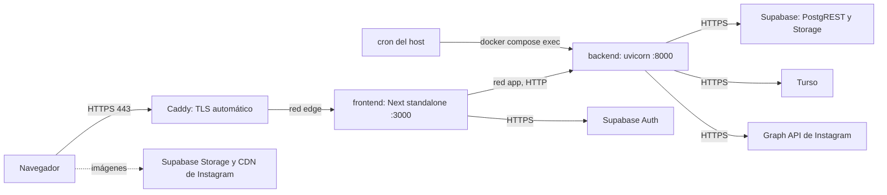

# Revisión para desplegar en un VPS

- **Fecha:** 01/10/2026
- **Commit revisado:** `37837334` (rama `main`, sin cambios locales)
- **Alcance:** backend (FastAPI 0.141, Python 3.13), frontend (Next.js 16.3.4, React 19.2.8), Supabase (`supabase/schema.sql` y `supabase/config.toml`), integración con Instagram (Meta y Turso), Docker y todo lo que hace falta armar en el servidor.
- **Documentos relacionados:** [`DEPLOY_READINESS_REVIEW.md`](./DEPLOY_READINESS_REVIEW.md) (23/09/2026), [`ARCHITECTURE_AUDIT.md`](./ARCHITECTURE_AUDIT.md) (12/09/2026) e [`INSTAGRAM_ANALYTICS.md`](./INSTAGRAM_ANALYTICS.md).

La revisión del 23/09 miraba DDD, TDD y UX. Este documento responde otra pregunta: **¿se puede subir hoy a un VPS y abrirlo a usuarios reales?** Parte del código actual, incluida la integración con Instagram, y se concentra en tres cosas: lo que impide desplegar, los fallos de seguridad y lo que falta armar en el servidor.

**Convenciones.** Las rutas son relativas a la raíz del repositorio y los números de línea corresponden al commit revisado. Lo marcado **[verificado]** se comprobó ejecutando código, builds, tests o requests; el resto sale de leer el código o la documentación oficial, y cuando algo es una deducción se aclara. El documento no contiene valores de secretos, solo nombres de variables. No se ejecutó nada contra el proyecto de Supabase hosted, Turso ni Meta, así que la configuración de esos servicios (sus dashboards) queda como pendiente de verificar.

## Índice

1. [Resumen ejecutivo](#1-resumen-ejecutivo)
2. [Cómo se verificó](#2-cómo-se-verificó)
3. [Bloqueantes de despliegue (P0)](#3-bloqueantes-de-despliegue-p0)
4. [Seguridad](#4-seguridad)
5. [Errores y robustez](#5-errores-y-robustez)
6. [Servicios externos](#6-servicios-externos)
7. [El VPS](#7-el-vps)
8. [CI](#8-ci)
9. [Calidad de código y limpieza](#9-calidad-de-código-y-limpieza)
10. [Lo que está bien](#10-lo-que-está-bien)
11. [Plan por fases](#11-plan-por-fases)
12. [Checklist final](#12-checklist-final)

---

## 1. Resumen ejecutivo

**Veredicto: todavía no está listo para desplegar en un VPS.** La aplicación está bien construida y avanzó mucho desde el 23/09 (casi todo aquel backlog quedó resuelto), pero hoy:

1. **No se puede construir ni configurar para producción.** La imagen de producción del frontend no compila [verificado], las variables públicas se congelan en el build con valores locales [verificado], y no existe un `docker-compose` de producción ni proxy reverso, TLS o el job semanal de Instagram.
2. **La base de producción no se puede crear de forma reproducible.** Se borraron las migraciones, `supabase/schema.sql` empieza con `DROP TABLE ... CASCADE`, y desarrollo ya usa un proyecto de Supabase y una base de Turso en la nube que no conviene reutilizar para producción.
3. **Hay dos fallos de seguridad al alcance de cualquier usuario registrado:** usar el avatar de otro usuario y borrárselo [verificado], y vincular el Instagram de otra persona a su propio perfil mandándole un enlace.
4. **El login de todo el sitio depende de una sola IP.** Como el auth corre en Server Actions, Supabase recibe todas las requests desde la IP del VPS: sus límites "por IP" pasan a ser límites globales. Con 150 intentos de login en 5 minutos, un atacante deja a todos sin poder entrar ni renovar la sesión (según la documentación de Supabase).

Mientras el registro siga limitado a la lista de testers, los fallos del punto 3 solo los puede explotar un tester; antes de abrir el registro son obligatorios. El resto bloquea incluso un despliegue de prueba.

### Bloqueantes, en el orden sugerido

| # | Bloqueante | Área | Esfuerzo |
|---|---|---|---|
| [3.1](#31-la-imagen-de-producción-del-frontend-no-compila-verificado) | La imagen de producción del frontend no compila | Frontend, Docker | XS |
| [3.2](#32-las-variables-públicas-se-congelan-en-el-build-con-valores-locales-verificado) | Variables `NEXT_PUBLIC_*` congeladas con valores locales: Supabase local, y robots, sitemap y Open Graph en `localhost` | Frontend, Docker | S |
| [3.3](#33-no-hay-migraciones-y-schemasql-borra-la-base-verificado) | Sin migraciones; `schema.sql` borra tablas; desarrollo y producción comparten servicios | Supabase, Turso | S |
| [3.4](#34-un-usuario-puede-usar-el-avatar-de-otro-y-borrarlo-verificado) | Un usuario puede usar el avatar de otro y borrarlo | Backend, seguridad | S |
| [3.5](#35-no-existe-configuración-de-producción-para-el-vps) | Sin configuración de producción: compose, proxy, TLS, cron y rotación de logs | Operación | M |
| [3.6](#36-imagen-del-backend-healthcheck-y-callback-público-verificado) | Backend como root, healthcheck que no detecta una configuración rota, callback de Instagram que obliga a exponerlo | Backend, operación | S |
| [4.1](#41-la-vinculación-de-instagram-no-está-atada-a-la-sesión) | Vinculación de Instagram no atada a la sesión | Seguridad | S |
| [4.4](#44-los-límites-de-supabase-auth-se-comparten-entre-todos-los-usuarios) | Límites de Supabase Auth compartidos por todo el sitio | Seguridad, disponibilidad | S |
| [6](#6-servicios-externos) | Supabase, Meta y Google sin configurar para producción (Meta exige App Review) | Servicios externos | M, más la espera de Meta |

Esfuerzo: XS = menos de 1 hora; S = hasta medio día; M = 1 o 2 días; L = más de 2 días.

### Qué cambió desde el 23/09

**Resuelto:** regla del usuario en el dominio, con `CHECK` e índice único en la base; `authenticated` sin permisos de escritura; `update_profile` atómico por RPC; avatar recodificado a WebP sin EXIF y con nombre único; logout, recuperación de contraseña, confirmación de email y borrado de cuenta; metadata, `lang="es"`, 404 y `error.tsx`; rutas `/me` y `/profiles`, códigos de error, handler global, logging JSON, rate limiting, límite de body y `/docs` cerrado en producción; contratos de import-linter; y datos reales de Instagram en lugar de los inventados.

**Pendiente de aquella revisión y retomado acá:** CI, imagen del backend como root, cabeceras de seguridad, build args del frontend, README del backend y configuración de Supabase de producción.

---

## 2. Cómo se verificó

| Comprobación | Resultado |
|---|---|
| `uv run pytest tests/unit` | 433 tests pasan en 1,35 s; también sin `.env` ni variables de entorno, como correrían en CI |
| `uv run pytest tests/integration/instagram` | 1 test pasa (los demás de integración necesitan Supabase local) |
| `uv run ruff check .` | Sin el W293 de `trial_testers.py` (archivo eliminado) |
| `uv run mypy` (con los `files` de `pyproject.toml`) | 12 errores en 6 archivos (sección [9](#9-calidad-de-código-y-limpieza)); `uv run mypy .` reporta 591 porque también revisa `tests/` |
| `uv run lint-imports` | Los 3 contratos se cumplen (con 11 imports ignorados) |
| `tsc --noEmit` | Sin errores |
| `eslint .` | 6 errores, todos en `components/ui/drawer/drawer.tsx`, y 8 warnings |
| `next build` sin `BACKEND_URL` | **Falla** al recolectar `/auth/callback` con "Falta BACKEND_URL" |
| `next build` con `BACKEND_URL` y sin `NEXT_PUBLIC_SITE_URL` | Compila; `robots.txt`, `sitemap.xml` y `og:image` apuntan a `http://localhost:3000` |
| Búsqueda de la URL y la clave de Supabase en `.next/server` | Quedan escritas en 6 chunks del servidor: cambiar la variable en runtime no tiene efecto |
| Servidor standalone (`node server.js`) | `X-Powered-By: Next.js`; sin CSP, HSTS, `X-Frame-Options`, `X-Content-Type-Options`, `Referrer-Policy` ni `Permissions-Policy` |
| Servidor standalone con el chequeo de `instrumentation.ts` fallando | El proceso **sigue vivo** y responde 500 a todo, incluido `/robots.txt` |
| Arreglo propuesto en [3.1](#31-la-imagen-de-producción-del-frontend-no-compila-verificado), probado en una copia del frontend | Compila sin `BACKEND_URL`; sin la variable el servidor sale con código 1; con ella, arranca y sirve |
| Backend sin variables de entorno | `GET /health` responde 200 y `GET /profiles/alguien` responde 500 |
| Script con los fakes de los tests sobre `UpdateUser`, `UploadAvatar` y `DeleteAccount` | Un usuario guarda en su perfil la ruta del avatar de otro; al subir su foto o borrar su cuenta, el backend borra el archivo ajeno |
| `UserName(...)` con nombres de rutas existentes | Acepta `forgot-password`, `reset-password`, `icon` y `opengraph-image` |
| `PostCursor.decode(...)` | Acepta fechas ISO que Postgres probablemente no entiende (semana ISO, formato compacto) y las usa tal cual |
| Tipos de clave en `.env` (solo el prefijo, sin mostrar los valores) | Frontend con clave publicable (`sb_publishable_…`), backend con clave secreta (`sb_secret_…`) |
| Historial de git | Sin secretos reales. Los prefijos `sb_secret_` y `sb_publishable_` solo aparecen en archivos de librerías del `.pnpm-store` que se versionó y luego se borró; por eso el pack pesa 157 MiB |
| Documentación de Supabase | Los límites por IP se aplican a la IP que hace la llamada; los backups automáticos no están incluidos en el plan Free |
| Documentación de Next 16 (`frontend/node_modules/next/dist/docs/`) | `NEXT_PUBLIC_*` se reemplaza al construir, también en código de servidor; guía de self-hosting |
| CI | No existe (no hay `.github/`) |

---

## 3. Bloqueantes de despliegue (P0)

Cada bloqueante incluye, cuando aplica, el test que conviene escribir **antes** del arreglo para verlo fallar.

### ✅ 3.1 La imagen de producción del frontend no compila [verificado]

`frontend/lib/api/client.ts:9-19` lee `BACKEND_URL` al cargar el módulo:

```ts
function requireBackendUrl(): string {
    const url = process.env.BACKEND_URL?.trim();
    if (!url) {
        throw new Error("Falta BACKEND_URL");
    }
    return url.replace(/\/$/, "");
}

const backendUrl = requireBackendUrl();
```

`next build` evalúa los módulos de cada ruta para recolectar su configuración. `app/auth/callback/route.ts` importa `lib/api/session`, que importa el cliente, y el build se corta:

```
Error: Failed to collect configuration for /auth/callback
  [cause]: Error: Falta BACKEND_URL
    at lib/api/client.ts:13:15
> Build error occurred
Error: Failed to collect page data for /auth/callback
```

El stage `builder` de `frontend/Dockerfile:20-28` no define `BACKEND_URL`, así que `docker build --target production` falla siempre. Pasarlo como build arg lo destraba, pero mete configuración de runtime en la imagen.

Además, el chequeo de arranque de `frontend/instrumentation.ts` no cumple su objetivo [verificado]. Cuando falla, Next registra "An error occurred while loading instrumentation hook", pero **el proceso sigue vivo y responde 500 a todas las rutas**. Docker ve el contenedor en marcha y no lo reinicia.

**Arreglo.** Lo probé en una copia del frontend: compila sin `BACKEND_URL` y sin warnings, el servidor termina con código 1 si falta la variable, y arranca normal si está.

```ts
// lib/api/client.ts
let cachedBackendUrl: string | undefined;

export function backendUrl(): string {
    if (cachedBackendUrl) {
        return cachedBackendUrl;
    }

    const url = process.env.BACKEND_URL?.trim();

    if (!url) {
        throw new Error("Falta BACKEND_URL");
    }

    cachedBackendUrl = url.replace(/\/$/, "");
    return cachedBackendUrl;
}

// dentro de fetchData
const url = path.startsWith("http") ? path : `${backendUrl()}${path}`;
```

```ts
// instrumentation.ts
export async function register() {
    if (process.env.NEXT_RUNTIME === "nodejs") {
        await import("./instrumentation-node");
    }
}
```

```ts
// instrumentation-node.ts
import { backendUrl } from "./lib/api/client";

try {
    backendUrl();
} catch (error) {
    console.error(error);
    process.exit(1);
}
```

El archivo aparte evita el warning de Turbopack por usar `process.exit`, que no existe en el runtime Edge.

**Test:** en CI, `pnpm build` sin `BACKEND_URL` (sección [8](#8-ci)).

### ✅ 3.2 Las variables públicas se congelan en el build con valores locales [verificado]

Next reemplaza `process.env.NEXT_PUBLIC_*` por su valor **al construir**, también en el código del servidor (`frontend/node_modules/next/dist/docs/01-app/02-guides/environment-variables.md`). Lo comprobé: la URL y la clave de Supabase pasadas al build quedan escritas en 6 chunks de `.next/server`, y definirlas después en el contenedor no cambia nada.

Con eso en mente, `frontend/Dockerfile:23-27`:

- **Tiene valores por defecto locales** para `NEXT_PUBLIC_SUPABASE_URL` (`http://127.0.0.1:54321`) y `NEXT_PUBLIC_SUPABASE_ANON_KEY` (la clave demo del stack local). Una imagen construida sin `--build-arg` intenta autenticar contra `127.0.0.1` dentro del contenedor, y el login falla para todos.
- **No recibe `NEXT_PUBLIC_SITE_URL`.** `siteUrl()` (`frontend/lib/site-url.ts:3-11`) cae en silencio a `http://localhost:3000`, y el build genera [verificado]:
  - `robots.txt` con `Sitemap: http://localhost:3000/sitemap.xml`;
  - `sitemap.xml` con `<loc>http://localhost:3000</loc>`;
  - `metadataBase` y `og:image` en `http://localhost:3000/opengraph-image?…`, así que **un perfil compartido en WhatsApp o Instagram sale sin imagen**.

Consecuencia operativa: **cada imagen sirve para un solo entorno.** No se puede construir una vez y promoverla de staging a producción cambiando variables.

**Arreglo.** Build args obligatorios, sin valores por defecto:

```dockerfile
FROM deps AS builder
ARG NEXT_PUBLIC_SUPABASE_URL
ARG NEXT_PUBLIC_SUPABASE_ANON_KEY
ARG NEXT_PUBLIC_SITE_URL
RUN test -n "$NEXT_PUBLIC_SUPABASE_URL" \
 && test -n "$NEXT_PUBLIC_SUPABASE_ANON_KEY" \
 && test -n "$NEXT_PUBLIC_SITE_URL" \
 || { echo "Faltan build args NEXT_PUBLIC_*" >&2; exit 1; }
ENV NEXT_PUBLIC_SUPABASE_URL=$NEXT_PUBLIC_SUPABASE_URL \
    NEXT_PUBLIC_SUPABASE_ANON_KEY=$NEXT_PUBLIC_SUPABASE_ANON_KEY \
    NEXT_PUBLIC_SITE_URL=$NEXT_PUBLIC_SITE_URL \
    NEXT_TELEMETRY_DISABLED=1
COPY . .
RUN mkdir -p public && pnpm build
```

Y que `siteUrl()` falle en producción en lugar de caer a localhost. Como `next build` corre con `NODE_ENV=production`, un build sin la variable se corta:

```ts
export function siteUrl() {
    const configured = process.env.NEXT_PUBLIC_SITE_URL?.trim().replace(/\/$/, "");

    if (configured) {
        return configured;
    }

    if (process.env.NODE_ENV === "production") {
        throw new Error("Falta NEXT_PUBLIC_SITE_URL");
    }

    return LOCAL_SITE_URL;
}
```

En la misma línea, `PROFILE_HOST = "sellonomada.com/"` está fijo en `frontend/features/start/component/start-form.tsx:32` y `frontend/features/tree/component/perfil/perfil-form.tsx:31`. Conviene derivarlo de `siteUrl()` para que cada entorno muestre su propio dominio.

**Test:** en CI, un build sin los build args debe fallar, y en el build normal `robots.txt` no debe contener `localhost` (sección [8](#8-ci)).

### ✅ 3.3 No hay migraciones y `schema.sql` borra la base [verificado]

- `supabase/migrations/` está vacío: los archivos se borraron en el commit `9c82232e` ("version 1.0.0").
- `supabase/config.toml:63` tiene `schema_paths = []`, así que `supabase db push` y `supabase db reset` no crean nada.
- `supabase/schema.sql:5-8` empieza con cuatro `DROP TABLE IF EXISTS ... CASCADE` (`posts`, `user_links`, `auth` y `users`). Si alguien lo pega en el SQL Editor del proyecto de producción para "actualizar el esquema", **borra todos los usuarios, perfiles, links y publicaciones**. El encabezado (`:2`) dice que las migraciones "quedan como historial", pero ya no existen.
- Los tests de integración se saltean en silencio cuando la tabla no existe (`backend/tests/integration/conftest.py:54-58`), así que con una base local recién creada nadie se entera de que falta el esquema.
- `.env` apunta a un proyecto de Supabase hosted y a una base de Turso Cloud. Si producción usa los mismos, desarrollo y producción comparten datos, usuarios, límites de envío de email, claves y `site_url`, que es un único valor y define a dónde llevan los enlaces de los emails ([6.1](#61-supabase-de-producción)).

**Arreglo**

1. Crear la migración base a partir de `schema.sql`, **sin los `DROP`**:

   ```bash
   supabase migration new baseline
   # copiar schema.sql sin las líneas 5-8 al archivo creado en supabase/migrations/
   supabase db reset   # local: recrea la base desde las migraciones
   ```

2. Crear un proyecto de Supabase **nuevo** para producción y aplicarle las migraciones con `supabase link --project-ref <ref-de-producción>` y `supabase db push`. El plan Free permite dos proyectos activos: alcanza para desarrollo y producción.
3. En el proyecto actual, que ya tiene las tablas, marcar la migración base como aplicada para que `db push` no intente recrearla: `supabase migration repair --status applied <timestamp>`.
4. Borrar `schema.sql`, o reemplazarlo por un volcado generado con `supabase db dump` y un encabezado que aclare que es solo referencia. A partir de ahí, cada cambio de esquema es una migración nueva.
5. Lo mismo para Turso: una base de producción y otra de desarrollo, cada una con su token.

**Test que debe fallar antes del arreglo:** en CI, `supabase start` seguido de `pytest tests/integration`, con la fixture `users_table` usando `pytest.fail` en lugar de `pytest.skip` cuando corre en CI. Hoy falla porque la tabla no existe.

### ✅ 3.4 Un usuario puede usar el avatar de otro y borrarlo [verificado]

`PATCH /me` acepta un campo `avatar` (`backend/api/schemas/user.py:44`) que puede ser una ruta o una URL pública. `object_path` (`backend/core/user/infrastructure/avatar_url.py:9-23`) extrae la ruta de cualquier URL que contenga `/object/public/avatars/`, sin mirar el host, y `UserAvatar` (`backend/core/user/domain/user_avatar.py:10-21`) solo valida el **formato** `<uuid>/<uuid>.webp`. Nadie comprueba que la carpeta sea la del propio usuario: `User.change_avatar` (`backend/core/user/domain/user.py:70-72`) acepta cualquier ruta válida.

La URL del avatar de cualquier perfil es pública. Con ella, un usuario registrado puede:

1. **Suplantar a otro artista:** guardar su foto en el propio perfil con un `PATCH /me` que lleve la URL ajena.
2. **Borrarle la foto:** al subir después su propia imagen, `UploadAvatar` borra "la anterior" (`backend/core/user/application/upload_avatar.py:23` y `:31-32`), que es el archivo de la víctima. El perfil de la víctima queda con la imagen rota.
3. **Borrársela al irse:** `DeleteAccount` borra el archivo al que apunta el perfil (`backend/core/user/application/delete_account.py:20-21`).

Lo reproduje con los fakes de los tests (`FakeUserRepo` y `FakeAvatarStorage`), siguiendo esos tres pasos: los tres se cumplen. El `CHECK users_avatar_path` (`supabase/schema.sql:37-41`) tampoco lo impide, porque también valida solo el formato.

El frontend **no usa** ese campo: los dos formularios suben la foto con `PUT /me/avatar` y después llaman a `updateUserAction` sin `avatar` (`perfil-form.tsx:100-114` y `start-form.tsx:130-144`). Es superficie de ataque sin uso.

**Arreglo**, en tres capas:

1. **API:** sacar `avatar` de `UpdateUserRequest` y de `UpdateProfileCommand`. Si más adelante hace falta "quitar la foto", que sea un `DELETE /me/avatar`. Borrar también `stored_avatar` (`backend/api/mapping.py:10-15`) y, en el frontend, `httpsAvatarUrl` y el campo `avatar` de `UpdateProfileDraft` (`frontend/features/profile/model.ts`).
2. **Dominio:** que el agregado proteja la invariante "el avatar es un archivo del propio usuario":

   ```python
   # core/user/domain/user_avatar.py
   def belongs_to(self, user_id: UserId) -> bool:
       return self.value.split("/", 1)[0].lower() == user_id.value.lower()

   # core/user/domain/user.py
   def change_avatar(self, avatar: str) -> None:
       candidate = UserAvatar(avatar)
       if not candidate.belongs_to(self.id):
           raise InvalidUserAvatarError("El avatar debe ser una imagen del propio usuario")
       self.avatar = candidate
       self._touch()
   ```

   Y en `UploadAvatar` y `DeleteAccount`, borrar el archivo anterior solo si `belongs_to(user.id)`.
3. **Base:** un `CHECK` que ate la ruta a la fila. Si ya no hay datos con el formato viejo `avatar.jpg`, se puede quitar:

   ```sql
   ALTER TABLE public.users DROP CONSTRAINT users_avatar_path;
   ALTER TABLE public.users ADD CONSTRAINT users_avatar_path CHECK (
       avatar_url IS NULL
       OR avatar_url ~ ('^' || id::text || '/[0-9a-f]{8}-[0-9a-f]{4}-[0-9a-f]{4}-[0-9a-f]{4}-[0-9a-f]{12}\.webp$')
   );
   ```

**Tests que deben fallar antes del arreglo:**

- Dominio: `user.change_avatar(f"{otro_id}/{uuid}.webp")` lanza `InvalidUserAvatarError`.
- Aplicación, con fakes: si un usuario intenta usar la ruta de otro y después sube su foto, el archivo del otro sigue en el storage.
- API: un `PATCH /me` con el avatar de otro usuario no cambia el avatar.
- Integración: el `CHECK` rechaza un `avatar_url` cuya carpeta no es el `id` de la fila.

### ✅ 3.5 No existe configuración de producción para el VPS

`docker-compose.yml` es solo para desarrollo, y usarlo en el servidor sería inseguro:

| Líneas | Qué hace | Problema en producción |
|---|---|---|
| `:14` y `:47` | `target: development` | `uvicorn --reload` y `pnpm dev`: lentos, con errores detallados y recarga de código |
| `:15-16` y `:48-49` | Publica los puertos 8000 y 3000 | **Docker publica puertos salteándose UFW**: el backend queda accesible desde internet aunque el firewall diga lo contrario |
| `:17-18` | `env_file: .env` | El backend recibe todas las variables del archivo, incluidas las de otros servicios y las que sobran (`GOOGLE_CLIENT_SECRET`, `SPOTIFY_*`) |
| `:53` | `NODE_TLS_REJECT_UNAUTHORIZED: "0"` | **Desactiva la verificación TLS de todas las conexiones salientes de Node**, incluidas las de Supabase Auth: alguien en el camino de red podría interceptar contraseñas y tokens |
| — | Sin proxy reverso | Nadie termina HTTPS ni renueva certificados |
| — | Sin job de snapshots | Ver [5.2](#52-nadie-ejecuta-el-job-de-snapshots) |
| — | Sin rotación de logs | El driver `json-file` de Docker crece sin límite hasta llenar el disco |

**Arreglo:** un `docker-compose.prod.yml` separado, con Caddy como proxy reverso con TLS automático, una red sin puertos publicados para el backend, rotación de logs y un archivo de variables por servicio. Está completo en la sección [7](#7-el-vps).

### ✅ 3.6 Imagen del backend, healthcheck y callback público [verificado]

**Imagen.** La etapa de producción (`backend/Dockerfile:18-24`) corre como root, con un único proceso y sin `HEALTHCHECK`. `backend/.dockerignore` no excluye `certs/`, donde hay una clave privada TLS de desarrollo (`backend/certs/localhost-key.pem`), ni `tests/` ni `*.db`, así que `COPY . .` los mete en la imagen.

**Healthcheck que no detecta una configuración rota [verificado].** El contenedor de dependencias se arma en el primer request (`backend/api/dependencies/container.py:155-157`) y `/health` no lo usa. Arrancando el backend sin ninguna variable de entorno, `GET /health` responde 200 y `GET /profiles/alguien` responde 500. Con un archivo de variables incompleto en el servidor, el healthcheck daría verde y fallaría cada request real.

**Callback de Instagram.** Meta redirige el navegador a `INSTAGRAM_REDIRECT_URI`, que hoy es una ruta del backend (`GET /instagram/oauth/callback`, `backend/api/routers/instagram.py:75-98`). Eso obliga a exponer el backend a internet, cuando todo lo demás lo consume solo el servidor de Next. Y si se expone entero, también queda público `POST /internal/instagram/snapshots` (`:149-170`), protegido solo por el token.

**Arreglo**

- Dockerfile con usuario no root, `HEALTHCHECK`, workers y un `.dockerignore` completo (sección [7.2](#72-dockerfiles)).
- Armar el contenedor y validar la configuración en el `lifespan`, para que una variable faltante impida arrancar. De paso se corrige el error de mypy de `main.py:19`:

  ```python
  @asynccontextmanager
  async def _lifespan(_app: FastAPI) -> AsyncIterator[None]:
      configure_logging()
      get_dependency_container()
      InstagramSettings()  # type: ignore[call-arg]
      yield
  ```

- **Recomendado:** mover el callback de Instagram al frontend. Meta redirige a una ruta de Next, que tiene la sesión del usuario, y Next llama al backend por la red interna. El backend no se expone nunca, y además se resuelve [4.1](#41-la-vinculación-de-instagram-no-está-atada-a-la-sesión).
- **Si por tiempo se mantiene el callback en el backend:** exponer en el proxy **solo** esa ruta (ejemplo en [7.4](#74-caddy)).

---

## 4. Seguridad

| # | Hallazgo | Severidad | Esfuerzo |
|---|---|---|---|
| [4.1](#41-la-vinculación-de-instagram-no-está-atada-a-la-sesión) | Vinculación de Instagram no atada a la sesión | Media; alta cuando las métricas sean públicas | S |
| [4.2](#42-la-misma-clave-cifra-los-tokens-y-firma-el-state) | La misma clave cifra los tokens de Instagram y firma el `state` | Baja | XS |
| [4.3](#43-borrar-la-cuenta-no-borra-los-datos-de-instagram) | Borrar la cuenta deja los datos de Instagram, y el job los sigue usando | Alta (datos personales) | S |
| [4.4](#44-los-límites-de-supabase-auth-se-comparten-entre-todos-los-usuarios) | Límites de Supabase Auth compartidos por todo el sitio | Alta (disponibilidad) | S |
| [4.5](#45-periodo-de-prueba) | ~~Periodo de prueba / lista de testers~~ — eliminado | — | — |
| [4.6](#46-rate-limiting-del-backend) | ~~Rate limiting en memoria y con claves frágiles~~ — clave por `sub` + IP real | — | — |
| [4.7](#47-cabeceras-de-seguridad-verificado) | ~~Sin cabeceras de seguridad~~ — headers + CSP Report-Only | — | — |
| [4.8](#48-cambio-de-contraseña-con-cualquier-sesión) | ~~Cambio de contraseña con cualquier sesión~~ — cookie de recovery + signOut others | — | — |
| [4.9](#49-mensajes-de-error-tomados-de-la-url) | ~~Mensajes de error en la URL~~ — códigos `?error=` | — | — |
| [4.10](#410-límite-de-body) | ~~Límite de body solo por Content-Length~~ — stream + nginx 4m | — | — |
| [4.11](#411-base-de-datos) | ~~Perfil huérfano / GRANT SELECT sin uso~~ — trigger + revoke | — | — |
| [4.12](#412-claves-de-cifrado) | ~~Claves sin versión ni AAD~~ — `v1:` + id de fila | — | — |

### ✅ 4.1 La vinculación de Instagram no está atada a la sesión

El `state` de OAuth firma `owner_user_id:nonce:expiración` (`backend/core/instagram/infrastructure/oauth_state_codec.py:17-24`) y vale 10 minutos. El callback es público y no sabe quién está logueado: vincula la cuenta de Instagram que autorizó con el `owner_user_id` que trae el `state` (`backend/core/instagram/application/complete_instagram_oauth.py:54-94`). El nonce no se guarda en ningún lado ni se compara con nada del navegador.

Ataque (CSRF de vinculación):

1. El atacante, logueado en Sello Nómada, pide `GET /me/instagram/connect` y obtiene una URL de autorización de Instagram con **su** `state`.
2. Se la manda a un artista ("conectá tu Instagram para aparecer destacado"). La pantalla de consentimiento es la real de Meta, con el nombre real de la app.
3. Si el artista acepta dentro de los 10 minutos, su Instagram queda vinculado **al perfil del atacante**. El atacante ve en su dashboard el usuario, la foto y la evolución de seguidores del artista, la app guarda y renueva el token del artista bajo una cuenta ajena, y el artista ya no puede conectar su propio Instagram (`InstagramAccountAlreadyLinkedError`, `:59-64`).

Hoy el perfil público no muestra métricas ("Todavía no hay métricas para mostrar", `frontend/features/tree/component/socials/socials.tsx:62-68`). Cuando las muestre, esto pasa a ser suplantación con datos reales.

**Arreglo recomendado:** completar el flujo desde Next, que conoce la sesión.

1. Redirect URI en Meta: `https://<dominio>/auth/instagram/callback`. Va bajo `/auth`, que ya es un nombre de usuario reservado y ya está excluido en `robots.txt`.
2. Route handler en Next:

   ```ts
   // app/auth/instagram/callback/route.ts
   export async function GET(request: Request) {
       const { searchParams } = new URL(request.url);
       const session = await getAuthSession();

       if (!session) {
           redirect("/login?error=session_expired");
       }

       const result = await completeInstagramConnect(session.accessToken, {
           code: searchParams.get("code"),
           state: searchParams.get("state"),
           error: searchParams.get("error"),
       });

       redirect(`/dashboard/tree?instagram=${result.isError ? "error" : "connected"}`);
   }
   ```

3. En el backend, reemplazar `GET /instagram/oauth/callback` por `POST /me/instagram/oauth` (autenticado), y que `CompleteInstagramOAuth.execute` reciba el `owner_user_id` del perfil actual y lance `InstagramOAuthStateError` si no coincide con el del `state`.
4. Sacar `FRONTEND_URL` de la configuración del backend, que ya no hace falta.

**Test que debe fallar antes del arreglo:** con fakes, `CompleteInstagramOAuth` con un `state` emitido para otro usuario lanza `InstagramOAuthStateError` y no guarda ninguna conexión.

### ✅  4.2 La misma clave cifra los tokens y firma el state

`SignedOAuthStateCodec` usa como clave HMAC `token_encryption_key_bytes` (`oauth_state_codec.py:14-15`), la misma que `TokenCrypto` usa para AES-GCM (`backend/core/instagram/infrastructure/token_crypto.py:11-12`). No hay un ataque práctico conocido para esta combinación, pero reutilizar una clave en dos primitivas acopla su ciclo de vida: rotar una obliga a rotar la otra, y una filtración en un uso compromete el otro.

**Arreglo:** derivar la clave de firma con HKDF y dejar la de cifrado como está. Así los tokens ya guardados se siguen descifrando, y solo cambian los `state`, que duran 10 minutos:

```python
from cryptography.hazmat.primitives import hashes
from cryptography.hazmat.primitives.kdf.hkdf import HKDF

state_key = HKDF(
    algorithm=hashes.SHA256(),
    length=32,
    salt=None,
    info=b"instagram-oauth-state",
).derive(settings.token_encryption_key_bytes)
```

### ✅  4.3 Borrar la cuenta no borra los datos de Instagram

`DeleteAccount` (`backend/core/user/application/delete_account.py:17-23`) borra el avatar, el perfil y la identidad, pero no tiene acceso a Instagram. La conexión, con el token cifrado, el usuario y la foto de Instagram, y todo el historial de seguidores quedan en Turso. Además, `execute_all` (`backend/core/instagram/application/capture_instagram_followers.py:54-67`) sigue renovando ese token y capturando seguidores de alguien que ya no existe, sin fecha de fin.

Eso incumple la promesa de "borrar la cuenta", las leyes de datos personales (Ley 25.326, GDPR) y las condiciones de la plataforma de Meta, que exigen borrar los datos cuando el usuario lo pide o elimina su cuenta.

**Arreglo**

- En `DELETE /me` (`backend/api/routers/me.py:151-170`), ejecutar `DisconnectInstagram` para el perfil **antes** de `DeleteAccount`, ignorando `InstagramNotConnectedError`. Se orquesta en la capa de API porque el contrato de independencia de import-linter impide que `core.user` dependa de `core.instagram`. Si falla, se aborta antes de borrar el perfil y el usuario puede reintentar.
- Un script único que borre de Turso las conexiones cuyo `owner_user_id` ya no existe en `public.users`.
- Los callbacks de desautorización y de borrado de datos de Meta ([6.2](#62-meta-instagram)).

**Test que debe fallar antes del arreglo:** `DELETE /me` de un usuario con Instagram conectado deja `get_by_owner(...)` en `None` y sin snapshots de esa cuenta.

### ✅ 4.4 Los límites de Supabase Auth se comparten entre todos los usuarios

Todas las llamadas a Supabase Auth salen del servidor de Next: `signInWithPassword` (login), `signUp` (registro), `resetPasswordForEmail` (recuperación), `verifyOtp` y `exchangeCodeForSession` (`/auth/confirm` y `/auth/callback`), `updateUser` (cambio de contraseña), y la renovación de la sesión que hace `getClaims()` en `frontend/proxy.ts:38` cuando el access token venció. [Según la documentación de Supabase](https://supabase.com/docs/guides/auth/rate-limits), los límites por IP se aplican a la IP que hace la llamada, que acá es siempre la del VPS:

| Operación | Endpoint | Límite por defecto | Qué lo usa |
|---|---|---|---|
| Login con contraseña, renovación de sesión, PKCE | `/auth/v1/token` | 150 cada 5 min por IP | Login, `proxy.ts`, `/auth/callback` |
| Registro, recuperación, `/user` | `/auth/v1/signup`, `/recover`, `/user` | 30 cada 5 min por IP | Registro, "Olvidé mi contraseña", cambio de contraseña |
| Verificación de enlaces | `/auth/v1/verify` | 30 cada 5 min por IP | `/auth/confirm` |
| Emails con el SMTP incluido | Todos los que envían email | 2 por hora **para todo el proyecto** | Confirmación y recuperación |

Consecuencias:

- **30 registros o pedidos de recuperación cada 5 minutos para todo el sitio.** Un lanzamiento con algo de tráfico ya los agota.
- **Un script con 150 intentos de login en 5 minutos**, aunque fallen, vacía el bucket de `/token`. Nadie puede iniciar sesión y, como la renovación usa el mismo bucket, las sesiones que vencen dejan de renovarse y la gente queda deslogueada.
- **Sin SMTP propio, solo 2 emails por hora:** a partir del tercer registro de la hora, la confirmación no llega.

**Arreglo**, combinando:

1. **CAPTCHA** (Cloudflare Turnstile o hCaptcha), que Supabase verifica de forma nativa: activarlo en el dashboard y pasar `options.captchaToken` en `signUp`, `signInWithPassword` y `resetPasswordForEmail`. Frena los scripts aunque vengan de muchas IPs.
2. **IP forwarding:** activarlo en *Authentication → Rate Limits → IP Address Forwarding* y mandar el header `sb-forwarded-for` con la IP real del cliente. Supabase **solo lo acepta con una clave secreta** (`sb_secret_…`), así que hace falta un cliente de servidor aparte, usado únicamente en las acciones de auth y en `proxy.ts`:

   ```ts
   // lib/supabase/auth-client.ts
   import "server-only";
   import { createServerClient } from "@supabase/ssr";
   import { cookies, headers } from "next/headers";
   import { getSupabaseAuthConfig } from "@/lib/supabase/env";

   export async function createAuthClient() {
       const secretKey = process.env.SUPABASE_SECRET_KEY?.trim();

       if (!secretKey) {
           throw new Error("Falta SUPABASE_SECRET_KEY");
       }

       const cookieStore = await cookies();
       const clientIp = (await headers()).get("x-forwarded-for")?.split(",")[0]?.trim();

       return createServerClient(getSupabaseAuthConfig().url, secretKey, {
           cookies: {
               getAll() {
                   return cookieStore.getAll();
               },
               setAll(cookiesToSet) {
                   cookiesToSet.forEach(({ name, value, options }) =>
                       cookieStore.set(name, value, options),
                   );
               },
           },
           global: { headers: clientIp ? { "sb-forwarded-for": clientIp } : {} },
       });
   }
   ```

   En `proxy.ts` va lo mismo, tomando la IP de `request.headers`. La IP tiene que venir del proxy reverso, que reemplaza el `X-Forwarded-For` que mande el cliente (Caddy lo hace por defecto, [7.4](#74-caddy)). El costo: el servidor de Next pasa a tener la clave secreta (como variable de runtime, nunca `NEXT_PUBLIC_`), así que comprometerlo da acceso total a la base. Hoy esa clave solo la tiene el backend.
3. **Límites por IP en el proxy** para los POST a `/login`, `/register` y `/forgot-password`: las Server Actions se envían como POST a la ruta de la página. Caddy no trae rate limiting en su build estándar; hace falta el plugin `caddy-ratelimit`, o nginx con `limit_req` ([7.4](#74-caddy)).
4. **SMTP propio con Resend** y subir el límite de emails acorde.
   - Local: `[auth.email.smtp]` en `config.toml` + `RESEND_API_KEY` en `.env`.
   - Hosted: `SUPABASE_ACCESS_TOKEN=sbp_… ./scripts/configure-resend-smtp.sh` (o SMTP Settings en el dashboard: `smtp.resend.com:465`, user `resend`, password = API key, sender `beth.t@example.com`).
   - Sin dominio verificado, Resend solo entrega a `EMAIL_RECIPIENT`.
   - Si Auth responde `over_email_send_rate_limit`, la app muestra mensaje de beta (`frontend/lib/supabase/auth-email.ts`).
5. Subir los límites de Supabase solo después de los puntos 1 y 2: mientras todo salga de una IP, subirlos amplía también lo que puede hacer un atacante.

### ✅ 4.5 Periodo de prueba

Se eliminó `TRIAL_TESTER_EMAILS` / `trial_testers` del backend y del frontend. El registro y el aprovisionamiento ya no filtran por lista fija.

### ✅ 4.6 Rate limiting del backend

- La clave es el `sub` del JWT (`request.state.auth_id` desde `get_current_user`); sin sesión, la IP de `X-Forwarded-For` (`backend/api/rate_limit.py`).
- Next reenvía la IP del visitante en `frontend/lib/api/client.ts` (el backend no está expuesto a Internet en prod).
- Límites en `POST /auth/session`, `DELETE /me`, `DELETE /me/posts/{id}` y `GET /profiles/*`.
- Sigue en memoria por worker: con varios workers el cupo efectivo se multiplica. Redis queda como mejora si hace falta un límite estricto compartido.

### ✅ 4.7 Cabeceras de seguridad [verificado]

`frontend/next.config.ts` define `poweredByHeader: false`, HSTS (1 semana), `X-Content-Type-Options`, `Referrer-Policy`, `Permissions-Policy`, `X-Frame-Options` y `Content-Security-Policy-Report-Only` (imágenes de Storage + CDN de Instagram; `unsafe-inline` en scripts hasta migrar a nonces en `proxy.ts`).

### ✅ 4.8 Cambio de contraseña con cualquier sesión

`/auth/confirm` con `type=recovery` (o `next=/reset-password`) setea la cookie httpOnly `sn_password_recovery` (10 min). `resetPasswordAction` la exige y la consume, y después hace `signOut({ scope: "others" })`. En local, `secure_password_change = true` en `config.toml` (revisar el mismo valor en el proyecto hosted).

### ✅ 4.9 Mensajes de error tomados de la URL

Login y register solo muestran textos propios vía `messageForAuthError` (`frontend/lib/auth/auth-error.ts`). Los redirects usan códigos (`oauth_failed`, `link_expired`, `not_allowed`, `session_expired`, `provision_failed`); lo desconocido se ignora.

### ✅ 4.10 Límite de body

`BodySizeLimitMiddleware` rechaza por `Content-Length` y, si no viene (p. ej. chunked), lee el stream hasta 3 MB (`backend/api/body_limit.py`). Nginx ya tiene `client_max_body_size 4m` (`deploy/nginx/nginx.conf`). Next limita Server Actions a 3 MB.

### ✅ 4.11 Base de datos

Trigger `auth_delete_profile`: al borrar `public.auth` se borra el `public.users` asociado (links y posts en cascade). Migración `20261002120000_orphan_profile_cleanup.sql`. Avatar en Storage y datos en Turso siguen siendo cosa de `DELETE /me` o un job de reconciliación. Se revocó `GRANT SELECT` a `authenticated` y las policies de solo lectura propias (nadie usa PostgREST).

### ✅ 4.12 Claves de cifrado

- Ciphertexts nuevos llevan prefijo `v1:` y AES-GCM usa el id de la fila como AAD (`core/shared/infrastructure/versioned_aead.py`): email ↔ `public.auth.id`, token IG ↔ `connection.id`. Los valores legacy (sin prefijo) siguen leyéndose.
- Producción: claves **nuevas** (`openssl rand -hex 32` para `EMAIL_ENCRYPTION_KEY`, `EMAIL_HMAC_KEY`, `INSTAGRAM_TOKEN_ENCRYPTION_KEY`), en un gestor de contraseñas + copia offline. No reutilizar las de desarrollo.
- **Rotación gradual (cuando haga falta):** agregar lectura con la clave nueva y la vieja; re-cifrar filas a `v2:`; apagar la clave vieja. Hasta entonces, perder la clave implica re-login de Instagram y emails ilegibles.

---

## 5. Errores y robustez

| # | Hallazgo | Impacto | Esfuerzo |
|---|---|---|---|
| [5.1](#51-turso-cae-en-silencio-a-un-sqlite-efímero) | ~~Turso cae a SQLite efímero~~ — fail-fast en producción | — | — |
| [5.2](#52-nadie-ejecuta-el-job-de-snapshots) | ~~Nadie ejecuta el job de snapshots~~ — cron diario + exit ≠ 0 | — | — |
| [5.3](#53-un-error-de-infraestructura-corta-el-job-completo) | ~~Error de infra corta el job~~ — `except Exception` y sigue | — | — |
| [5.4](#54-token-de-una-hora-aceptado-en-silencio) | ~~Token de una hora aceptado en silencio~~ — canje fallido aborta la conexión | — | — |
| [5.5](#55-la-foto-y-el-usuario-de-instagram-no-se-actualizan) | ~~Foto y usuario de Instagram no se actualizan~~ — el job refresca perfil | — | — |
| [5.6](#56-si-el-backend-falla-el-usuario-va-al-onboarding) | ~~Backend caído manda al onboarding~~ — solo 200 sin name; si no, Reintentar | — | — |
| [5.7](#57-nombres-de-usuario-que-chocan-con-rutas-verificado) | ~~Nombres que chocan con rutas~~ — RESERVED + CHECK + test CI | — | — |
| [5.8](#58-el-cursor-de-publicaciones-llega-crudo-a-postgres-verificado-en-parte) | ~~Cursor crudo a Postgres~~ — `decode` re-serializa la fecha | — | — |
| [5.9](#59-el-callback-de-instagram-ante-errores-de-infraestructura) | El callback de Instagram ante errores de infraestructura | JSON 500 en lugar de volver al dashboard | XS |
| [5.10](#510-el-login-oculta-el-email-sin-confirmar) | El login oculta "email sin confirmar" y "demasiados intentos" | Usuarios bloqueados sin saber por qué | XS |
| [5.11](#511-configuración-del-backend-verificado) | Configuración con rutas relativas y leída en cada request | Errores difíciles de diagnosticar | XS |

### ✅ 5.1 Turso cae en silencio a un SQLite efímero

En producción el `lifespan` llama `TursoSettings.require_remote_for_production()`: exige `TURSO_URL` remoto (no SQLite) y `TURSO_TOKEN` no vacío; si no, no arranca.

### ✅ 5.2 Nadie ejecuta el job de snapshots

Cron diario en el host ([7.5](#75-job-de-snapshots)). `run_instagram_snapshots.py` imprime `captured=` / `failed=` y termina con exit `1` si `failed > 0`. Preferí `docker compose exec` frente al endpoint HTTP (el token del job queda opcional).

### ✅ 5.3 Un error de infraestructura corta el job completo

`execute_all` captura `Exception`, registra con `logger.exception` y sigue con el resto. Un `TokenDecryptError` o fallo de Turso en una cuenta no frena a las demás.

### ✅ 5.4 Token de una hora aceptado en silencio

Si el canje a token de larga duración falla, `_exchange_long_lived` registra y propaga `InstagramGraphError`. Ya no se acepta el token de una hora.

### ✅ 5.5 La foto y el usuario de Instagram no se actualizan

El job usa `fetch_profile` y guarda usuario y `profile_picture_url` en cada captura, así la URL firmada del CDN no queda vencida entre autorizaciones.

### ✅ 5.6 Si el backend falla, el usuario va al onboarding

`postAuthPathForToken` / `getPostAuthPath` solo mandan a `/dashboard/start` si `GET /me` responde 200 sin `name`. Ante cualquier otro error van a `/dashboard/unavailable` con "Reintentar".

### ✅ 5.7 Nombres de usuario que chocan con rutas [verificado]

`UserName.RESERVED` y el `CHECK` de `users_name_format` (migración `20261002140000_reserved_usernames.sql`) incluyen las rutas de `frontend/app` y nombres legales previstos. Un test de unitarios falla si aparece un segmento de primer nivel que no esté reservado, o si el schema se desincroniza.

### ✅ 5.8 El cursor de publicaciones llega crudo a Postgres [verificado en parte]

`PostCursor.decode` guarda `PostCreatedAt.from_isoformat(...).to_isoformat()`, así el filtro a PostgREST siempre lleva una fecha canónica (p. ej. `2026-W01-1...` → `2025-12-29T00:00:00+00:00`).

### 5.9 El callback de Instagram ante errores de infraestructura

`instagram_oauth_callback` (`backend/api/routers/instagram.py:87-97`) solo captura `ApplicationError` y `DomainError`. Si Turso falla durante la vinculación, el handler global responde un **JSON 500** al navegador, que se queda en el dominio del backend en lugar de volver al dashboard. Además, si la primera captura (`complete_instagram_oauth.py:94`) falla después de guardar la conexión, el usuario ve "No se pudo conectar Instagram" cuando en realidad quedó conectado.

**Arreglo:** con el callback en Next ([4.1](#41-la-vinculación-de-instagram-no-está-atada-a-la-sesión)), cualquier fallo termina en una redirección. Y la primera captura conviene hacerla "si se puede": registrar el error sin fallar la conexión.

### 5.10 El login oculta el email sin confirmar

`loginCredentialAction` (`frontend/features/login/action/login-credential-action.ts:29-36`) convierte cualquier error en "Email o contraseña incorrectos", incluidos `email_not_confirmed` (las confirmaciones están activas) y el 429 de [4.4](#44-los-límites-de-supabase-auth-se-comparten-entre-todos-los-usuarios). Quien no confirmó su email cree que la contraseña está mal.

**Arreglo:** mirar `error.code`. Con `email_not_confirmed`, "Confirmá tu email" y la opción de reenviarlo (`supabase.auth.resend`); con un 429, "Demasiados intentos, probá en unos minutos"; con el resto, el mensaje genérico. Distinguir "sin confirmar" no revela qué cuentas existen, porque Supabase solo devuelve ese código cuando la contraseña es correcta.

### 5.11 Configuración del backend [verificado]

- Todas las clases de `backend/config/` leen `env_file="../.env"`, una ruta relativa al directorio de trabajo: desde `backend/` toma el `.env` del repositorio, desde otro directorio no encuentra nada, y en el contenedor busca `/.env`. Lo comprobé ejecutando la app desde otro directorio: arrancó sin ninguna configuración (y con `/health` en 200, [3.6](#36-imagen-del-backend-healthcheck-y-callback-público-verificado)). En producción, las variables tienen que venir solo del entorno.
- `get_auth_jwt_settings` y `get_supabase_url` crean un `DBSettings()` en cada request (`backend/api/dependencies/auth.py:41-42` y `backend/api/dependencies/supabase.py:5`), lo que implica releer el entorno y el archivo cada vez. Cachearlos con `lru_cache`.

---

## 6. Servicios externos

### 6.1 Supabase de producción

`supabase/config.toml` solo aplica al stack local. El proyecto hosted se configura en el dashboard, o con `supabase config push`, que sube `config.toml` al proyecto linkeado (revisar el diff antes de confirmar).

- [ ] Proyecto nuevo, con las migraciones aplicadas ([3.3](#33-no-hay-migraciones-y-schemasql-borra-la-base-verificado)).
- [ ] **Plan.** El Free no incluye backups automáticos y pausa el proyecto después de una semana con poca actividad. Para producción conviene Pro (backups diarios de 7 días, sin pausa); si se arranca en Free, sí o sí con backups propios ([7.7](#77-backups-y-monitoreo)).
- [ ] **Site URL** `https://<dominio>`. Las plantillas arman el enlace con `{{ .SiteURL }}` (`supabase/templates/confirmation.html:7` y `recovery.html:7`), así que con otro valor los emails llevan a otro sitio. En local es `http://127.0.0.1:3000` (`config.toml:151`).
- [ ] **Redirect URLs** exactas del dominio real: `/auth/callback`, `/auth/confirm` y `/auth/confirm?next=/reset-password`. Las de `config.toml:155-164` son de localhost. Sin comodines.
- [ ] **Confirm email** activado. Además de lo obvio, impide que alguien se registre con el email de un tester y ocupe su lugar: sin confirmación, Supabase entrega una sesión al instante y el backend aprovisiona porque el email está en la lista.
- [ ] Plantillas de confirmación, recuperación e invitación cargadas en el dashboard. Los `content_path` de `config.toml:247-253` solo valen en local.
- [ ] **SMTP con Resend** y límite de emails acorde ([4.4](#44-los-límites-de-supabase-auth-se-comparten-entre-todos-los-usuarios)): `./scripts/configure-resend-smtp.sh` o SMTP Settings en el dashboard.
- [ ] Política de contraseñas igual a la local (`config.toml:183-186`): mínimo 8, con minúsculas, mayúsculas y dígitos.
- [x] **Secure password change** activado ([4.8](#48-cambio-de-contraseña-con-cualquier-sesión)).
- [ ] **CAPTCHA** e **IP Address Forwarding** ([4.4](#44-los-límites-de-supabase-auth-se-comparten-entre-todos-los-usuarios)).
- [ ] **Claves JWT asimétricas** (ES256 o RS256). El backend solo acepta esos algoritmos (`backend/api/dependencies/auth.py:15`), y `getClaims()` valida el token localmente solo con claves asimétricas; con la clave HS256 heredada hace una llamada de red por request.
- [ ] Google configurado con las credenciales del proyecto de Google de producción ([6.3](#63-google-oauth)).
- [ ] Security Advisor y Performance Advisor sin alertas.

### 6.2 Meta (Instagram)

- [ ] App en modo **Live**, con *Advanced Access* aprobado en App Review para `instagram_business_basic`. Sin eso solo pueden conectarse las cuentas que tienen un rol en la app. App Review pide un video del flujo y puede tardar días, así que conviene empezarlo en paralelo con el resto.
- [ ] Verificación del negocio, si Meta la pide para el acceso avanzado.
- [ ] Redirect URI de producción exacta, idéntica a `INSTAGRAM_REDIRECT_URI` (la nueva ruta de Next si se aplica [4.1](#41-la-vinculación-de-instagram-no-está-atada-a-la-sesión)).
- [ ] URLs de política de privacidad y de términos ([6.4](#64-páginas-legales)).
- [ ] **Callback de desautorización** y **callback de solicitud de borrado de datos**. Hoy no existen. Meta los llama con un `signed_request` firmado con el App Secret cuando el usuario quita la app o pide borrar sus datos: hay que verificar la firma, borrar la conexión y los snapshots, y en el de borrado responder `{ "url": ..., "confirmation_code": ... }`.
- [ ] App de desarrollo separada de la de producción, o por lo menos tokens y testers que no se mezclen.

### 6.3 Google OAuth

- [ ] Pantalla de consentimiento **publicada** (*In production*), con dominio verificado, logo y enlaces a privacidad y términos. Sin publicar, solo pueden entrar los usuarios de prueba.
- [ ] *Authorized redirect URI*: `https://<proyecto>.supabase.co/auth/v1/callback`. El callback es de Supabase, no de la app.
- [ ] El Client ID y el Secret van al dashboard de Supabase. Hoy `GOOGLE_CLIENT_ID` y `GOOGLE_CLIENT_SECRET` están en `.env` sin uso, y el compose de desarrollo se los pasa al backend.

### 6.4 Páginas legales

No hay política de privacidad ni términos: no existen esas rutas en `frontend/app`. Meta y Google los exigen para publicar, y la app procesa emails, fotos y datos de Instagram. Mínimo: `/privacidad` y `/terminos`, reservando antes esos nombres de usuario ([5.7](#57-nombres-de-usuario-que-chocan-con-rutas-verificado)), enlazadas desde el registro y el pie de página. Tienen que explicar qué se guarda (email cifrado, perfil, publicaciones, token de Instagram cifrado e historial de seguidores), dónde (Supabase y Turso, con sus regiones), por cuánto tiempo y cómo borrarlo. En Argentina, conviene consultar si corresponde inscribir la base en el Registro Nacional de Bases de Datos de la AAIP (Ley 25.326).

---

## 7. El VPS

### 7.1 Arquitectura



Solo Caddy publica puertos (80 y 443). El backend está en una red a la que el proxy no tiene acceso y no publica ninguno. Las dos redes son bridges comunes: **no** usar `internal: true` en la del backend, porque corta su salida a internet y no podría hablar con Supabase, Turso ni Meta.

Para empezar alcanza un VPS de 2 vCPU y 2 a 4 GB de RAM, siempre que las imágenes se construyan en CI ([7.9](#79-build-y-despliegue)). Construir Next en el servidor necesita bastante más memoria.

### 7.2 Dockerfiles

**Backend**, etapa de producción:

```dockerfile
FROM base AS production
ENV ENVIRONMENT=production \
    UV_COMPILE_BYTECODE=1
RUN uv sync --frozen --no-dev --no-install-project
COPY . .
RUN uv sync --frozen --no-dev \
 && useradd --system --uid 10001 --no-create-home app
USER app
EXPOSE 8000
HEALTHCHECK --interval=30s --timeout=3s --start-period=20s --retries=3 \
    CMD ["python", "-c", "import urllib.request; urllib.request.urlopen('http://127.0.0.1:8000/health', timeout=2)"]
CMD ["uvicorn", "main:app", "--host", "0.0.0.0", "--port", "8000", "--workers", "2", "--no-server-header"]
```

- El healthcheck solo es confiable si el `lifespan` valida la configuración ([3.6](#36-imagen-del-backend-healthcheck-y-callback-público-verificado)).
- uvicorn confía en `X-Forwarded-For` solo desde `127.0.0.1` por defecto. Está bien así: al backend solo le habla Next. Si algún día recibe tráfico del proxy y hace falta la IP real, usar `--forwarded-allow-ips` con la subred de la red de Docker, nunca `*`.
- Con varios workers, los límites de `slowapi` se multiplican ([4.6](#46-rate-limiting-del-backend)).

`backend/.dockerignore`, además de lo que ya tiene:

```
certs/
tests/
*.db
.import_linter_cache
.coverage
htmlcov
```

**Frontend:** el builder de [3.2](#32-las-variables-públicas-se-congelan-en-el-build-con-valores-locales-verificado), y en la etapa de producción, que ya corre sin root, un healthcheck:

```dockerfile
HEALTHCHECK --interval=30s --timeout=3s --start-period=20s --retries=3 \
    CMD ["node", "-e", "fetch('http://127.0.0.1:3000/robots.txt').then(r => process.exit(r.ok ? 0 : 1)).catch(() => process.exit(1))"]
```

### 7.3 docker-compose.prod.yml

```yaml
name: sellonomada

x-logging: &logging
  driver: json-file
  options:
    max-size: "10m"
    max-file: "5"

services:
  caddy:
    image: caddy:2
    restart: unless-stopped
    ports:
      - "80:80"
      - "443:443"
    volumes:
      - ./deploy/Caddyfile:/etc/caddy/Caddyfile:ro
      - caddy_data:/data
      - caddy_config:/config
    depends_on:
      frontend:
        condition: service_healthy
    networks: [edge]
    logging: *logging

  frontend:
    image: ghcr.io/fabvargaspinto/rank-frontend:${TAG:?definí TAG}
    restart: unless-stopped
    env_file: ./deploy/frontend.env
    depends_on:
      backend:
        condition: service_healthy
    networks: [edge, app]
    logging: *logging

  backend:
    image: ghcr.io/fabvargaspinto/rank-backend:${TAG:?definí TAG}
    restart: unless-stopped
    env_file: ./deploy/backend.env
    networks: [app]
    logging: *logging

networks:
  edge:
  app:

volumes:
  caddy_data:
  caddy_config:
```

`TAG` sale del archivo `.env` que queda junto al compose en el servidor ([7.9](#79-build-y-despliegue)). `caddy_data` guarda los certificados: no hay que borrarlo, o Let's Encrypt puede limitar las emisiones por exceso de pedidos.

**`deploy/backend.env`** (permisos `600`, fuera de git):

```
SUPABASE_URL=
SUPABASE_SECRET_KEY=
EMAIL_ENCRYPTION_KEY=
EMAIL_HMAC_KEY=
INSTAGRAM_APP_ID=
INSTAGRAM_APP_SECRET=
INSTAGRAM_REDIRECT_URI=https://<dominio>/auth/instagram/callback
INSTAGRAM_TOKEN_ENCRYPTION_KEY=
TURSO_URL=
TURSO_TOKEN=
```

`ENVIRONMENT=production` ya viene en la imagen. `FRONTEND_URL` solo hace falta mientras el callback siga en el backend, e `INSTAGRAM_SNAPSHOT_JOB_TOKEN` solo si el job se dispara por HTTP en lugar de con `docker compose exec`.

**`deploy/frontend.env`:**

```
BACKEND_URL=http://backend:8000
SUPABASE_SECRET_KEY=
```

`SUPABASE_SECRET_KEY` es la clave secreta (`sb_secret_…`) para el IP forwarding de [4.4](#44-los-límites-de-supabase-auth-se-comparten-entre-todos-los-usuarios). Las `NEXT_PUBLIC_*` no van acá: son build args ([3.2](#32-las-variables-públicas-se-congelan-en-el-build-con-valores-locales-verificado)).

Agregar `deploy/*.env` a `.gitignore`: el patrón actual `.env*` solo cubre archivos cuyo nombre empieza con `.env`.

### 7.4 Caddy

`deploy/Caddyfile`:

```
<dominio> {
    encode zstd gzip

    request_body {
        max_size 4MB
    }

    reverse_proxy frontend:3000
}

www.<dominio> {
    redir https://<dominio>{uri} permanent
}
```

- Caddy obtiene y renueva los certificados solo, siempre que los registros DNS A y AAAA apunten al VPS y los puertos 80 y 443 estén abiertos.
- Reenvía el `Host` original y escribe `X-Forwarded-For`, `X-Forwarded-Proto` y `X-Forwarded-Host`, **reemplazando** lo que mande el cliente mientras no se configure `trusted_proxies`. Las Server Actions lo necesitan, porque comparan `Origin` con el host y fallan si el proxy no lo reenvía. Y [4.4](#44-los-límites-de-supabase-auth-se-comparten-entre-todos-los-usuarios) depende de que la IP no se pueda falsificar.
- El streaming de Next funciona sin configuración extra: Caddy envía de inmediato las respuestas sin `Content-Length`. Con nginx haría falta `proxy_buffering off` o el header `X-Accel-Buffering: no`, como indica `frontend/node_modules/next/dist/docs/01-app/02-guides/self-hosting.md`.

**Si el callback de Instagram sigue en el backend** de forma temporal, Caddy tiene que sumarse a la red `app` y enrutar solo esa ruta. Todo lo demás, incluido `/internal/*`, sigue sin ser accesible:

```
<dominio> {
    handle /instagram/oauth/callback {
        reverse_proxy backend:8000
    }
    handle {
        reverse_proxy frontend:3000
    }
}
```

**Rate limiting en el proxy.** Con nginx, limitando solo los POST de las páginas de auth. Va dentro del bloque `http`; el TLS (por ejemplo con certbot) se configura aparte:

```nginx
map $request_method $auth_post_key {
    POST    $binary_remote_addr;
    default "";
}

limit_req_zone $auth_post_key zone=auth_post:10m rate=10r/m;

server {
    server_name <dominio>;
    client_max_body_size 4m;

    proxy_set_header Host $host;
    proxy_set_header X-Forwarded-Host $host;
    proxy_set_header X-Forwarded-Proto $scheme;
    proxy_set_header X-Forwarded-For $remote_addr;
    proxy_buffering off;

    location ~ ^/(login|register|forgot-password|reset-password)$ {
        limit_req zone=auth_post burst=5 nodelay;
        proxy_pass http://frontend:3000;
    }

    location / {
        proxy_pass http://frontend:3000;
    }
}
```

Las requests con la clave vacía (todo lo que no es POST) no cuentan para el límite. Con Caddy hace falta una imagen propia con el plugin `caddy-ratelimit` (`xcaddy build --with github.com/mholt/caddy-ratelimit`).

### 7.5 Job de snapshots

Crontab del usuario de despliegue, **una vez por día** ([5.2](#52-nadie-ejecuta-el-job-de-snapshots)). Usá `bash -lc` con `pipefail` para que un `failed > 0` (exit 1 del script) no se pierda al pipe a `logger`:

```
15 4 * * * bash -lc 'set -o pipefail; cd /opt/sellonomada && docker compose -f docker-compose.prod.yml exec -T backend python run_instagram_snapshots.py 2>&1 | logger -t sellonomada-snapshots'
```

- La salida queda en journald (`journalctl -t sellonomada-snapshots`).
- Para enterarse si el job deja de correr, agregar al final un ping a un servicio de heartbeat (Healthchecks.io, Better Stack o Uptime Kuma), que avisa cuando no llega.
- Con `docker compose exec` el job usa la misma imagen y las mismas variables que el backend, y no hace falta exponer ni proteger `/internal/instagram/snapshots`.
- `run_instagram_snapshots.py` sale con código `1` si `failed > 0`.

### 7.6 Endurecimiento del servidor

- Ubuntu 24.04 LTS o Debian 12, con `unattended-upgrades` activo.
- Un usuario de despliegue sin root, que pertenezca al grupo `docker`. SSH solo con clave (`PasswordAuthentication no`, `PermitRootLogin no`) y `fail2ban`.
- UFW: permitir solo SSH, 80 y 443. **Ojo:** los puertos que publica Docker se saltean UFW, porque Docker escribe sus propias reglas de iptables. Por eso solo Caddy publica puertos, y ningún otro servicio debe tener `ports:`. Si alguno tiene que publicarse para uso local, que sea `127.0.0.1:8000:8000`.
- Rotación de logs de Docker: la de [7.3](#73-docker-composeprodyml), o global en `/etc/docker/daemon.json` (`"log-driver": "json-file"`, `"log-opts": {"max-size": "10m", "max-file": "5"}`).
- Reloj sincronizado (`systemd-timesyncd`): el backend valida el vencimiento de los JWT con solo 30 segundos de tolerancia.
- Swap de 1 a 2 GB si el VPS tiene poca RAM.

### 7.7 Backups y monitoreo

**Backups**

- **Supabase:** con el plan Free no hay backups automáticos. Un `supabase db dump` (o `pg_dump`) diario a un almacenamiento externo (Backblaze B2, S3, etc.), con retención y una **prueba de restauración** periódica. Con Pro, backups diarios de 7 días, y PITR como opción paga.
- **Storage (avatares):** no entra en los backups de la base. Sincronizar el bucket periódicamente (Supabase Storage tiene API compatible con S3; sirve `rclone`).
- **Turso:** revisar qué incluye el plan y sumar un volcado periódico (`turso db shell <base> .dump`).
- **Claves de cifrado:** sin ellas, los backups de emails y tokens no sirven ([4.12](#412-claves-de-cifrado)).

**Monitoreo**

- Uptime (UptimeRobot, Better Stack o Uptime Kuma) contra `https://<dominio>/robots.txt` y contra un perfil público, que pasa por el backend.
- Errores con Sentry en el backend (`sentry-sdk[fastapi]`) y en el frontend (`@sentry/nextjs`), sin datos personales (`send_default_pii=False`).
- Logs: `docker compose logs`; los del backend ya salen en JSON con `request_id`.
- Alertas de disco y memoria del VPS, y el heartbeat del job ([7.5](#75-job-de-snapshots)).

### 7.8 Secretos

- Un archivo de variables por servicio en `deploy/`, con permisos `600`, propiedad del usuario de despliegue y nunca en git.
- Claves de producción **nuevas**: la clave secreta del proyecto de Supabase de producción, `openssl rand -hex 32` para cada clave de cifrado, y un token de Turso limitado a la base de producción.
- Las claves de cifrado, también en un gestor de contraseñas y en una copia offline ([4.12](#412-claves-de-cifrado)).
- Si algún recurso de desarrollo pasa a ser de producción, rotar sus claves: estuvieron en la laptop y en `.env`.
- Sacar de `.env` las variables que sobran ([9](#9-calidad-de-código-y-limpieza)).

### 7.9 Build y despliegue

- Construir las imágenes en CI y publicarlas en GitHub Container Registry, con el SHA del commit como tag ([8](#8-ci)). En el VPS, guardar el tag desplegado en `/opt/sellonomada/.env` (`TAG=<sha>`), que Compose lee para interpolar el archivo. Así `docker compose -f docker-compose.prod.yml pull`, `up -d` y el cron de [7.5](#75-job-de-snapshots) usan siempre la misma versión; sin ese archivo, cualquier comando de Compose, incluido `exec`, falla por la variable obligatoria. Si el repositorio es privado, el VPS necesita `docker login ghcr.io` con un token de solo lectura (`read:packages`).
- Las `NEXT_PUBLIC_*` como variables de GitHub Actions (no secretos: son públicas).
- **Rollback:** poner el tag anterior en ese `.env` y volver a ejecutar `up -d`.
- **Migraciones antes del código que las necesita** (`supabase db push`), y siempre compatibles con la versión que está corriendo: primero se agrega, después se despliega el código y al final se quita lo viejo.
- `up -d` recrea los contenedores y corta unos segundos, algo aceptable a esta escala. Después de un deploy, las pestañas abiertas pueden fallar al invocar Server Actions de la versión anterior hasta que recarguen. Si en algún momento hay más de una instancia del frontend, hace falta el mismo `NEXT_SERVER_ACTIONS_ENCRYPTION_KEY` en el build de todas, y `deploymentId` para manejar las diferencias de versión, según la guía de self-hosting.

---

## 8. CI

No existe ningún pipeline. Mínimo propuesto con GitHub Actions (el repositorio está en GitHub):

```yaml
name: ci
on:
  push:
    branches: [main]
  pull_request:

jobs:
  backend:
    runs-on: ubuntu-latest
    defaults:
      run:
        working-directory: backend
    steps:
      - uses: actions/checkout@v4
      - uses: astral-sh/setup-uv@v6
      - run: uv sync --frozen
      - run: uv run ruff check .
      - run: uv run mypy
      - run: uv run lint-imports
      - run: uv run pytest tests/unit -q

  backend-integration:
    runs-on: ubuntu-latest
    steps:
      - uses: actions/checkout@v4
      - uses: supabase/setup-cli@v1
      - run: supabase start
      - uses: astral-sh/setup-uv@v6
      - working-directory: backend
        run: uv sync --frozen && uv run pytest tests/integration -q

  frontend:
    runs-on: ubuntu-latest
    defaults:
      run:
        working-directory: frontend
    steps:
      - uses: actions/checkout@v4
      - uses: pnpm/action-setup@v4
      - uses: actions/setup-node@v4
        with:
          node-version: 22
          cache: pnpm
          cache-dependency-path: frontend/pnpm-lock.yaml
      - run: pnpm install --frozen-lockfile
      - run: pnpm lint
      - run: pnpm exec tsc --noEmit
      - run: pnpm build
        env:
          NEXT_PUBLIC_SUPABASE_URL: https://example.supabase.co
          NEXT_PUBLIC_SUPABASE_ANON_KEY: sb_publishable_ci
          NEXT_PUBLIC_SITE_URL: https://ci.example
      - run: "! grep -q localhost .next/server/app/robots.txt.body"

  images:
    if: github.ref == 'refs/heads/main'
    needs: [backend, backend-integration, frontend]
    runs-on: ubuntu-latest
    permissions:
      contents: read
      packages: write
    steps:
      - uses: actions/checkout@v4
      - uses: docker/login-action@v3
        with:
          registry: ghcr.io
          username: ${{ github.actor }}
          password: ${{ secrets.GITHUB_TOKEN }}
      - uses: docker/build-push-action@v6
        with:
          context: backend
          target: production
          push: true
          tags: ghcr.io/${{ github.repository }}-backend:${{ github.sha }}
      - uses: docker/build-push-action@v6
        with:
          context: frontend
          target: production
          push: true
          tags: ghcr.io/${{ github.repository }}-frontend:${{ github.sha }}
          build-args: |
            NEXT_PUBLIC_SUPABASE_URL=${{ vars.NEXT_PUBLIC_SUPABASE_URL }}
            NEXT_PUBLIC_SUPABASE_ANON_KEY=${{ vars.NEXT_PUBLIC_SUPABASE_ANON_KEY }}
            NEXT_PUBLIC_SITE_URL=${{ vars.NEXT_PUBLIC_SITE_URL }}
```

Notas:

- `uv run mypy` sin argumentos usa los `files` de `pyproject.toml`. `mypy .` también revisa `tests/` y da 591 errores.
- `pnpm/action-setup` toma la versión de pnpm del campo `packageManager` de `frontend/package.json`.
- `pnpm build` sin `BACKEND_URL` es a propósito: verifica [3.1](#31-la-imagen-de-producción-del-frontend-no-compila-verificado).
- La integración solo protege algo si la base local se crea desde las migraciones ([3.3](#33-no-hay-migraciones-y-schemasql-borra-la-base-verificado)) y si los skips por tabla faltante pasan a ser fallos.
- Hoy el pipeline fallaría en ruff (1 error), mypy (12) y ESLint (6). Hay que corregirlos antes de exigirlo para mergear ([9](#9-calidad-de-código-y-limpieza)).
- Más adelante: Playwright contra el compose de producción en cada merge a `main`, y desplegar solo con todo en verde.

---

## 9. Calidad de código y limpieza

**Errores que hoy romperían el CI**

- mypy, 12 errores en 6 archivos:
  - `api/logging.py:47` y `:57`;
  - `core/user/application/avatar_image.py:24` y `:26`;
  - `core/user/application/change_username.py:12` (acceso a un atributo de algo que puede ser `None`);
  - `api/mapping.py:21`, `:28`, `:40` y `:41` (`UUID` contra `str`);
  - `api/dependencies/supabase.py:5` (dos errores: faltan los argumentos con nombre de `DBSettings`);
  - `main.py:19` (`_lifespan` sin tipo de retorno; se corrige con [3.6](#36-imagen-del-backend-healthcheck-y-callback-público-verificado)).
- ESLint, 6 errores en `components/ui/drawer/drawer.tsx`: `react-hooks/refs` en `74:5`, `75:5`, `93:5` y `166:36`, y `react-hooks/set-state-in-effect` en `100:9` y `113:9`. Con `reactCompiler: true`, el compilador no optimiza un componente con esos patrones, y además son fuente de bugs con el renderizado concurrente.
- ESLint, 8 warnings: variables sin usar en `delete-account-action.ts`, `login-google-action.ts`, `register-google-action.ts` y `lib/supabase/server.ts`, y `` en lugar de `next/image` en `features/profile/avatar-picker.tsx:33` y `features/tree/component/tree.tsx:249`. Para las imágenes remotas hace falta `images.remotePatterns` con el host de Supabase Storage.

**Limpieza**

- `backend/README.md` está vacío. Mínimo: setup, variables, tests y despliegue, con un enlace a este documento.
- `backend/config/crypto_setings.py` tiene un error en el nombre; su propio comentario dice `crypto_settings.py`.
- `backend/tests/integration/spotify/` es un directorio vacío.
- En `.env` sobran `GOOGLE_CLIENT_ID` y `GOOGLE_CLIENT_SECRET` (van en el dashboard de Supabase), `SPOTIFY_*` y `TURSO_DATABASE`. `SUPABASE_ANON_KEY` está vacía y solo la usan los tests de integración.
- `NEXT_PUBLIC_SUPABASE_ANON_KEY` contiene una clave publicable (`sb_publishable_…`), no una anon key. Renombrarla a `NEXT_PUBLIC_SUPABASE_PUBLISHABLE_KEY` evita confusiones al configurar el CI y el servidor.
- `docker-compose.yml` de desarrollo usa por defecto los servicios hosted, por el `.env`. Conviene que el desarrollo use Supabase local por defecto, como ya hace `integration-tests`.
- `get_user_by_name` busca con `ilike` (`backend/core/user/infrastructure/user_supabase_repo.py:57`), que no puede usar un índice btree: cada visita a un perfil público recorre la tabla. Como el `CHECK` garantiza nombres en minúsculas, un `UNIQUE (name)` es equivalente al índice actual sobre `lower(name)` y permite buscar con `eq`.
- `POST /internal/instagram/snapshots` usa `HTTPException` (`backend/api/routers/instagram.py:165-168`), así que sus errores no siguen el formato `{code, detail, request_id}` del resto de la API.
- Textos del login: "musicos, astistas", "Login" y "no tienes una cuenta?" (`frontend/features/login/component/login-form.tsx:24-26`), el placeholder "Password" (`:36`) y campos sin label. Ver la sección 9.3 de [`DEPLOY_READINESS_REVIEW.md`](./DEPLOY_READINESS_REVIEW.md).
- El historial de git pesa 157 MiB por el `.pnpm-store` que se versionó. Opcional: limpiarlo con `git filter-repo`. Reescribe el historial, así que hay que coordinarlo con cualquier otro clon.

---

## 10. Lo que está bien

Conviene no tocarlo al arreglar lo anterior:

- **Autenticación:** el backend valida el JWT contra JWKS con ES256 o RS256, exigiendo `aud`, `exp` y `sub` (`backend/api/dependencies/auth.py:89-106`), y el aprovisionamiento es idempotente.
- **Errores centralizados** con `code`, `detail`, `field` y `request_id`, y un handler para lo inesperado.
- **Logging JSON** que filtra `/health` y baja `httpx` a `WARNING` para no registrar los tokens de Meta que viajan en la URL.
- `/docs`, `/redoc` y `/openapi.json` cerrados en producción; límite de body de 3 MB.
- **Avatar:** recodificado con Pillow a WebP de 512 px (lo que elimina el EXIF), nombre único por subida y caché larga.
- `update_profile` atómico por RPC; RLS activo con `REVOKE ALL`; RPCs `SECURITY DEFINER` habilitadas solo para `service_role`; ninguna policy de escritura en Storage.
- **Regla del usuario** en el VO, en un `CHECK` y en un índice único sin distinguir mayúsculas.
- Paginación por cursor; propiedad verificada al borrar publicaciones.
- **Frontend:** módulos de API con `server-only` y timeout, `layout` privado que protege todo `/dashboard`, confirmación escribiendo el usuario para borrar la cuenta, `error.tsx`, `not-found`, `loading`, metadata y Open Graph, `lang="es"`.
- **Tokens de Instagram** cifrados con AES-GCM, `state` firmado con expiración, y comparación del token del job en tiempo constante.
- **Arquitectura:** contratos de import-linter que se cumplen, 433 tests unitarios en poco más de un segundo, y tests de integración forzados a Supabase local, que nunca tocan la base hosted.

---

## 11. Plan por fases

Estimaciones orientativas para una persona.

### Fase 0: antes del primer despliegue (3 o 4 días)

- [ ] `BACKEND_URL` perezosa y chequeo de arranque que termine el proceso ([3.1](#31-la-imagen-de-producción-del-frontend-no-compila-verificado)).
- [ ] Build args obligatorios y `siteUrl()` que falle en producción ([3.2](#32-las-variables-públicas-se-congelan-en-el-build-con-valores-locales-verificado)).
- [ ] Migración base sin `DROP`, proyecto de Supabase y base de Turso de producción ([3.3](#33-no-hay-migraciones-y-schemasql-borra-la-base-verificado)).
- [ ] Propiedad del avatar en la API, el dominio y la base; primero los tests ([3.4](#34-un-usuario-puede-usar-el-avatar-de-otro-y-borrarlo-verificado)).
- [x] Dockerfile del backend, `.dockerignore`, configuración validada en el `lifespan` y Turso obligatorio en producción ([3.6](#36-imagen-del-backend-healthcheck-y-callback-público-verificado), [5.1](#51-turso-cae-en-silencio-a-un-sqlite-efímero)).
- [ ] `docker-compose.prod.yml`, Caddyfile, archivos de variables, rotación de logs y cron diario ([7](#7-el-vps)).
- [x] Cabeceras de seguridad y `poweredByHeader: false` ([4.7](#47-cabeceras-de-seguridad-verificado)).
- [ ] Supabase de producción: Site URL, redirects, confirmación, SMTP, plantillas y política de contraseñas ([6.1](#61-supabase-de-producción)).
- [ ] CI mínimo y corrección de los errores de ruff, mypy y ESLint ([8](#8-ci), [9](#9-calidad-de-código-y-limpieza)).
- [ ] Iniciar el App Review de Meta, que corre en paralelo ([6.2](#62-meta-instagram)).

### Fase 1: antes de abrir a los testers (2 o 3 días)

- [ ] Callback de Instagram en Next, con verificación del dueño; el backend deja de exponerse ([4.1](#41-la-vinculación-de-instagram-no-está-atada-a-la-sesión)).
- [ ] Borrado de los datos de Instagram al borrar la cuenta, y limpieza de los huérfanos ([4.3](#43-borrar-la-cuenta-no-borra-los-datos-de-instagram)).
- [ ] CAPTCHA, IP forwarding o límites en el proxy, y SMTP propio ([4.4](#44-los-límites-de-supabase-auth-se-comparten-entre-todos-los-usuarios)).
- [ ] Job robusto: captura de todos los errores, sin token de una hora, código de salida y heartbeat ([5.2](#52-nadie-ejecuta-el-job-de-snapshots) a [5.4](#54-token-de-una-hora-aceptado-en-silencio)).
- [ ] Endurecimiento del VPS, backups probados y monitoreo ([7.6](#76-endurecimiento-del-servidor), [7.7](#77-backups-y-monitoreo)).

### Fase 2: antes de abrir el registro (unos 2 días, más la espera de Meta)

- [ ] Meta en modo Live con App Review aprobado y callbacks de desautorización y borrado ([6.2](#62-meta-instagram)).
- [ ] Google publicado ([6.3](#63-google-oauth)).
- [ ] Páginas legales y nombres reservados ([6.4](#64-páginas-legales), [5.7](#57-nombres-de-usuario-que-chocan-con-rutas-verificado)).
- [x] Cambio de contraseña solo desde recuperación y cierre de las demás sesiones ([4.8](#48-cambio-de-contraseña-con-cualquier-sesión)).
- [ ] Códigos de error en la URL, onboarding solo con un 200 y mensajes de login claros ([4.9](#49-mensajes-de-error-tomados-de-la-url), [5.6](#56-si-el-backend-falla-el-usuario-va-al-onboarding), [5.10](#510-el-login-oculta-el-email-sin-confirmar)).
- [x] Clave de firma del `state` derivada, y procedimiento de custodia y rotación de las claves ([4.2](#42-la-misma-clave-cifra-los-tokens-y-firma-el-state), [4.12](#412-claves-de-cifrado)).

### Fase 3: mejoras continuas

- [x] Rate limiting por `sub` + IP reenviada desde Next; Redis solo si hace falta cupo estricto entre workers ([4.6](#46-rate-limiting-del-backend)).
- [ ] Trigger del perfil huérfano y revocar el `SELECT` sin uso ([4.11](#411-base-de-datos)).
- [ ] Foto y usuario de Instagram actualizados por el job ([5.5](#55-la-foto-y-el-usuario-de-instagram-no-se-actualizan)).
- [ ] Cursor normalizado, callback robusto y configuración cacheada ([5.8](#58-el-cursor-de-publicaciones-llega-crudo-a-postgres-verificado-en-parte), [5.9](#59-el-callback-de-instagram-ante-errores-de-infraestructura), [5.11](#511-configuración-del-backend-verificado)).
- [ ] CSP con nonces; HSTS largo.
- [ ] Limpieza de [9](#9-calidad-de-código-y-limpieza) y Playwright en CI.

---

## 12. Checklist final

- [ ] `docker build --target production` funciona para los dos servicios, y el del frontend falla si falta algún build arg.
- [ ] Sin `BACKEND_URL` el frontend no arranca; sin las variables obligatorias el backend no arranca. Los healthchecks solo dan verde con la configuración completa.
- [ ] `robots.txt`, `sitemap.xml` y `og:image` usan el dominio real; compartir un perfil muestra título, descripción e imagen.
- [ ] Una base local creada con `supabase start` desde las migraciones pasa todos los tests de integración, sin skips.
- [ ] Ningún archivo del repositorio borra tablas.
- [ ] Un usuario no puede guardar, mostrar ni borrar un avatar que no sea suyo.
- [ ] Vincular Instagram con un `state` ajeno falla; borrar la cuenta borra también los datos de Instagram.
- [ ] Desde internet solo responden los puertos 80 y 443 (`nmap` desde afuera), y el backend no es accesible.
- [ ] HTTPS con certificado válido, redirección desde HTTP, y cabeceras de seguridad presentes (por ejemplo, con securityheaders.com).
- [ ] 200 intentos de login fallidos desde una IP no impiden que otra persona inicie sesión.
- [ ] Registro con confirmación, login, logout, recuperación de contraseña, Google e Instagram funcionan en el dominio real.
- [ ] El job de snapshots corre todos los días en el VPS (cron de [7.5](#75-job-de-snapshots)), con heartbeat si deja de correr.
- [ ] Backups de la base y de Storage automáticos, con una restauración probada.
- [ ] Errores reportados en Sentry y uptime monitoreado.
- [ ] CI en verde: ruff, mypy, import-linter, tests unitarios y de integración, ESLint, `tsc` y build.
- [ ] Secretos de producción nuevos, en archivos `600` fuera de git, con las claves de cifrado respaldadas.
- [ ] Política de privacidad y términos publicados y enlazados.
